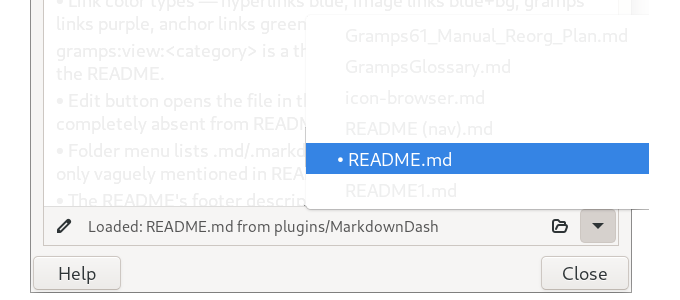

#  Markdown Dash
A [Gramps](https://gramps-project.org/) Dashboard gramplet for viewing Markdown (`.md`) files
with proper formatting — **no WebKit, no third-party packages**.

Use the **footer bar** (pinned below the document) to open,  browse, and  edit files.
Browse to [icon-browser.md](icon-browser.md) for a targeted icon inventory or the use Icon Browser for searching.

* [Installation via Addon Manager](#installation-via-addon-manager)
* [Footer Bar](#footer-bar)
* [Markdown Syntax Reference](#markdown-syntax-reference)
  * [Emphasis](#emphasis)
  * [Headings](#headings)
  * [Links](#links)
  * [Tables](#tables)
  * [Images](#images)
  * [Lists and Blockquotes](#lists-and-blockquotes)
  * [Code Blocks](#code-blocks)
* [Gramps Extensions](#gramps-extensions)
  * [Inline Theme Icons](#inline-theme-icons)
  * [Gramps Object Links](#gramps-object-links)
* [Compatibility](#compatibility)
* [Architecture](#architecture)
* [Credits](#credits)

---

## Installation via Addon Manager

1. Open Gramps → **Help** → **Plugin Manager** → **Install Addons...**
2. Under **Settings**, add this repository if not already listed:
   - Project name: **Emyoulation GitHub curated addons**
   - URL: `https://raw.githubusercontent.com/emyoulation/CuratedGrampsPlugins/master/gramps52/`
3. Find **Markdown Dash** and click **Install**, then restart Gramps.
4. Add the **Markdown Dash** gramplet to your Dashboard.

---

## Footer Bar

The footer is pinned below the document and does not scroll away.
Controls run left → right:

```
[ ✎ edit ]  [ Loaded: filename from parent/dir … ]  [ 📂 browse ]  [ ▾ folder ]
```

| Control | Icon | Description |
|---------|------|-------------|
| **Edit** | pencil (`document-edit`) | Opens the current file in the system default editor for `.md` / `text/plain` files via `Gio.AppInfo`. Insensitive until a file is loaded. |
| **Status label** | *(none)* | Shows `Loaded: <filename> from <parent/dir>` on success, or an error message in red. Expands to fill available space. |
| **Browse** | folder-open (`document-open`) | Opens a GTK file-chooser filtered to `*.md` / `*.markdown` (or all files). The dialog opens in the add-ons folder when possible, falling back to the plug-ins directory then `$HOME`. |
| **Folder menu** | chevron-down (`pan-down-symbolic`) | Popup menu listing all `.md` / `.markdown` files found in the same directory as the current file, sorted alphabetically. The active file is prefixed with `•`. Click any entry to load (or reload) it. Insensitive until a file is loaded. |

---

## Markdown Syntax Reference

Each example shows the rendered result followed by raw Markdown in `[code]…[/code]`.

---

### Emphasis

| Style | markdown code |
|---------|-------------|
|**Bold** | `**Bold**`|    
|*Italic* | `*Italic*`|    
|***Bold-italic*** | `***Bold-italic***`|    
|~~Strikethrough~~ | `~~Strikethrough~~`|    
|`inline code` | ``inline code``|

---

### Headings

# Heading 1  `# Heading 1`
## Heading 2  `## Heading 2`
### Heading 3  `### Heading 3`
#### Heading 4  `#### Heading 4`

Every heading automatically becomes a scroll target — see [Links → Anchor links](#links) below.

---

### Links

`[label](url)`

Links are color-coded by type:
 **color code    | Type                                    | Example syntax** 
 [Blue](https://gramps-project.org/)                 | Web / external URL        | `[Blue](https://gramps-project.org/)` 
      | broken image link           | `` 
 [Green](#links)              | In-document anchor     | `[Green](#markdown-dash)` 
 [**Purple**](gramps:nav:Person:I0001)             | Gramps object / view    | `[Purple](gramps:nav:Person:I0001)` 

**Web links** open in the OS web browser:
[Gramps project](https://gramps-project.org/) `[Gramps project](https://gramps-project.org/)`
**Relative `.md` links** load inside the gramplet:
[Load icon browser](icon-browser.md) `[Load icon browser](icon-browser.md)`
**Anchor links** scroll the viewer to a heading without leaving the document.
The slug is the heading text lowercased with spaces replaced by hyphens and
punctuation removed — the same algorithm used by GitHub-Flavored Markdown:
[Back to top](#markdown-dash) `[Back to top](#markdown-dash)`
[Jump to Tables](#tables) `[Jump to Tables](#tables)`

---

### Tables

GFM pipe tables with optional column alignment:

| Name | Type | Size | Notes |
|------|:----:|-----:|-------|
| `person`  | Object | 16 px | Left-aligned default |
| **family**   | Object | 22 px | *Bold cells work* |
| `gramps-geo` | View | 48 px | Full GTK name |
| [Gramps](https://gramps-project.org/) | Link | — | Links work too |


```
| Name | Type | Size | Notes |
|------|:----:|-----:|-------|
| `person` | Object | 16 px | Left-aligned default |
```


Column alignment: `:---` left (default), `:---:` center, `---:` right.

---

### Images

 ``

Alternate logo styles in `media/`: dark badge, light badge, pill, text-only.

Images are scaled to fit the gramplet width (maximum 560 px).
If `alt` text is supplied it is rendered as a caption below the image.

Missing images become clickable placeholders (click to open in the system image viewer):


---

### Lists and Blockquotes


- Unordered Level 1 (Uses hyphen, asterisk or plus ) 
  * Nested Level 2 (Uses 2 leading spaces )
   + Nested Level 3 (Uses 4 leading spaces )
```
- Unordered Level 1 (Uses hyphen, asterisk or plus ) 
  * Nested Level 2 (Uses 2 leading spaces )
   + Nested Level 3 (Uses 4 leading spaces )
```

1. Main Topic
2. next Topic
   - Sub-point A
   - Sub-point B
   1. Detail one
   2. Detail two
3. test
```
1. Main Topic
2. next Topic
   - Sub-point A
   - Sub-point B
   1. Detail one
   2. Detail two
3. test
```
  
> Blockquote    `> text`

---

### Code Blocks

Fenced code blocks (language tag is accepted but ignored — no syntax highlighting):

```python
def hello(name):
    return f"Hello, {name}!"
```

---

## Gramps Extensions

### Inline Theme Icons

Embed a live GTK / Gramps theme icon using the `gramps:icon` image scheme.
Default size is 16 px; an optional size suffix overrides it.

``  — 16 px default    
``  — explicit size

| Object icons (22 px) | | | | | | | | | |
|---|---|---|---|---|---|---|---|---|---|
|  |  |  |  |  |  |  |  |  |  |
| person | family | event | place | source | citation | repository | media | note | tag |

Dashboard icon at all sizes:
 16   22   24   32   48   64   128   256 

See [icon-browser.md](icon-browser.md) for a complete visual inventory including SVG support tests.

---

### Gramps Object Links

**Purple** links that interact with your open database.
Three URI schemes are supported:

#### `gramps:nav` — navigate to an object

Switches to the correct view category and sets the active record.

`[label](gramps:nav:Person:I0001)`

[Navigate to person](gramps:nav:Person:I0001)

#### `gramps:edit` — open an object editor

Opens the Gramps editor dialog for the specified object.

`[label](gramps:edit:Person:I0001)`

[Edit person](gramps:edit:Person:I0001)

Both `gramps:nav` and `gramps:edit` accept either a **Gramps ID** (`I0001`) or
an internal **handle** via the `handle:` prefix:

`[label](gramps:nav:Person:handle:b39fe3f4a cabf7d520b3)`

#### `gramps:view` — switch view category

Switches the main window to a named view category without selecting a specific record.

`[label](gramps:view:people)`

Valid category names (case-insensitive):
`people`, `families`, `events`, `places`, `sources`, `citations`,
`repositories`, `media`, `notes`, `geography`, `charts`, `dashboard`

#### Supported object types for `nav` and `edit`

`Person`, `Family`, `Event`, `Place`, `Source`, `Citation`,
`Repository`, `Media`, `Note`

---

## Compatibility

Gramps 5.2 / Python 3.11+ / GTK 3. No WebKit, no `markdown` package.
SVG icons require `librsvg2` (standard on most Linux desktops).

---

## Architecture

`MarkdownDash.py` is a thin display and file-navigation shell.
All Markdown parsing, tag styling, icon resolution, and table rendering are
handled by `MarkdownUtils.py` (imported at startup).

This separation keeps the gramplet class focused on GTK widget management
and makes the parser independently testable.

---

## Credits

Developed with [Claude](https://claude.ai) (Anthropic) by Brian McCullough.
License: GPL v2 or later.

Generated-by: Claude Sonnet 4.6 (Anthropic, claude-sonnet-4-6, release 2026-05)  
Prompts: "update README.md to reflect current MarkdownDash gramplet: accurate footer
bar description (edit button, status label, folder menu, browse button); add anchor
link documentation; fix gramps: URI section; add Architecture note; align TOC."  
Constraints: https://gramps-project.org/wiki/index.php/Howto:_Contribute_to_Gramps#AI_generated_code
