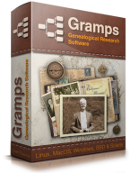
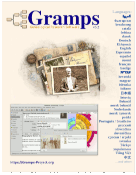
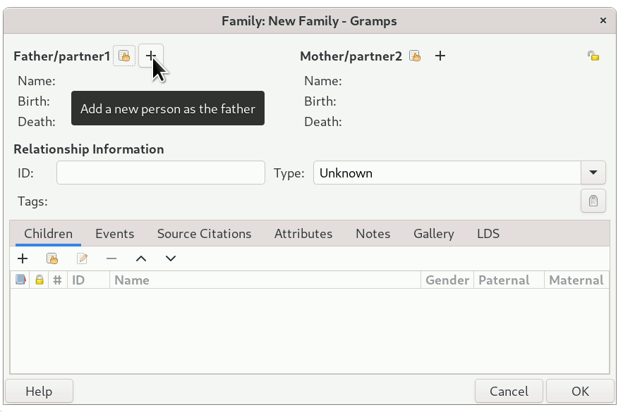
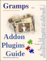
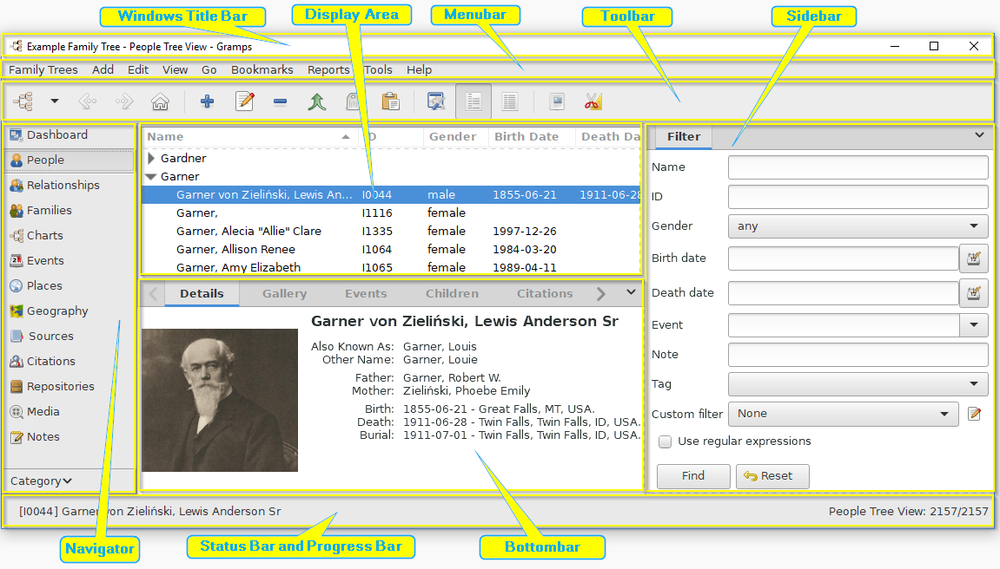

 
#  Introduction  

**Gramps** is a powerful, free, and open-source software application for genealogical research. Created by and for family historians in 2001, it combines professional-grade tools with a flexible design that lets you record, analyze, and explore your family tree your own way. Unlike many genealogy programs, Gramps does not lock you into a single “best practice” or trap your data in a proprietary format. Your research remains fully portable and accessible, ensuring that your family history can be preserved and shared across generations.

Because **Gramps** is *Free and Open Source Software*, you’re encouraged to adapt it to suit your own needs. If you make improvements, we invite you to share them so the entire community can benefit. You’re also free to copy and distribute Gramps without restrictions, and with licensing that never expires, you can trust your research will remain your own — today and in the future.

 Learn more about **Gramps** by visiting the [Gramps-Project.org website.](https://gramps-project.org/). Explore the [Reference resources available for Gramps](https://gramps.discourse.group/t/about-the-user-manual-category/2585).

### Who makes Gramps?

Gramps is created by genealogists for genealogists, organized in the Gramps Project by the ***Gramps Genealogy Foundation***, a non-profit organization.

It is developed and maintained by a worldwide team of volunteers whose goal is to make Gramps powerful, yet easy to use. (You have a standing invitation to join as one of those volunteers!)

There is an active community of user volunteers available on the mailing lists and [**Gramps Discourse**](https://discourse.gramps-project.org) forum to answer questions, share ideas and techniques.
* Explore the **Gramps** [online manual](https://gramps-project.org/wiki/index.php?title=Gramps_6.0_Wiki_Manual) or [download the PDF eBook](https://gramps-project.org/wiki/index.php/User_manual_translations#Enabled) for offline use. 
 
* [Ask questions on the gramps-users mailing list](https://gramps-project.org/blog/contact/)
* [Share knowledge on the Gramps Discourse Forum](https://discourse.gramps-project.org)

### Getting Started

The first time Gramps is started, most of the Views will be blank. There will be very few menu or toolbar options. Gramps needs a Tree with People before more menu and toolbar options appear.

This is because options are offered on a contextual basis. (If an option does not apply to what is displayed or selected, that option is not actively displayed.) The basic context of a Family Tree is needed for any activity to happen. Family Trees are your "blank document" or "new project" workspaces.

To create a new Family Tree (sometimes called a 'database'), select "Family Trees" menu, pick the "Manage Family Trees..." option, press the "New" button, and name your Family Tree. Then click the "Load Family Tree" button to make the selected tree active and ready to accept genealogical research data.

If you are just exploring, scroll down to bottom of this text and learn about importing the example Tree that is included with Gramps. Make any "beginner mistakes" there instead in your research. After a bit of exploring, you will be ready to begin entering your first family, or importing a genealogy file. For one strategy for filling in the Tree, please read the information at the links below.
 • [Start with Genealogy and Gramps](https://gramps-project.org/wiki/index.php?title=Start_with_Genealogy)
 • [Discourse forum list of Gramps tutorial videos](https://gramps.discourse.group/t/tutorial-videos/126)

### Enter your first Family
Switch to the "Relationships" view and, from the "Add" menu, select the "Family" to bring up the "Edit Family" window. Here you can click the "plus" icon beside the "Father/partner1" or "Mother/partner2" to begin entering that person. Start with just the basic Name information for one person. (We'll come back to add Birth and Death data later.) Clicking the "OK" stores the record, creating your first Person. You can add an immediate relative in one of the other spots or Click the "OK" button to store that first family.

 
This establishes a starting point for your tree. With the context of this first person and family, all of the menu options and toolbar icon functions will have become available. Spend some time moving your mouse over the icons. As your cursor passes over an icon, a hint message will appear telling you the icon's function. The same hint system is useful for exploring any of the edit windows. Moving the mouse cursor over an item will tell you what that control will do.

You can now expand families by adding parents, a spouse and children. Under the tabs of the lower section of the Edit windows, the "plus" icon  under the Events tab allows adding landmark life occasions (with dates and places) to People and Families. Under the other tabs, you can add Sources, Citations, Notes and other types of information to provide documentation for your entries.

As you start using Gramps, you will find that information can be entered from all the various Views. There are multiple ways of doing most activities in Gramps. The flexibility allows you to choose which fits your work style.
* [Entering and editing data (a brief overview)](https://gramps-project.org/wiki/index.php?title=Gramps_5.1_Wiki_Manual_-_Entering_and_editing_data:_brief)

### Importing a Family Tree
To import a Family Tree from another program, first export a GEDCOM (or other data exchange format) file from your previous program.

Create a new, blank Gramps database (Tree) file as described in the "Getting Started" section above. Then use the "Import" option under the "Family Trees" menu to import the GEDCOM data.
* [Import from another genealogy program](https://gramps-project.org/wiki/index.php?title=Import_from_another_genealogy_program)

###   Dashboard View
You are currently reading from the "Dashboard" view, where you can add your own gramplets. You can also add gramplets to any view by adding a sidebar and/or bottombar, and right-clicking to the right of the tab.

 The Configure... option in the View menu (or clicking the icon in the toolbar) opens the "Gramplet Layout" tab. This allows you to subdivide the dashboard into more or fewer columns. 

 You can also drag the Properties button to reposition the gramplet within this dashboard or click to detach the gramplet to float above Gramps or place on a second monitor.

While the Dashboard view is about using Gramps more efficiently, the other view categories allow data entry and understanding of how your data interconnects.
* *Gramps* [primary object](https://gramps-project.org/wiki/index.php/Gramps_Glossary#primary_object) *View* [Categories](https://gramps-project.org/wiki/index.php/Gramps_Glossary#V)
     [Dashboard](https://gramps-project.org/wiki/index.php?title=Gramps_6.0_Wiki_Manual_-_Categories#Dashboard_Category)
      [People](https://gramps-project.org/wiki/index.php?title=Gramps_6.0_Wiki_Manual_-_Categories#People_Category) 
     [Relationships](https://gramps-project.org/wiki/index.php?title=Gramps_6.0_Wiki_Manual_-_Categories#Relationships_Category)
     [Families](https://gramps-project.org/wiki/index.php?title=Gramps_6.0_Wiki_Manual_-_Categories#Families_Category) 
     [Charts](https://gramps-project.org/wiki/index.php?title=Gramps_6.0_Wiki_Manual_-_Categories#Charts_Category) 
     [Events](https://gramps-project.org/wiki/index.php?title=Gramps_6.0_Wiki_Manual_-_Categories#Events_Category) 
     [Places](https://gramps-project.org/wiki/index.php?title=Gramps_6.0_Wiki_Manual_-_Categories#Places_Category)
     [Geography](https://gramps-project.org/wiki/index.php?title=Gramps_6.0_Wiki_Manual_-_Categories#Geography_Category) 
     [Sources](https://gramps-project.org/wiki/index.php?title=Gramps_6.0_Wiki_Manual_-_Categories#Sources_Category) 
     [Citations](https://gramps-project.org/wiki/index.php?title=Gramps_6.0_Wiki_Manual_-_Categories#Citations_Category) 
     [Repositories](https://gramps-project.org/wiki/index.php?title=Gramps_6.0_Wiki_Manual_-_Categories#Repositories_Category) 
     [Media](https://gramps-project.org/wiki/index.php?title=Gramps_6.0_Wiki_Manual_-_Categories#Media_Category) 
     [Notes](https://gramps-project.org/wiki/index.php?title=Gramps_6.0_Wiki_Manual_-_Categories#Notes_Category) 
    

### Addons and "Gramplets"
 
There hundreds of Addons (plugins) that are available to assist you in data entry and visualizing your family tree. These addons provide reports, filter rules, View modes, "Gramplets", and more.

Many tools are already distributed with the basic installation of Gramps. Many more are freely available to download and install.
* [List of Addons and "Gramplets"](https://gramps-project.org/wiki/index.php?title=6.0_Addons)

### Example Database
Want to see Gramps in use? There is a demonstration Genealogical Tree database that was used in the screen captures illustrating the documentation. You can create a blank tree and then import that Example database. This allows you to follow the examples while seeing exactly the same output. And it allows you to freely experiment without the worry of damaging your tree's data. (You can always delete the example tree and re-import to get back to data in the manual.) 

Create a new Family Tree as described in the "Getting Started" section above. (A good name for that Family Tree would be “EXAMPLE”.)

Import the example.gramps Gramps archive file. (The webpage below describes what is in that archive and the file location for the different Operation Systems that run the Gramps program. It also describes where the file is available on the web.
* [Example.gramps](https://gramps-project.org/wiki/index.php?title=Example.gramps)

---

Browse to  [Welcome.md (english)](Welcome.en.md) | [icon-browser.md](icon-browser.md) | [README.md](../README.md) | [README1.md](README1.md) | [GrampsGlossary.md](GrampsGlossary.md).

