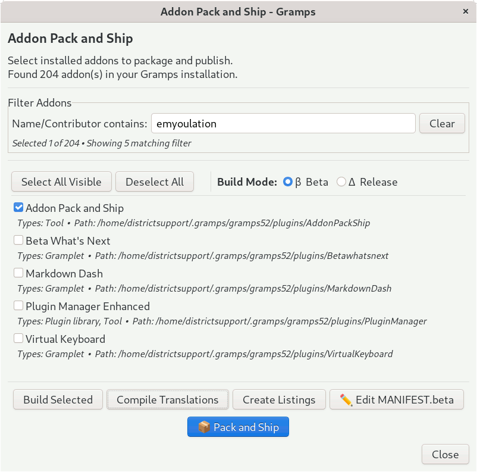
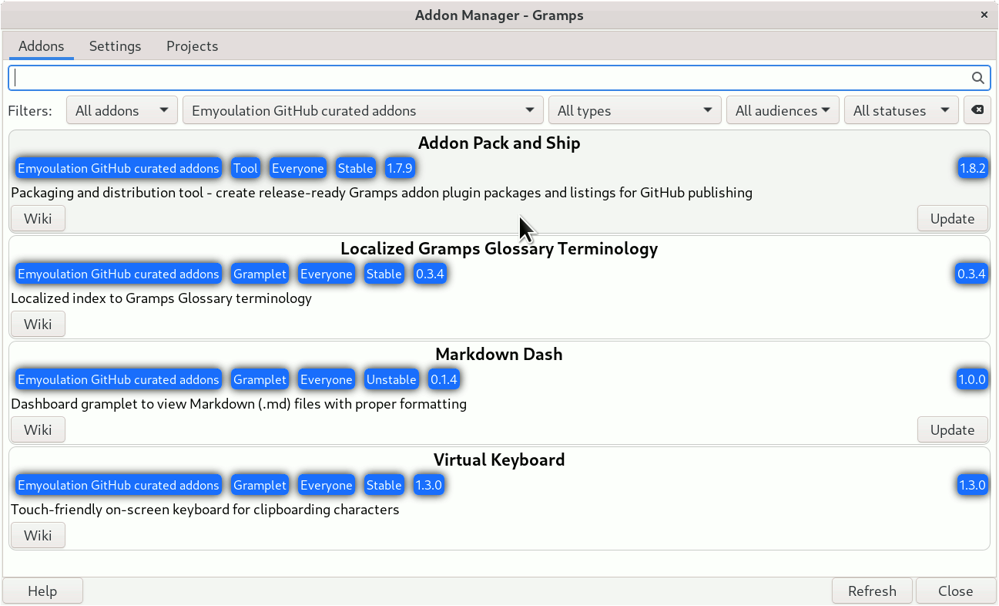
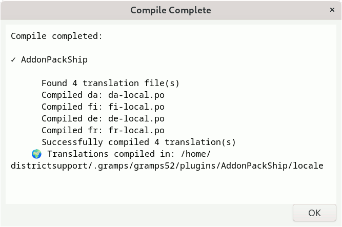

# AddonPackShip — Gramps Addon Packaging Tool

**Version 1.8.3** — Development Release  
**For Gramps 5.2.x** desktop genealogy software  
[**QuickStart.md**](QuickStart.md) | [**README.md**](README.md)



Package your Gramps addons for distribution with a simple checkbox interface. Create release-ready `.addon.tgz` files and JSON listings for GitHub publishing in seconds.

---

## What This Tool Does

**AddonPackShip** packages finished Gramps addons for sharing:

✅ **Build** — Creates `.addon.tgz` packages from installed addons  
✅ **Compile** — Compiles translation files (`.po` → `.mo`), generates `template.pot` if missing  
✅ **Amend Listings** — Adds/updates JSON metadata for the Addon Manager  
✅ **Pack and Ship** — One-click build + listing for GitHub upload  
✅ **Per-Addon MANIFEST Editor** — Folder icon button on each addon row opens a file chooser/editor

**Not a development tool** — use this when your addon is ready to share. For active development, use your preferred text editor.

---

## Installation

**Via Addon Manager** (Recommended):

1. Open Gramps → **Edit** → **Addon Manager**  
2. Go to the **Projects** tab  
3. Add (if not already present) and select the **Emyoulation GitHub curated addons** URL from the **Project** tab:  
   `https://raw.githubusercontent.com/emyoulation/CuratedGrampsPlugins/main/gramps52/listings/addons-en.json`
4. Click **Refresh**
5. Find **Addon Pack and Ship** under the Tools category
6. Click **Install**
7. Restart Gramps

The tool then appears under **Tools** → **Utilities** → **Addon Pack and Ship**



---

## Quick Start

### First Use

1. **Tools** → **Utilities** → **Addon Pack and Ship**
2. Select addon(s) with checkboxes
3. Choose **β Beta** mode (includes translation source files)
4. Click **📦 Pack and Ship**
5. Upload the `gramps52/` folder to GitHub

Your addon is ready to share!

---

## Interface Overview

### Filter Addons Frame (always visible)

The **Filter Addons** frame at the top contains all controls that stay visible while the addon list scrolls:

- **Select All Visible** / **Deselect All** — checkbox selection helpers
- **Build Mode** radio buttons — **β Beta** (default) or **Δ Release**
- **Name/Contributor contains:** — filter the addon list by name, author, or email
- **Build Selected**, **Compile Translations**, **Amend Listings** — individual operation buttons

### Addon List (scrollable)

Each addon row shows:
- A **checkbox** with the addon's display name
- Small text showing type(s) and folder path
- A **📂 folder icon button** on the right — click to create or open the MANIFEST/MANIFEST.beta for that addon in your text editor

### Bottom Bar

- **Selected N of M addons** status — left side
- **📦 Pack and Ship** — centre, highlighted action button
- **Close** — right side

---

## Build Modes

### β Beta Build (Default)

**For**: Translators, beta testers, developers

**Includes everything**:
- All core files (`.py`, `.gpr.py`, `.glade`, `.xml`)
- All documentation (`README.md`, `CHANGELOG.md`, `*.md`)
- Translation source files (`po/*.po`, `po/template.pot`)
- Compiled translations (`locale/*.mo`)
- Development files (`MANIFEST`, `MANIFEST.beta`)
- All subdirectory contents (`data/`, `layouts/`, etc.)

**When to use**: Sharing work-in-progress, requesting translations, beta testing

### Δ Release Build

**For**: End users

**Includes only**:
- All core files (`.py`, `.gpr.py`, `.glade`, `.xml`)
- `README.md` only
- Compiled translations (`locale/*.mo`)
- MANIFEST extras (if `MANIFEST` file exists)

**Intentionally excludes**: Translation source files, developer documentation, build metadata

⚠ **Warning**: Release mode is *intentionally lossy*. Use β Beta for development sharing.

**When to use**: Final public release for end users

---

## Features

### Checkbox Selection Interface

- Filter addons by name, author, or email
- **Select All Visible** / **Deselect All** — fixed in the Filter frame, never scrolls away
- Selection count shown in bottom-left status bar
- Shows addon type and path beneath each checkbox

### Build Operations

**Build Selected** — Creates `.addon.tgz` packages  
- Compiles translations automatically  
- Generates `template.pot` if missing  
- Uses `MANIFEST.beta` or `MANIFEST` if present  
- Auto-includes appropriate files per mode  
- Output: `gramps52/download/AddonName.addon.tgz`

**Compile Translations** — Standalone translation compilation  
- Generates `template.pot` from source files if missing  
- Finds all `.po` files (any naming pattern)  
- Compiles to `locale/*/LC_MESSAGES/*.mo`  
- Works with typical `.po` file-naming patterns (e.g., `fr-local.po`, `fr_FR.po`, `fr.po`)



**Amend Listings** — Generates/updates JSON metadata  
> ℹ️ **"Amend" not "Create"**: This operation *adds or updates* entries in `addons-en.json` — it does **not** remove entries for addons you haven't selected. Existing entries for other addons are preserved.  
> **To shrink the listing** (e.g., to remove a retired addon): delete the `gramps52/listings/` folder first, then run Amend Listings for only the addons you want listed.

- Creates `addons-LANG.json` for each locale
- Uses actual plugin registration data
- Includes status and audience fields
- Output: `gramps52/listings/addons-en.json`

**Pack and Ship** — Combined build + listing (recommended!)  
- One button for complete packaging  
- Shows which `MANIFEST` file was used  
- Creates both `download/` and `listings/` folders  
- Ready to upload to GitHub

### Per-Addon MANIFEST Editor (📂 button)

Each addon row has a **folder icon button** on the right. Clicking it:

1. Opens (or creates) `MANIFEST.beta` (β mode) or `MANIFEST` (Δ mode) for that specific addon
2. Seeds from existing `MANIFEST` when creating a new `MANIFEST.beta`
3. Appends a helpful header with file inclusion rules
4. Appends an annotated directory listing showing which files are auto-included vs. need manual entry
5. Opens the file in your OS default text editor

The button's tooltip tells you whether the file already exists, its full path, and which mode it applies to — so it doubles as a quick sanity check.

> The button is always enabled — you don't need to select an addon first. Just click the folder icon next to whichever addon you want to manage.

---

## MANIFEST Files

Control exactly what goes into your addon package with optional `MANIFEST` and `MANIFEST.beta` files.

### MANIFEST.beta (β Beta mode)

**Optional** — if absent, β Beta auto-includes everything.

**When to create**:
- You want to *exclude* specific files from auto-inclusion
- You need precise control over beta packages

**Example**:
```
# MANIFEST.beta for VirtualKeyboard
VirtualKeyboard/README.md
VirtualKeyboard/layouts/*
VirtualKeyboard/data/config.json
```

**If `MANIFEST.beta` exists** → it controls inclusion (additive on top of core files)  
**If `MANIFEST.beta` absent** → auto-includes everything

### MANIFEST (Δ Release mode)

**Optional** — defines extras beyond release defaults.

**Example**:
```
# MANIFEST for VirtualKeyboard
VirtualKeyboard/layouts/*
VirtualKeyboard/data/*
```

**Release always includes**: `.py`, `.gpr.py`, `.glade`, `.xml`, `locale/*.mo`, `README.md`

### Wildcard Patterns

```
AddonName/data/*              # All files in data/
AddonName/layouts/*.csv       # Specific extension
AddonName/README.md           # Individual file
```

---

## GitHub Publishing Workflow

### 1. Prepare Your Addon

- Finish coding and testing
- Mark translatable strings with `_()`
- Compile translations to generate `template.pot`
- Get translations as `po/*.po` files

### 2. Package with AddonPackShip

#### For Beta Testing / Translation

1. Select **β Beta** mode
2. Click **📦 Pack and Ship**
3. Find output in `~/.gramps/gramps52/plugins/AddonPackShip/gramps52/`

#### For Public Release

1. Select **Δ Release** mode
2. Click **📦 Pack and Ship** (confirm warning dialog)
3. Find output in same location

### 3. Upload to GitHub

Create this structure in your GitHub repository:

```
your-repo/
├── gramps52/
│   ├── download/
│   │   └── YourAddon.addon.tgz
│   └── listings/
│       ├── addons-en.json
│       ├── addons-fr.json
│       └── addons-de.json
└── README.md
```

**URL format**: `https://raw.githubusercontent.com/username/repo/main/gramps52/listings/addons-en.json`

### 4. Share with Users

**Users add your URL** in Gramps Addon Manager:
1. **Tools** → **Addon Manager** → **Projects** tab
2. Add URL to addon repository list
3. Refresh → Install your addon

---

## Local Testing

Test your addon package **before** uploading to GitHub using `file://` URLs:

1. **Build** your addon with AddonPackShip
2. Note the output path (shown in results dialog)
3. **Tools** → **Addon Manager** → **Projects** tab
4. Add: `file:///home/username/.gramps/gramps52/plugins/AddonPackShip/gramps52/listings/addons-en.json`
   - Windows: `file:///C:/Users/username/.gramps/gramps52/plugins/AddonPackShip/gramps52/listings/addons-en.json`
5. Refresh and install from your local "repository"

**Test both modes**:
- β Beta — check that `.po` files and docs are included
- Δ Release — verify clean end-user package

---

## Default File Inclusion Rules

### Always Auto-Included (Both Modes)

- `*.py` — All Python source files
- `*.gpr.py` — Plugin registration
- `*.glade` — GTK interface definitions
- `*.xml` — XML data files
- `locale/*.mo` — Compiled translations

### β Beta Auto-Includes (Additional)

- `*.md` — All markdown documentation
- `po/*.po` — Translation source files
- `po/template.pot` — Translation template
- `MANIFEST` and `MANIFEST.beta` — Packaging metadata
- All subdirectory contents (`data/`, `layouts/`, custom folders)

### Δ Release Auto-Includes (Additional)

- `README.md` only (no other `.md` files)

### Never Included (Filtered Out)

- `__pycache__/` — Python cache directories
- `*.pyc`, `*.pyo` — Compiled Python bytecode
- `*~` — Editor backup files
- Hidden directories (`.git`, `.`, `..`)

---

## Troubleshooting

### "No Addons Found"

**Cause**: No third-party addons installed.

**Solution**: Install at least one addon first using the Addon Manager, then use AddonPackShip to package it.

### "Malformed .gpr.py File"

**Cause**: Commas inside quoted strings in list fields.

**Example of error**:
```python
authors = ["Smith, John"]  # ❌ Wrong
```

**Fix**:
```python
authors = ["Smith", "John"]  # ✅ Correct
```

### Translation Files Not Compiling

**Cause**: `msgfmt` tool not installed.

**Solution**:
- **Linux**: `sudo apt install gettext`
- **Windows**: https://mlocati.github.io/articles/gettext-iconv-windows.html
- **macOS**: `brew install gettext`

### Listing Entries Not Being Removed

**Cause**: "Amend Listings" adds/updates but never removes entries.

**Solution**: Delete the `gramps52/listings/` folder entirely, then run Pack and Ship (or Amend Listings) for only the addons you want in the listing.

---

## Tips and Best Practices

### For Addon Developers

✅ Start with **β Beta** mode for all development and testing  
✅ Use the **📂 folder button** on each addon row to check or create MANIFEST files  
✅ Test locally with `file://` URLs before publishing  
✅ Run **Compile Translations** to generate `template.pot`  
✅ Commit MANIFEST files to version control for transparency  
✅ To reduce the listing file, delete `gramps52/listings/` first

### For Translators

✅ Request **β Beta** packages — you need `po/template.pot` and `po/*.po` files  
✅ Check `template.pot` is up-to-date before translating  
✅ Return `.po` files to addon author for next release  
✅ Test compiled translations by installing β Beta package locally

### For Beta Testers

✅ Install from **β Beta** to get latest features  
✅ Report bugs with version number and mode (β/Δ)  
✅ Check `README.md` in β Beta packages for testing instructions

---

## Version History

### 1.8.3 (2026-02-27)

- **MANIFEST button moved to per-row icon buttons**: Each addon row now has a 📂 folder icon button that opens MANIFEST/MANIFEST.beta for that specific addon — no need to first select exactly one addon
- **Select All / Build Mode controls** moved into the Filter Addons frame, so they stay visible when the addon list scrolls
- **Status readout** moved to bottom-left of the Close button row
- Button label was "Create Listings" — renamed to **Amend Listings** to better reflect additive behavior
- Fixed: Build Mode radio buttons now immediately refresh the per-row folder button tooltips

### 1.8.2 (2026-02-xx)

- Button at bottom renamed to **Pack and Ship**
- Various UI refinements

### 1.7.0 (2026-02-17) — First Public Release

- Dual build modes (β Beta / Δ Release)
- MANIFEST editor with directory preview
- Smart file filtering per mode
- Automatic translation compilation and `template.pot` generation
- JSON listing generation with metadata
- One-click Pack and Ship

---

## Credits

**Author**: Brian McCullough  
**Email**: emyoulation@yahoo.com  
**Development**: AI-assisted using Claude (Anthropic)  
**License**: GPL v2 or later  
**Gramps**: https://gramps-project.org  
**Repository**: https://github.com/emyoulation/CuratedGrampsPlugins

---

## Support and Feedback

**Issues**: Report via Gramps Discourse forums  
**Feature Requests**: Discourse or email  
**Contributions**: Welcome — discuss on Discourse first

---

## See Also

[**QuickStart.md**](QuickStart.md) — 5-minute guide to first use  
[**COMPARE_make_APS.md**](COMPARE_make_APS.md) — How AddonPackShip compares to make52.py/make60.py  
**Gramps Developer Docs** — https://gramps-project.org/wiki/index.php/Portal:Developers

---

**AddonPackShip** — Pack it, ship it, share it! 📦🚀
