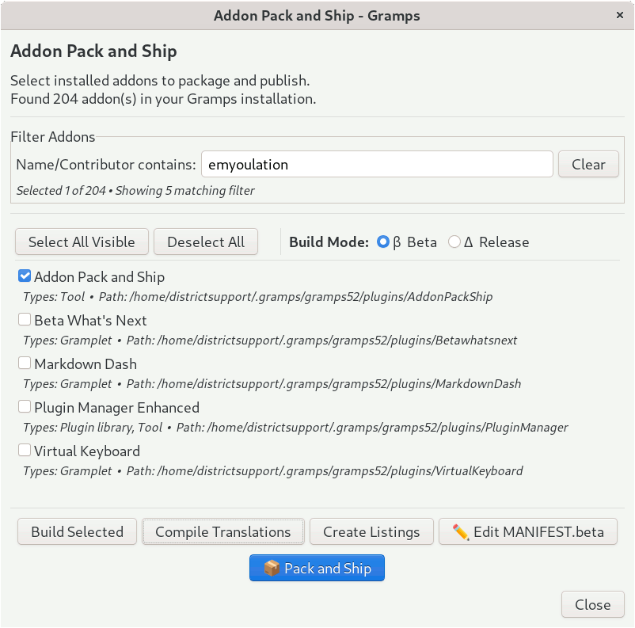
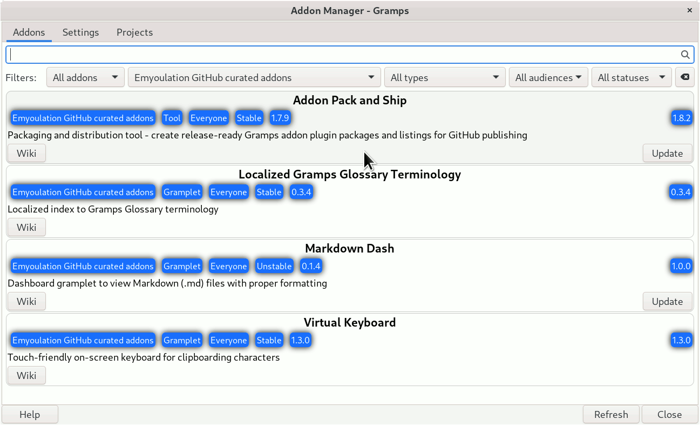
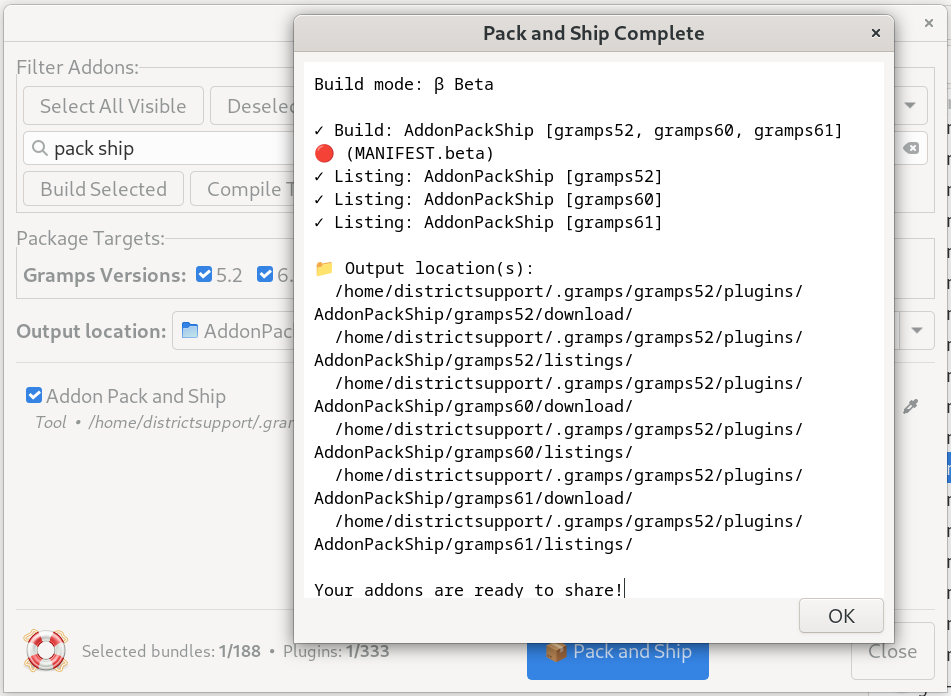

# AddonPackShip — Gramps Addon Packaging Tool

**Version 1.9.0** — Development Release
**For Gramps 5.2+** desktop genealogy software — packages for one or several installed Gramps versions at once
[**QuickStart.md**](QuickStart.md) | [**README.md**](README.md)



Package your Gramps addons for distribution with a simple checkbox interface. Create release-ready `.addon.tgz` files and JSON listings for GitHub publishing in seconds.

---

## What This Tool Does

**AddonPackShip** packages finished Gramps addons for sharing:

✅ **Build** — Creates `.addon.tgz` packages from installed addons, for one or more Gramps versions at once
✅ **Compile** — Compiles translation files (`.po` → `.mo`), generates `template.pot` if missing
✅ **Amend Listings** — Adds/updates JSON metadata for the Addon Manager
✅ **Pack and Ship** — One-click build + listing for GitHub upload
✅ **Per-Addon MANIFEST Editor** — Folder icon button on each addon row/bundle opens a file chooser/editor
✅ **Per-Addon Version Bump** — Click an addon's version tag to flag a patch-version bump on its next build
✅ **Named Configurations** — Save and reload your build mode, target versions, output folder, filters, and selections by name
✅ **Built-in Documentation** — Help icon opens this README directly, no browser required (when Markdown Dash is installed)

**Not a development tool** — use this when your addon is ready to share. For active development, use your preferred text editor.

---

## Installation

**Via Addon Manager** (Recommended):

1. Open Gramps → **Edit** → **Addon Manager**
2. Go to the **Projects** tab
3. Add (if not already present) and select the **Emyoulation GitHub curated addons** URL from the **Project** tab:
   `https://raw.githubusercontent.com/emyoulation/CuratedGrampsPlugins/main/gramps52/listings/addons-en.json`
4. Click **Refresh**
5. Find **Addon Pack and Ship** under the Tools category
6. Click **Install**
7. Restart Gramps

The tool then appears under **Tools** → **Utilities** → **Addon Pack and Ship**



---

## Quick Start

### First Use

1. **Tools** → **Utilities** → **Addon Pack and Ship**
2. Select addon(s) with checkboxes
3. Choose **β Beta** mode (includes translation source files)
4. Check which **Gramps Versions** to package for under **Package Targets:** — the version you're currently running is pre-checked for you
5. Click **📦 Pack and Ship**
6. Upload the generated `gramps52/` (and/or `gramps60/`, etc.) folder(s) to GitHub

Your addon is ready to share! The settings you used are saved automatically the first time you run this tool, under a configuration named **default**, so they're ready to reuse next time — see [Named Configurations](#named-configurations) below.

---

## Interface Overview

### Filter Addons Frame (always visible)

The **Filter Addons** frame at the top contains all controls that stay visible while the addon list scrolls:

- **Select All Visible** / **Deselect All** — checkbox selection helpers (apply to whatever the current filters show)
- **Build Mode** radio buttons — **β Beta** (default) or **Δ Release**
- **Type filter** dropdown — narrow the list to one plugin type (VIEW, GRAMPLET, TOOL, REPORT, GENERAL, etc.)
- **Search bundles and plugins…** — a live search box (with a built-in ✕ clear button) that matches across every plugin field: name, type, id, path, authors, version, category, and more
- **Build Selected**, **Compile Translations**, **Amend Listings** — individual operation buttons

### Package Targets Frame

Directly below the addon filters, the **Package Targets** frame controls which installed Gramps releases to build and list packages for:

- **Gramps Versions** — one checkbox per bundled packaging script (e.g. `5.2`, `6.0`). Check as many as you want to target in one pass; the same `.addon.tgz` is reused across every checked version, so nothing is rebuilt twice. By default, only the Gramps version you're currently running is checked — tick additional boxes to also package for other installed versions.
- **Update Scripts…** — fetches the latest packaging scripts from `gramps-project/addons-source` on GitHub, refreshing your bundled copies (with a timestamped backup kept) and offering to add a script for any newly released Gramps version not yet bundled here. Requires an internet connection; existing bundled scripts keep working offline if it can't reach GitHub.

### Output Location & Named Configurations

Below Package Targets, one row combines where packages are written with saving/loading your settings:

- **Output location** — the parent folder under which each checked version's `download/` and `listings/` subfolders are created. Defaults to this tool's own installation folder; pick something else (e.g. a local clone of your addon's GitHub repository) if you want the generated files to land somewhere you can commit and push directly.
- **Suggested folder** dropdown (shown only if any are found) — local Git repository clones detected under common developer folders (e.g. `~/Documents/GitHub`); picking one fills in the Output location for you.
- **Configuration** name box and save icon — see [Named Configurations](#named-configurations) below.

### Named Configurations

AddonPackShip can remember a complete snapshot of your settings — build mode, checked Gramps Versions, output location, filters, and which addons are selected — under a name you choose, so you don't have to rebuild the same setup by hand each time:

- Type a name and press **Enter** (or click the save icon) to save the current settings under that name, overwriting it if it already exists.
- Pick an existing name from the dropdown to load it.
- Whichever configuration was active when you last closed this tool is restored automatically the next time you open it.
- On a fresh install, before you've saved anything, AddonPackShip automatically saves your very first session's settings as a configuration named **default** — including the running-version-only Gramps Versions selection above — so there's always at least one ready to reload.

Configurations are stored in `APS.ini`, alongside this tool's own files — not in `gramps.ini`.

### Addon List (scrollable)

Each addon row (or, for addons that register several plugins in one folder, each bundle header) shows:
- A **checkbox** with the addon's display name (bundles with multiple plugins list one checkbox per plugin beneath a shared header)
- Small text showing type(s) and folder path
- A **version tag** (e.g. `1.2.3`) — click it to flag that addon for a patch-version bump (e.g. `1.2.3` → `1.2.4`) in its `.gpr.py` the next time it's built; click again to cancel
- A **📂 folder icon button** — click to create or open the MANIFEST/MANIFEST.beta for that addon in your text editor

### Bottom Bar

- **❓ Help icon** — leftmost. Opens this tool's own documentation, preferring to show `README.md` directly if the Markdown Dash gramplet is installed, otherwise opening the online help page in your browser
- **Found N bundles (M registered plugins)…** — shown when nothing is selected; switches to a live **Selected bundles: X/Y • Plugins: V/T** readout as soon as you check something
- **📦 Pack and Ship** — centre, highlighted action button
- **Close** — right side

---

## Build Modes

### β Beta Build (Default)

**For**: Translators, beta testers, developers

**Includes everything**:
- All core files (`.py`, `.gpr.py`, `.glade`, `.xml`)
- All documentation (`README.md`, `CHANGELOG.md`, `*.md`)
- Translation source files (`po/*.po`, `po/template.pot`)
- Compiled translations (`locale/*.mo`)
- Development files (`MANIFEST`, `MANIFEST.beta`)
- All subdirectory contents (`data/`, `layouts/`, etc.)

**When to use**: Sharing work-in-progress, requesting translations, beta testing

### Δ Release Build

**For**: End users

**Includes only**:
- All core files (`.py`, `.gpr.py`, `.glade`, `.xml`)
- `README.md` only
- Compiled translations (`locale/*.mo`)
- MANIFEST extras (if `MANIFEST` file exists)

**Intentionally excludes**: Translation source files, developer documentation, build metadata

⚠ **Warning**: Release mode is *intentionally lossy*. Use β Beta for development sharing.

**When to use**: Final public release for end users

---

## Features

### Checkbox Selection Interface

- Filter addons by type, or search by name, author, email, id, path, version, or category
- **Select All Visible** / **Deselect All** — fixed in the Filter frame, never scrolls away, and respects whatever the current filters show
- Selection count shown in the bottom bar, next to the Help icon
- Shows addon type and path beneath each checkbox

### Multi-Version Package Targets

- Check as many **Gramps Versions** as you want to package for in one pass — each checked version gets its own `gramps<NN>/download/` and `gramps<NN>/listings/` output
- The version you're currently running is pre-checked by default; add others as needed
- **Update Scripts…** refreshes the bundled packaging engines from `gramps-project/addons-source` on GitHub, and can add scripts for newly released Gramps versions not yet bundled

### Output Location and Named Configurations

- Choose where the generated `gramps<NN>/` folders are created — defaults to this tool's own folder, or point it at a local Git clone
- Detected local Git repository clones are offered as one-click suggestions
- Save and reload complete settings snapshots by name, backed by `APS.ini`
- Your most recently used configuration is restored automatically next time you open the tool
- A **default** configuration is created for you automatically the first time you use this tool

### Build Operations

**Build Selected** — Creates `.addon.tgz` packages
- Compiles translations automatically
- Generates `template.pot` if missing
- Uses `MANIFEST.beta` or `MANIFEST` if present
- Auto-includes appropriate files per mode
- Bumps the `.gpr.py` patch version first for any addon flagged with its version tag
- Builds once per checked Gramps Version — output: `gramps<NN>/download/AddonName.addon.tgz`

**Compile Translations** — Standalone translation compilation
- Generates `template.pot` from source files if missing
- Finds all `.po` files (any naming pattern)
- Compiles to `locale/*/LC_MESSAGES/*.mo`
- Works with typical `.po` file-naming patterns (e.g., `fr-local.po`, `fr_FR.po`, `fr.po`)



**Amend Listings** — Generates/updates JSON metadata
> ℹ️ **"Amend" not "Create"**: This operation *adds or updates* entries in `addons-en.json` — it does **not** remove entries for addons you haven't selected. Existing entries for other addons are preserved.
> **To shrink the listing** (e.g., to remove a retired addon): delete the `gramps<NN>/listings/` folder first, then run Amend Listings for only the addons you want listed.

- Creates `addons-LANG.json` for each locale, for each checked Gramps Version
- Uses actual plugin registration data
- Includes status and audience fields
- Output: `gramps<NN>/listings/addons-en.json`

**Pack and Ship** — Combined build + listing (recommended!)
- One button for complete packaging across every checked Gramps Version
- Validates every selected addon's `.gpr.py` first and reports any that are malformed
- Confirms before a Release build, since it's intentionally lossy
- Creates both `download/` and `listings/` folders
- Ready to upload to GitHub

### Per-Addon MANIFEST Editor (📂 button)

Each addon row (or bundle header, for addons with multiple plugins) has a **folder icon button**. Clicking it:

1. Opens (or creates) `MANIFEST.beta` (β mode) or `MANIFEST` (Δ mode) for that specific addon
2. Seeds from existing `MANIFEST` when creating a new `MANIFEST.beta`
3. Appends a helpful header with file inclusion rules
4. Appends an annotated directory listing showing which files are auto-included vs. need manual entry
5. Opens the file in your OS default text editor

The button's tooltip tells you whether the file already exists, its full path, and which mode it applies to — so it doubles as a quick sanity check.

> The button is always enabled — you don't need to select an addon first. Just click the folder icon next to whichever addon you want to manage.

### Per-Addon Version Bump

Each addon shows its current version as a small clickable tag next to its name:

1. Click the tag to flag that addon for a **patch-version bump** (e.g. `1.2.3` → `1.2.4`) — the tag turns red and previews the new version
2. Click it again to cancel the flag
3. Flagged addons have their `.gpr.py` version actually incremented the next time they're built (via **Build Selected** or **Pack and Ship**)

This applies per addon folder — for a bundle with multiple plugins sharing one `.gpr.py`, the tag on the bundle header covers the whole group.

---

## MANIFEST Files

Control exactly what goes into your addon package with optional `MANIFEST` and `MANIFEST.beta` files.

### MANIFEST.beta (β Beta mode)

**Optional** — if absent, β Beta auto-includes everything.

**When to create**:
- You want to *exclude* specific files from auto-inclusion
- You need precise control over beta packages

**Example**:
```
# MANIFEST.beta for VirtualKeyboard
VirtualKeyboard/README.md
VirtualKeyboard/layouts/*
VirtualKeyboard/data/config.json
```

**If `MANIFEST.beta` exists** → it controls inclusion (additive on top of core files)
**If `MANIFEST.beta` absent** → auto-includes everything

### MANIFEST (Δ Release mode)

**Optional** — defines extras beyond release defaults.

**Example**:
```
# MANIFEST for VirtualKeyboard
VirtualKeyboard/layouts/*
VirtualKeyboard/data/*
```

**Release always includes**: `.py`, `.gpr.py`, `.glade`, `.xml`, `locale/*.mo`, `README.md`

### Wildcard Patterns

```
AddonName/data/*              # All files in data/
AddonName/layouts/*.csv       # Specific extension
AddonName/README.md           # Individual file
```

---

## GitHub Publishing Workflow

### 1. Prepare Your Addon

- Finish coding and testing
- Mark translatable strings with `_()`
- Compile translations to generate `template.pot`
- Get translations as `po/*.po` files

### 2. Package with AddonPackShip

#### For Beta Testing / Translation

1. Select **β Beta** mode
2. Check the **Gramps Versions** you want to package for
3. Click **📦 Pack and Ship**
4. Find the output under whichever **Output location** folder you've chosen — the tool's own folder by default — inside `gramps<NN>/`

#### For Public Release

1. Select **Δ Release** mode
2. Click **📦 Pack and Ship** (confirm warning dialog)
3. Find output in the same location

### 3. Upload to GitHub

Create this structure in your GitHub repository (one `gramps<NN>/` folder per Gramps Version you packaged for):

```
your-repo/
├── gramps52/
│   ├── download/
│   │   └── YourAddon.addon.tgz
│   └── listings/
│       ├── addons-en.json
│       ├── addons-fr.json
│       └── addons-de.json
├── gramps60/
│   ├── download/
│   └── listings/
└── README.md
```

Tip: if you point **Output location** at a local Git clone of this repository (or use the **Suggested folder** dropdown to find one), the generated files land exactly where you'll commit and push them from.

**URL format**: `https://raw.githubusercontent.com/username/repo/main/gramps52/listings/addons-en.json`

### 4. Share with Users

**Users add your URL** in Gramps Addon Manager:
1. **Tools** → **Addon Manager** → **Projects** tab
2. Add URL to addon repository list
3. Refresh → Install your addon

---

## Local Testing

Test your addon package **before** uploading to GitHub using `file://` URLs:

1. **Build** your addon with AddonPackShip
2. Note the output path (shown in results dialog) — this depends on your chosen **Output location**
3. **Tools** → **Addon Manager** → **Projects** tab
4. Add: `file:///<output-location>/gramps52/listings/addons-en.json`
   - Windows: `file:///C:/<output-location>/gramps52/listings/addons-en.json`
5. Refresh and install from your local "repository"

**Test both modes**:
- β Beta — check that `.po` files and docs are included
- Δ Release — verify clean end-user package

---

## Default File Inclusion Rules

### Always Auto-Included (Both Modes)

- `*.py` — All Python source files
- `*.gpr.py` — Plugin registration
- `*.glade` — GTK interface definitions
- `*.xml` — XML data files
- `locale/*.mo` — Compiled translations

### β Beta Auto-Includes (Additional)

- `*.md` — All markdown documentation
- `po/*.po` — Translation source files
- `po/template.pot` — Translation template
- `MANIFEST` and `MANIFEST.beta` — Packaging metadata
- All subdirectory contents (`data/`, `layouts/`, custom folders)

### Δ Release Auto-Includes (Additional)

- `README.md` only (no other `.md` files)

### Never Included (Filtered Out)

- `__pycache__/` — Python cache directories
- `*.pyc`, `*.pyo` — Compiled Python bytecode
- `*~` — Editor backup files
- Hidden directories (`.git`, `.`, `..`)

---

## Troubleshooting

### "No Addons Found"

**Cause**: No third-party addons installed.

**Solution**: Install at least one addon first using the Addon Manager, then use AddonPackShip to package it.

### "Malformed .gpr.py File"

**Cause**: Commas inside quoted strings in list fields.

**Example of error**:
```python
authors = ["Smith, John"]  # ❌ Wrong
```

**Fix**:
```python
authors = ["Smith", "John"]  # ✅ Correct
```

### Translation Files Not Compiling

**Cause**: `msgfmt` tool not installed.

**Solution**:
- **Linux**: `sudo apt install gettext`
- **Windows**: https://mlocati.github.io/articles/gettext-iconv-windows.html
- **macOS**: `brew install gettext`

### Listing Entries Not Being Removed

**Cause**: "Amend Listings" adds/updates but never removes entries.

**Solution**: Delete the `gramps<NN>/listings/` folder entirely, then run Pack and Ship (or Amend Listings) for only the addons you want in the listing.

### "No Versions Found" when clicking Update Scripts…

**Cause**: No bundled packaging scripts were found locally, and the GitHub branch list couldn't be reached.

**Solution**: Check your internet connection and try again. If you're offline, any already-bundled `make<NN>.py` scripts still work for packaging — this only affects fetching newer/additional ones.

### Help icon opens a browser instead of the README

**Cause**: The Markdown Dash gramplet isn't installed (or couldn't be loaded), so AddonPackShip falls back to opening its online help page instead of showing `README.md` directly.

**Solution**: This is expected without Markdown Dash — the browser fallback still gets you to the documentation. Install Markdown Dash from the Addon Manager if you'd like the README shown in-app instead.

---

## Tips and Best Practices

### For Addon Developers

✅ Start with **β Beta** mode for all development and testing
✅ Check every **Gramps Version** you want to support before Pack and Ship
✅ Use the **📂 folder button** on each addon row to check or create MANIFEST files
✅ Use the version tag to flag a patch bump instead of hand-editing `.gpr.py`
✅ Save a **named configuration** once your settings are right, so you don't have to redo them next time
✅ Test locally with `file://` URLs before publishing
✅ Run **Compile Translations** to generate `template.pot`
✅ Commit MANIFEST files to version control for transparency
✅ To reduce the listing file, delete `gramps<NN>/listings/` first

### For Translators

✅ Request **β Beta** packages — you need `po/template.pot` and `po/*.po` files
✅ Check `template.pot` is up-to-date before translating
✅ Return `.po` files to addon author for next release
✅ Test compiled translations by installing β Beta package locally

### For Beta Testers

✅ Install from **β Beta** to get latest features
✅ Report bugs with version number and mode (β/Δ)
✅ Check `README.md` in β Beta packages for testing instructions

---

## Version History

### 1.9.0 (2026-08)

- **Multi-version Package Targets**: Check any number of **Gramps Versions** to build and list for in one pass, instead of packaging for a single hardcoded version
- **Gramps Versions now default to the version you're running**: only the checkbox matching the currently running Gramps release is pre-checked, instead of every known version
- **Update Scripts…**: fetch the latest packaging scripts from `gramps-project/addons-source` on GitHub, with automatic backups and detection of newly released Gramps versions
- **Configurable Output location**, with a **Suggested folder** dropdown for detected local Git repository clones
- **Named Configurations**: save/load a full settings snapshot (build mode, target versions, output location, filters, selections) to `APS.ini`; your last-used configuration is restored automatically, and a **default** one is seeded for you on first use
- **Type filter** dropdown alongside the search box, and the search box now matches across every plugin field, not just name/contributor
- **Per-addon version bump control**: click an addon's version tag to flag a patch-version bump for its next build
- **Help icon**: opens this README directly when the Markdown Dash gramplet is installed, falling back to the online help page in your browser otherwise

### 1.8.3 (2026-02-27)

- **MANIFEST button moved to per-row icon buttons**: Each addon row now has a 📂 folder icon button that opens MANIFEST/MANIFEST.beta for that specific addon — no need to first select exactly one addon
- **Select All / Build Mode controls** moved into the Filter Addons frame, so they stay visible when the addon list scrolls
- **Status readout** moved to bottom-left of the Close button row
- Button label was "Create Listings" — renamed to **Amend Listings** to better reflect additive behavior
- Fixed: Build Mode radio buttons now immediately refresh the per-row folder button tooltips

### 1.8.2 (2026-02-xx)

- Button at bottom renamed to **Pack and Ship**
- Various UI refinements

### 1.7.0 (2026-02-17) — First Public Release

- Dual build modes (β Beta / Δ Release)
- MANIFEST editor with directory preview
- Smart file filtering per mode
- Automatic translation compilation and `template.pot` generation
- JSON listing generation with metadata
- One-click Pack and Ship

---

## Credits

**Author**: Brian McCullough
**Email**: emyoulation@yahoo.com
**Development**: AI-assisted using Claude (Anthropic)
**License**: GPL v2 or later
**Gramps**: https://gramps-project.org
**Repository**: https://github.com/emyoulation/CuratedGrampsPlugins

---

## Support and Feedback

**Issues**: Report via Gramps Discourse forums
**Feature Requests**: Discourse or email
**Contributions**: Welcome — discuss on Discourse first

---

## See Also

[**QuickStart.md**](QuickStart.md) — 5-minute guide to first use
[**COMPARE_make_APS.md**](COMPARE_make_APS.md) — How AddonPackShip compares to make52.py/make60.py
**Gramps Developer Docs** — https://gramps-project.org/wiki/index.php/Portal:Developers

---

**AddonPackShip** — Pack it, ship it, share it! 📦🚀
