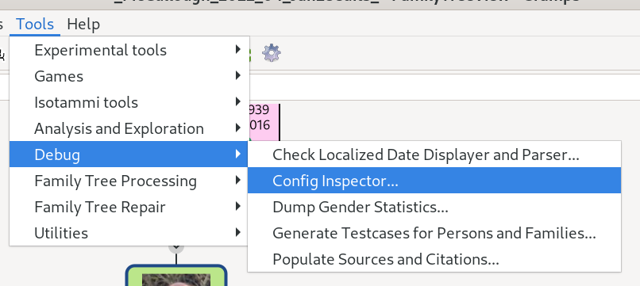
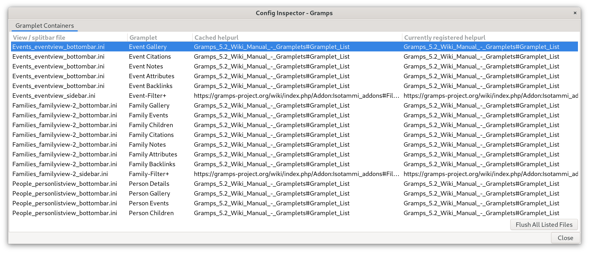

# Configuration Inxpsector

This tool was quickly cobbled together to help diagnose Gramps Configuration (data stored in `.ini` files scattered around the Gramps User Directory.

After installing this (**EXPERIMENTAL** status **DEVELOPER** audience) addon tool with the **Addon Manager**, Open from the **Tools -> Debug** submenu.

This initial version helps diagnose problems with the configuration of Gramplets in the various containers: the Dashboard and splitbars (sidebar and bottombar) for the various view modes of the Navigator categories.  

