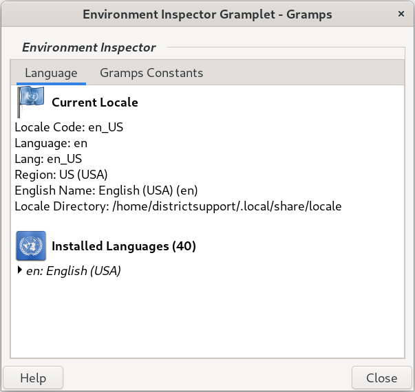
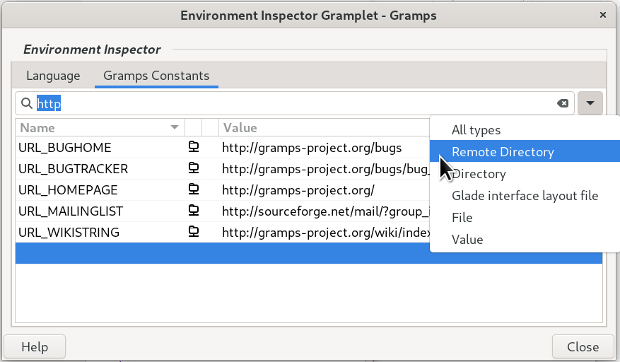

# Environment Inspector for the Gramps genealogy research application 

An interactive diagnostic dashboard gramplet designed to verify installation of language translations, explore internal environment parameters (Gramps [Constants](media/EfficientConstants.md)), and assist with desktop-level troubleshooting or answering tech-support questions about your system.

Instead of navigating complex system configurations or scanning raw application code, this dashboard pane bundles all active configuration variables directly into your interface window.

---

## Purpose
Discover what Gramps knows about your configuration, what languages it can handle

The Environment Inspector is organized into two primary diagnostic views, accessible as clickable tabs along the top edge of the panel:

### 1. Language Diagnostics Tab
This view examines how your current Gramps installation interacts with your computer's localization settings. It is useful for diagnosing missing translations or text-display issues.
* **Current Settings Profile:** Lists your active interface language, geographic region code, specific dialect variants, and the exact path where your computer looks for translations.
* **Installed Languages Catalog:** Scans your hard drive to count and display every translation package currently installed on your system, helping you verify whether a language pack is missing or successfully loaded.
 

### 2. System Constants Directory Tab
This view acts as an interactive index of parameters and structural configuration paths defined inside Gramps.
* **Real-Time Search Bar:** Lets you instantly filter the entire list by typing parts of a variable name or target location value.
* **Category Dropdown Filter:** Allows you to isolate specific entry types, such as Web Links, Files, Storage Directories, or Layout Templates.
* **Visual Icon Status Indicators:** Instantly tells you if an item points to an open folder, a standard document, an online address, or a system variable—and flags whether folders are hidden by your operating system's default privacy settings.

---

## Interaction Shortcuts & Power Actions

The inspector features context actions designed to speed up tech-support troubleshooting and clipboard management:

### One-Click Clipboard Exports (Language Tab)
To copy environment summaries for troubleshooting or sharing on support forums, look for the icons next to the section headers:
* **Clicking the Globe Icon:** Copies your full system localization text settings directly to your clipboard.
* **Clicking the Language/A-Z Icon:** Copies your primary language summary row (if the section is closed), or copies the complete list of installed system languages (if the list is expanded).

### Double-Click Launch Actions (Constants Tab)
Double-clicking a row in the Constants directory copies its value to your clipboard and launches its associated application:

| Entry Type Found | Clipboard Effect | Double-Click System Action |
| :--- | :--- | :--- |
| **Local Folder / Directory** | Copies folder path | Launches your system File Manager directly to that folder. |
| **Standard Configuration File** | Copies file path | Opens the file in your operating system's default text viewer. |
| **Interface Blueprint File** | Copies layout path | Hands the blueprint file to your native system display engine. |
| **Remote Web Link** | Copies web address | Opens your default web browser directly to that specific URL. |
| **Generic Text Parameter** | Copies text value | No desktop application navigation is triggered. |

### Master List Dump via Sentinel Spacers
A blank padding row is pinned to the absolute bottom of the constants list. Double-clicking this empty space gathers all currently filtered rows into a clean, tab-delimited list and copies it directly to your clipboard for easy pasting into support tickets or spreadsheets.

---

## Future Roadmap (Version 2.x Planned Features)

To extend the utility of the inspector from a purely passive diagnostic readout to an interactive configuration tool, the following enhancements are being considered for the version 2.x release cycle:

* **On-the-Fly Locale Preference Switching:** An interface control allowing users to dynamically switch Gramps' active translation preference directly from the dashboard to preview layouts or run quick multi-language text audits without changing fundamental operating system settings or launching via a command line terminal.
* **Code Snippet Generator:** A contextual utility designed for developers and plugin designers that generates the exact Python syntax required to query or safely import any chosen row value from `gramps.gen.const` into external addons, simplifying script development.

---

## Installation & Activation

1. Download or copy `LocaleChecker.gpr.py` and `LocaleChecker.py` from the plugin repository.
2. Locate the custom plugin folder for your specific operating system:
   * **Linux:** `~/.gramps/gramps52/plugins/`
   * **macOS:** `~/Library/Application Support/gramps/gramps52/plugins/`
   * **Windows:** `%APPDATA%\gramps\gramps52\plugins\`
3. Place both files into that `plugins/` folder.
4. Restart your Gramps application.
5. In the left-hand navigation sidebar, click on the **Dashboard** category.
6. Right-click any empty space inside the main Dashboard area, highlight **Add Gramplet**, and select **Environment Inspector** from the pop-up selection list.

---

## Technical Specifications & AI Lineage

<b>Click to expand developer specifications, versioning, and open-source documentation</b>

### System Environment Specifications
* **Minimum Software Target:** Gramps 5.2.0 or later.
* **Component Classification:** Plugin Type: Dashboard Gramplet (evaluated asynchronously).
* **UI Render Engine:** Native GTK+ 3.0 utilizing custom text-view anchor containers.
* **Component Version:** 1.0.5

### AI Contribution and Review History
In accordance with the open-source **GNU General Public License v2.0 or later** and the standard *Gramps AI Contribution and Validation Guidelines*, the development lineage of this codebase is explicitly certified below:

1. **Core Logical Framework (v1.0.0):** Layout blueprints and initialization protocols generated via ChatGPT (OpenAI).
2. **Structural Engineering & Interface Maintenance (v1.0.1 – v1.0.5):** Refactored, debugged, and enhanced by Claude Sonnet 4.6 (Anthropic, `claude-sonnet-4-6`, release May 2026). Key additions include custom layout notebook isolation, search parameters, cross-platform hidden attributes, and dynamic text buffer geometry controls.
3. **Documentation Architecture:** This user guide and troubleshooting manual was generated by Gemini 1.5 Pro (Google, `gemini-1.5-pro-20240514`), extracting technical functionality from the python logic to create an accessible end-user document.

