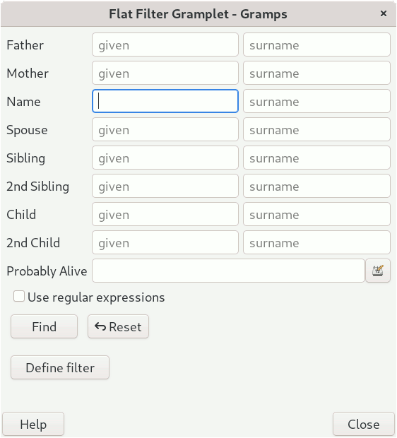

# FlatFilter — Extended Person Filter Gramplet for Gramps

**Author:** Paul Womack (developer name: BugBear)  
**Maintainer:** *(position vacant — see "Taking Over Maintenance" below)*  
**License:** GNU General Public License v2 or later (GPL-2.0-or-later)  
**Gramps target version:** 5.2 and 6.0+  
**Plugin version:** 1.0.2  
**Status:** Stable

---

## Overview


FlatFilter is a sidebar/bottombar Gramplet for Person-oriented [Gramps](https://www.gramps-project.org/) views that extends the built-in Person Filter with a richer set of relationship-aware name-matching fields.

Where the standard Person Filter offers a single *Name* search box, FlatFilter gives you **two entry boxes per relationship role** — one for given/personal names and one for family/surnames — so you can narrow searches precisely, with or without regular expressions.

Supported filter rows:

| Row label | What it matches |
|-----------|-----------------|
| **Father** | Given or family name of the person's father |
| **Mother** | Given or family name of the person's mother |
| **Name** | The person's own given or family name |
| **Spouse** | Given or family name of any spouse |
| **Sibling** *(× 2)* | Given or family name of any sibling |
| **Child** *(× 2)* | Given or family name of any child |
| **Probably Alive** | Date or date-range expression (e.g. `before 1900`) |

A *Use regular expressions* checkbox activates regex matching in all fields simultaneously.

---

## Background

FlatFilter was written by Paul Womack (BugBear) to fill a gap in the standard Gramps filter sidebar: the inability to search separately on given names versus surnames, and the absence of quick relationship-relative name filters.

[Paul suffered a serious stroke in April 2026 and is seeking volunteers to continue maintaining the gramplet](https://gramps.discourse.group/t/filter-any-take-over-help/9725). If you are willing to take on that role, please see the section below.

---

## Requirements

- Gramps 5.2 or later (GTK+/GNOME desktop application)
- Python 3.10 or later
- No additional third-party Python packages are required; the gramplet uses   only the Gramps core libraries and PyGObject (GTK bindings).

---

## Installation

### Via the Gramps Plugin Manager (recommended)

1. In Gramps, open **Help → Plugin Manager**.
2. Switch to the **Addons** tab.
3. Search for *FlatFilter* and click **Install**.

---

## Activating the Gramplet

FlatFilter is available in the **People**, **Relationships** or **Families** view category.

1. Switch to the **People** view (navigator icon or **View → People**).
2. Click the drop-down arrow (∨) on the **Sidebar** or **Bottombar** to open    the gramplet selector.
3. Choose **Flat Filter** from the list and click **Add**.

The gramplet docks into the sidebar/bottombar panel.  Fill in as many or as few fields as you like, then press **Enter** (or click the **Apply** button that appears in the toolbar) to apply the filter to the People list.  Click **Reset** or clear all fields and re-apply to remove the filter.

---

## Usage

### Basic name search

Type part of a name into the *given name* (left) box or the *family name* (right) box for any row.  Matches are case-insensitive substrings by default.

Example — find everyone whose **father's surname** starts with "Mac":

- In the **Father** row, leave the left box empty and type `Mac` in the right   box.

### Regular expressions

Check **Use regular expressions** to switch all fields to regex mode.

Example — find people with a **spouse** whose given name is "Ann", "Anne", or "Anna":

- Check *Use regular expressions*.
- In the **Spouse** row, type `Ann(e|a)?` in the left box.

### Probably Alive

Type a Gramps date expression into the **Probably Alive** field.  The gramplet passes this to the built-in `ProbablyAlive` filter rule.

Examples of valid expressions (locale-dependent):

```
before 1900
between 1800 and 1900
```

### Combining filters

All active fields are combined with **AND** logic — a person must match every non-empty field to appear in the results.

---

## Technical notes

### Filter rules provided

**FlatFilter** registers the following private filter-rule classes (used only internally by the gramplet; they are not exposed in the Gramps Filter Editor):

| Class | Matches |
|-------|---------|
| `RegExpPersonal` | Given name, title, or nickname |
| `RegExpFamily` | Surname, suffix, title, family nickname, or call name |
| `HasNamedFather` | Person's father matches a name rule |
| `HasNamedMother` | Person's mother matches a name rule |
| `HasNamedSpouse` | Any spouse matches a name rule |
| `IsSiblingofNamedSibling` | Any sibling (via main parent family) matches a name rule |
| `HasNamedChild` | Any child matches a name rule |
| `HasName` | The person themselves match (with female surname → spouse surname logic) |

### Female surname handling

For the **Name / family** field, if the person is female, **FlatFilter** also searches the surnames of the person's spouses, reflecting the common genealogical practice of recording married surnames.

### Code structure

```
FlatFilter/
├── FlatFilter.py      # All rule classes, sidebar filter, and gramplet class
└── FlatFilter.gpr.py  # Gramps plugin registration
```

---

## Known limitations

- Sibling matching uses only the *main* parent family (`get_main_parents_family_handle`), not all parent families.  Persons with multiple parent families may miss some siblings.
- The `_HasNamedRelation` hierarchy mixes composition and inheritance in a way that the original author acknowledged as "slightly nasty".  Future refactoring   is welcome.
- There are currently two identical **Sibling** rows and two identical **Child** rows in the UI. These were placeholders for planned distinct filter variations;   they are harmless duplicates in the current release.

---

## Contributing

Bug reports and patches are welcome.  Please follow the [Gramps developer guidelines](https://www.gramps-project.org/wiki/index.php/Howto:_Contribute_to_Gramps) when submitting code, including the [AI-generated code disclosure requirements](https://www.gramps-project.org/wiki/index.php/Howto:_Contribute_to_Gramps#AI_generated_code) if applicable.

Code must pass:

```bash
black FlatFilter.py
pylint FlatFilter.py   # target score ≥ 9.0
mypy FlatFilter.py
```

Tests live in `test/` and use the `unittest` framework:

```bash
GRAMPS_RESOURCES=. python3 -m unittest discover -p "*_test.py"
```

---

## Taking Over Maintenance

Paul Womack (BugBear) is seeking a new maintainer following his stroke in April 2026.  If you are willing to take on this role, please:

1. Open an issue or post on the [Gramps Discourse forum](https://gramps.discourse.group/) with the subject    *"FlatFilter — volunteering as maintainer"*.
2. Review the known limitations above and the TODO comments in the source.
3. Ensure you have a working Gramps development environment before accepting.

Responsibilities of a maintainer include triaging bug reports, reviewing and merging patches, keeping the gramplet compatible with new Gramps releases, and tagging new plugin-manager releases.

---

## Changelog

### 1.0.0 (initial release)

- Split name entry into given/personal and family/surname boxes for each relationship role.
- Relationship-aware rules: father, mother, own name, spouse, sibling, child.
- Probably-Alive date range field.
- Regular-expression support across all fields.

---

## Acknowledgements

- Paul Womack (BugBear) — original author and designer.
- The Gramps development team for the `SidebarFilter`, `GenericFilter`, and `Rule` infrastructure that FlatFilter builds upon.

---

## Licence

```
This program is free software; you can redistribute it and/or modify it under the terms of the GNU General Public License as published by the Free Software Foundation; either version 2 of the License, or (at your option) any later version.

This program is distributed in the hope that it will be useful, but WITHOUT ANY WARRANTY; without even the implied warranty of MERCHANTABILITY or FITNESS FOR A PARTICULAR PURPOSE.  See the GNU General Public License for more details.

You should have received a copy of the GNU General Public License along with this program; if not, write to the Free Software Foundation, Inc., 51 Franklin Street, Fifth Floor, Boston, MA 02110-1301 USA.
```
