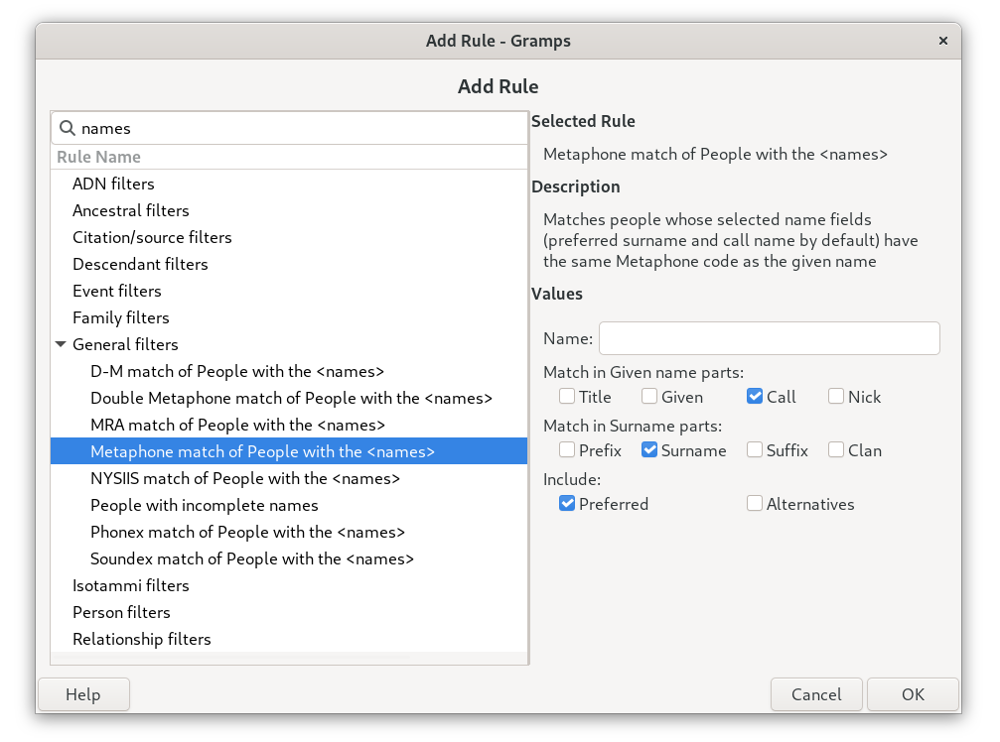
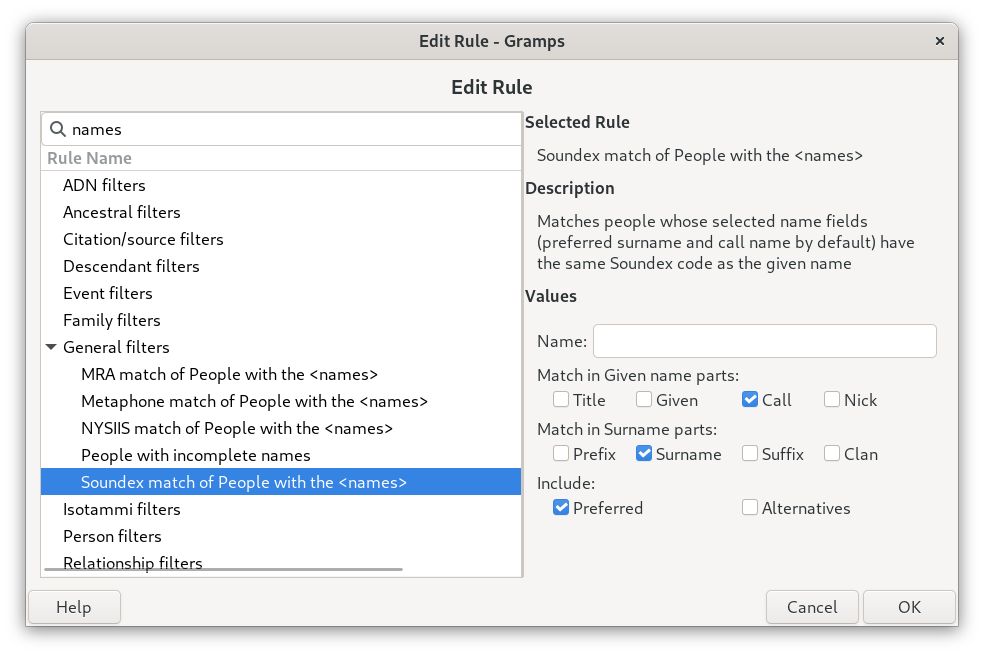
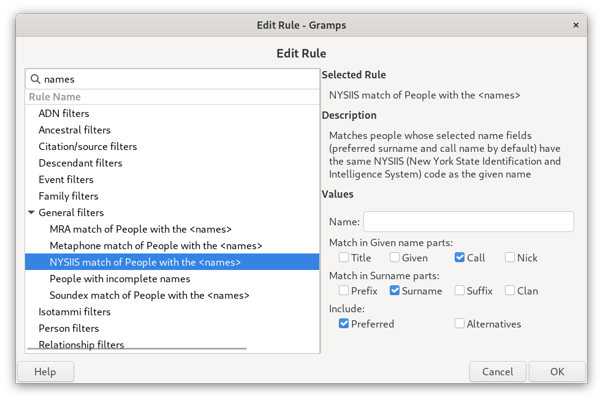
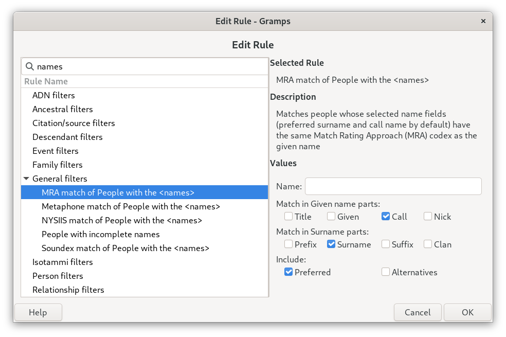
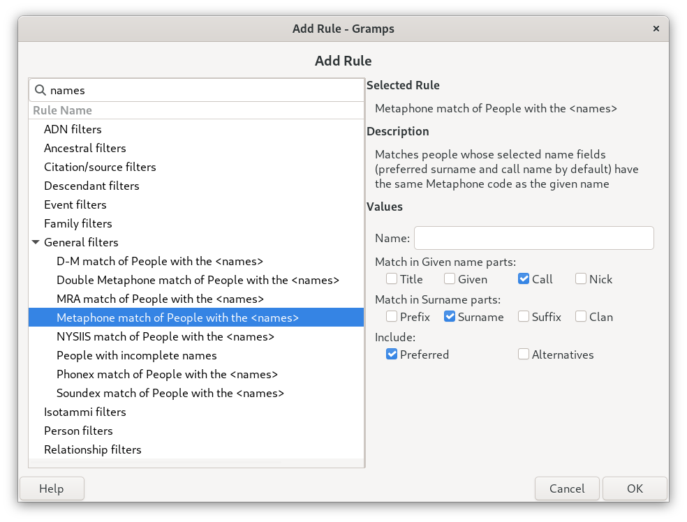
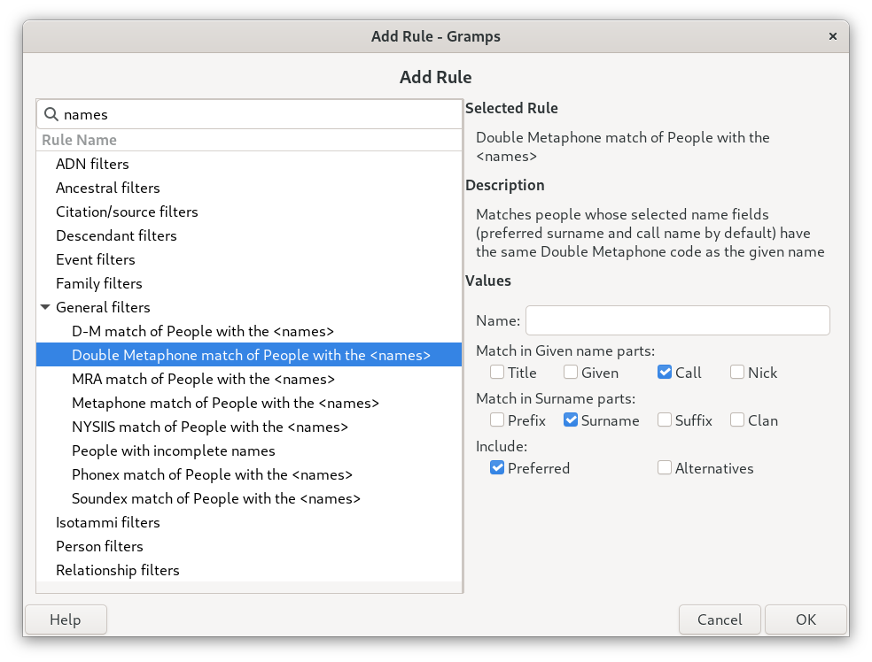
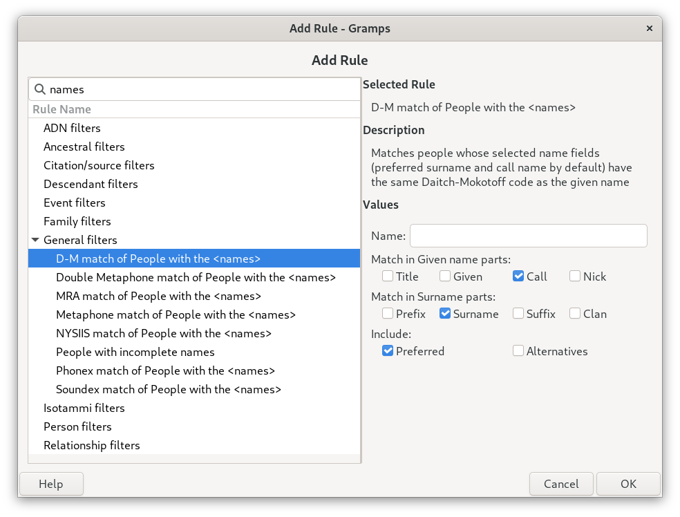
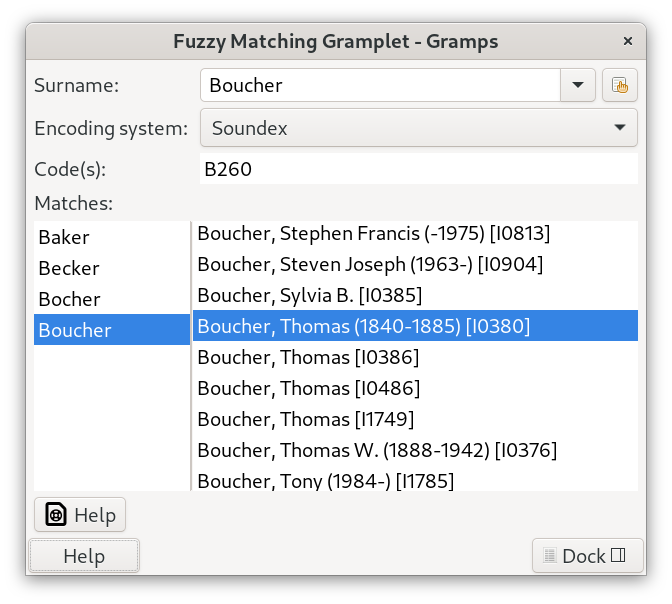
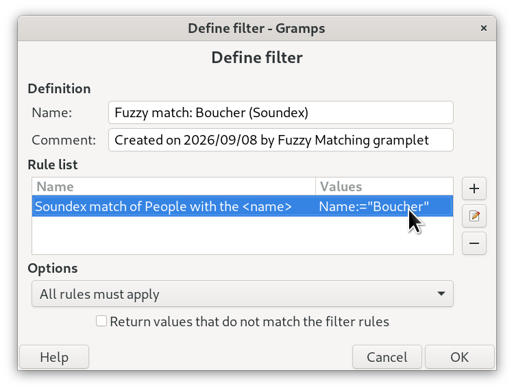
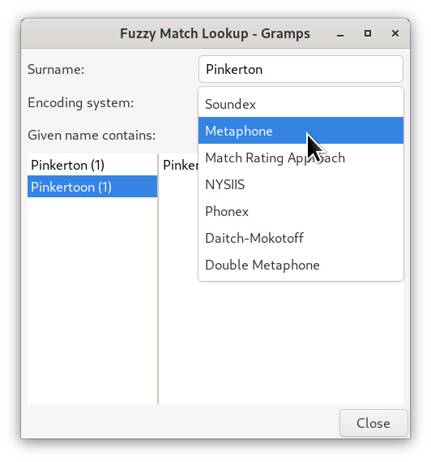

# Phonetic Filter Rules
This addon bundles seven Person filter rules — **Soundex**, **NYSIIS**, **Match Rating Approach** (MRA), **Phonex**, **Metaphone**, **Double Metaphone** and **Daitch-Mokotoff** — that work anywhere Gramps filters do. Each can compare any combination of name fields you choose, not just the surname. Developed for use with the Fuzzy Matching gramplet but not limited to use only inside it. If you just want the gramplet's own Matches panel, you do not need this document at all; it is for building your *own* filters with these rules directly.

## Features
* [Finding the rules](#finding-the-rules) — where they show up in the Filter Editor
* [Choosing which name fields to match](#choosing-which-name-fields-to-match) — surname only, or given names, nicknames, alternate names and more
* [Building a filter with one of these rules](#building-a-filter-with-one-of-these-rules) — a worked example
* [Using these rules from other features](#using-these-rules-from-other-features) — the Fuzzy Matching gramplet, the Custom Filter it can create for you, the floating lookup dialog, and other addons
* [Combining a rule with other conditions](#combining-a-rule-with-other-conditions) — why you would do this instead of using the gramplet's own shortcut
* The Rules
   * [Soundex](#soundex) — the classic genealogy code, now with name-field choices
   * [Phonex](#phonex) — a Soundex refinement that catches a few common leading-letter patterns Soundex misses
   * [NYSIIS](#nysiis) — catches more spelling drift than Soundex, in exchange for a longer code
   * [Match Rating Approach](#match-rating-approach) — a compact code, best for near-identical spellings
   * [Metaphone](#metaphone) — models English pronunciation more closely than Soundex
   * [Double Metaphone](#double-metaphone) — the second-generation Metaphone; can return two codes for one name
   * [Daitch-Mokotoff](#daitch-mokotoff) — built for Slavic and Germanic-derived Jewish surnames; a name can encode to several codes at once

## Finding the rules
Open **Edit ▸ Person Filter Editor** (or the "Edit" button next to the filter dropdown on the People view), create or edit a filter, and click **Add Rule...**. (Search for "match of People".) All seven rules appear under **General filters**, alongside Gramps' own built-in rules, as:

* `Soundex match of People with the <names>`
* `NYSIIS match of People with the <names>`
* `MRA match of People with the <names>`
* `Metaphone match of People with the <names>`
* `Double Metaphone match of People with the <names>`
* `Phonex match of People with the <names>`
* `D-M match of People with the <names>`

Short names and acronyms keep the list compact; each rule's description, shown when you select it, gives the full name of its encoding system. Gramps' own built-in rule, `Soundex match of People with the <name>`, also still appears — see [Soundex](#soundex) for how the two differ.

Each rule takes a **Name** to compare against, and a **Match in** choice of which name fields to compare it with.

## Choosing which name fields to match
The **Match in** option sits below the Name field, in three groups:
* **Match in Given name parts:** Title, Given, Call, Nick
* **Match in Surname parts:** Prefix, Surname, Suffix, Clan
* **Include:** Preferred, Alternatives — whether to look in each person's preferred name, their alternate names, or both

The default is **Surname** and **Call** in the **Preferred** name. A search for "Johnson" finds the Johnsons and Jonsons, not every John; a search for "John" finds people who go by John.

* **Call** uses the Call name field; when that is empty, it uses the first given name, the same way Gramps itself treats a blank call name. So "John Henry Smith" is found by "John", but "Henry John Doe" is not, unless you tick **Given**.
* Tick **Given** to look at every given name, word by word, so "William" also finds "Joseph William".
* Tick **Alternatives** under Include to also look in people's alternate names, for whichever fields are ticked — for example, married and birth surnames recorded as alternate names. Untick **Preferred** to look *only* in alternate names.
* **Clan** is the family nickname field.

Every surname of a double or compound surname is compared on its own, so "Ann Thompson Johnson" is found by either "Thompson" or "Johnson".

Filters saved before this option existed get the default. Gramps may note "Too few arguments" once in its console when loading one; saving the filter again stores the option.

## Soundex
Soundex is the classic four-character genealogy code, the same one Gramps' own SoundEx gramplet shows. It groups names that sound alike when spoken, such as "Smith" and "Smyth".

Gramps already has a built-in Soundex rule, **Soundex match of People with the \<name\>**. It always searches every name field — given, surname, call and nick names, in primary and alternate names — with no way to narrow it, so a search for the surname "Thomas" also returns everyone named Thomas. This addon's **Soundex match of People with the \<names\>** uses the same code but lets you choose the fields with **Match in**. Ticking Given, Call, Nick and Surname, with both Preferred and Alternatives, gives about the same reach as the built-in rule.

When this addon is installed, the Fuzzy Matching gramplet uses this rule for Soundex, both to work out which surnames match and to build a Custom Filter from a match — see [Using these rules from other features](#using-these-rules-from-other-features).

## Phonex
Phonex (Lait & Randell, 1996) is a Soundex refinement built for English/British surnames. It folds a handful of leading letters and letter-pairs plain Soundex treats as unrelated — "Kn-" and "N-" code the same, and so do "Wr-" and "R-", and "Ph-" and "F-" — and it treats R and L differently depending on whether a vowel follows them, which Soundex doesn't do at all. Its codes are the same four-character, letter-plus-three-digits shape as Soundex's, so the two are easy to compare side by side on the same name.


## NYSIIS
NYSIIS (New York State Identification and Intelligence System) keeps more information about vowel position than Soundex does, which is both its strength and its one real quirk: it does not treat "Y" as a vowel, so some pairs Soundex considers a match — "Smith" and "Smythe" is the classic example — come out as different NYSIIS codes. That is not a bug to work around; it is simply a different, and often complementary, way of grouping spelling variants. If Soundex is not catching a variant you expect, NYSIIS sometimes will, and vice versa.


## Match Rating Approach
Match Rating Approach (MRA) produces a shorter, more literal code: it drops non-leading vowels and collapses repeated consonants, without Soundex's or NYSIIS's broader letter-grouping rules. Worth knowing before you reach for it: Match Rating Approach's reputation for catching loose spelling variants comes from its own *comparison* algorithm, which tolerates codes that are similar but not identical — this rule does not implement that comparison, only the plain code. Used as an exact-match filter rule (the only kind Gramps supports), it will group truly identical spellings and very close variants, but is the most literal of the rules here — it won't catch as much drift as NYSIIS or Metaphone will.


## Metaphone
Metaphone models English pronunciation more closely than Soundex: it accounts for silent letters and consonant clusters Soundex's simpler scheme misses — "PH" becoming an F sound, a silent "GH", and others — and produces a shorter, variable-length code rather than Soundex's fixed four characters. It agrees with Soundex on more pairs than NYSIIS does (both correctly group "Smith" and "Smyth", for example), while still catching some variants Soundex's cruder letter-grouping misses.


## Double Metaphone
Double Metaphone (Lawrence Philips, 2000) is the second-generation Metaphone, and the one rule here that can produce two codes for a single name at once rather than one: it returns a primary code and, where a name is genuinely ambiguous, a secondary one too. "Smith" encodes to SM0 and XMT; "Schmidt" encodes to XMT and SMT — different primaries, but the same secondary, so the two are still linked. As a filter rule, a name matches if it hits *either* of the target name's codes, which is what lets it catch a German-derived and an English-derived reading of the same surname at once.


## Daitch-Mokotoff
Daitch-Mokotoff Soundex (1985) was built specifically for Slavic and Germanic-derived Jewish surnames, and is the standard indexing system used by JewishGen and the U.S. Holocaust Memorial Museum. It differs from every other rule here in a few ways worth knowing: codes are six digits rather than four, the first letter is itself coded rather than kept literally, and a name can legitimately produce several distinct codes at once, not just two — "Jackson" alone is four different codes. As with Double Metaphone, a filter built from this rule matches on any one of the target name's codes. One limit to know before reaching for it: the coding chart is built from Latin-letter combinations, so it expects a Latin/Romanized spelling of the name — it won't help with a name still recorded in Hebrew or Cyrillic script.


## Building a filter with one of these rules
As a worked example, here is building a filter that finds everyone with a NYSIIS-equivalent surname to "Boucher", including surnames recorded as alternate names:

1. **Edit ▸ Person Filter Editor**, then **Add** to create a new filter (or pick an existing one to edit).
2. **Add Rule...**, find "NYSIIS match of People with the \<names\>" under *General filters*, and select it.
3. Type `Boucher` into the **Name** field.
4. Under **Match in**, untick **Call** (so only surnames are compared), leave **Surname** and **Preferred** ticked, and also tick **Alternatives** under Include. Click **OK**.
5. Give the filter a name (e.g. "NYSIIS: Boucher") and click **OK**.
6. The new filter is now available anywhere Gramps lets you pick a Person filter — the filter side-bar on the People view, reports, and more.

Swap in any of the other six rules; everything else about the steps is identical.

## Using these rules from other features
Besides working as ordinary filter rules, each rule also makes its phonetic encoding system available to other features in Gramps. Any Person rule registered with an id starting `FuzzyMatchingEncoder:` shows up wherever a feature offers an **Encoding system** choice, so a rule added to this addon later, or shipped by another addon, appears there without any change to the feature. (Developers: see [FuzzyDev.md](https://github.com/emyoulation/CuratedGrampsPlugins/blob/main/gramps61/source/Fuzzy/FuzzyDev.md).)

### The Fuzzy Matching gramplet

Type a surname, pick an **Encoding system** from the list of every rule installed, and the gramplet shows the phonetic code(s) for that name, every surname in the Family Tree sharing a code, and the people who carry each one. See the [gramplet's own README](https://github.com/emyoulation/CuratedGrampsPlugins/blob/main/gramps61/source/Fuzzy/README.md) for everything it does.

### Creating a Custom Filter from the gramplet
Double-clicking a surname in the gramplet's left Matches column builds a Custom Filter for you, using the Encoding system currently selected:

1. Choose an **Encoding system** in the gramplet.
2. Double-click any surname in the left Matches column. It does not have to be the one you typed; the column can list several surnames that share a code.
3. A "Define filter" dialog opens, pre-filled with one rule from the selected Encoding system, with that surname as its **Name**. The filter is named `Fuzzy match: <surname> (<encoding system>)`, with a comment recording the date and that the gramplet created it.

4. Every **Match in** box is ticked to start with — all the given-name and surname parts, in both the **Preferred** and **Alternatives** names — so the filter begins as wide as it can be. Untick whatever you don't want before saving.
5. Click **OK** to save the filter. Nothing is saved until you do; **Cancel** discards it. Once saved, it is available anywhere Gramps lets you pick a Person filter.

Things worth knowing:
* **It can return more people than the Matches column lists.** The gramplet's right-hand list only includes people whose preferred name has a matching surname. A filter with every box ticked also finds people whose given name, call name, nickname, title or alternate names match. To reproduce the gramplet's list exactly, untick everything except **Surname** under **Preferred**; the number next to the **Matches:** heading should then equal the filter's count.
* **Soundex without this addon.** If this addon isn't installed, the gramplet falls back to Gramps' own built-in Soundex rule. That rule has no **Match in** option and always searches every name field, in preferred and alternate names.
* **An Encoding system with no matching rule.** If one ever has none, the gramplet tells you it can't create a filter for it instead of doing nothing.
* **An older version of this addon.** With this gramplet, its rules ignore the "all boxes ticked" request and start with their own default, **Surname** and **Call** in the **Preferred** name.

To add other conditions to a filter the gramplet created, such as a birth-year range or a second surname, edit it in the Person Filter Editor — see [Combining a rule with other conditions](#combining-a-rule-with-other-conditions).

### The floating Fuzzy Match Lookup dialog

Where a persistent panel doesn't suit the feature, another addon can open the floating **Fuzzy Match Lookup** dialog instead. It lists the surnames in the tree that match a name under an Encoding system of its own, chosen independently of the gramplets, and appears under Gramps' **Windows** menu while it is open. For example, in the Photo Tagging gramplet you can choose `Fuzzy Match Lookup...` from the list panel's context menu to check a name against the people already in the tree, and select or navigate to the Active Person from the result.

### Other addons
The gramplet's index, its person-display formatting and the lookup dialog are available to any addon; [FuzzyMatchAPI.md](https://github.com/emyoulation/CuratedGrampsPlugins/blob/main/gramps61/source/Fuzzy/FuzzyMatchAPI.md) is written for that addon's developer, or their AI coding assistant, to read on its own. An addon that builds a filter in code with one of these rules can pass `"all"` as the rule's second argument (the **Match in** value) to tick every name field, in preferred and alternate names, without listing the fields. This keeps working if name fields are added or removed later.

## Combining a rule with other conditions
The [Fuzzy Matching gramplet's](https://github.com/emyoulation/CuratedGrampsPlugins/blob/main/gramps61/source/Fuzzy/README.md) own "Define filter" double-click action builds exactly this kind of single-rule filter for you automatically, pre-filled with whichever surname you double-click and whichever Encoding system is currently selected, with every Match in box ticked to start with (see [Creating a Custom Filter from the gramplet](#creating-a-custom-filter-from-the-gramplet)) — for a quick, one-off check, that is almost always faster than building one by hand here. Building a filter yourself is worth it when you want other name fields, or to combine one of these rules with something the gramplet's shortcut does not offer: AND'd with a birth-year range, OR'd with a second surname, restricted to a specific tag, and so on — anything the Filter Editor's own rule list and "All rules must apply"/"At least one rule must apply" options support.

## Files
| File | Purpose |
|---|---|
| `soundexrule.gpr.py`, `soundexrule.py` | Soundex rule (`HasSoundexNames`) |
| `nysiisrule.gpr.py`, `nysiisrule.py` | NYSIIS rule (`HasNysiisName`) |
| `matchratingrule.gpr.py`, `matchratingrule.py` | Match Rating Approach rule (`HasMatchRatingName`) |
| `phonexrule.gpr.py`, `phonexrule.py` | Phonex rule (`HasPhonexNames`) |
| `metaphonerule.gpr.py`, `metaphonerule.py` | Metaphone rule (`HasMetaphoneName`) |
| `doublemetaphonerule.gpr.py`, `doublemetaphonerule.py` | Double Metaphone rule (`HasDoubleMetaphoneNames`) |
| `daitchmokotoffrule.gpr.py`, `daitchmokotoffrule.py` | Daitch-Mokotoff rule (`HasDaitchMokotoffNames`) |
| `phonetic_name_parts.py` | The **Match in** option shared by all seven rules. Keep it in this folder: without it the rules still load, but compare the preferred surname only and show no Match in option. |
| `media/` | Screenshots for this document |
| `test/` | `unittest` tests: `phonetic_name_parts_test.py`, `phonetic_rules_test.py`, and one file for each newer rule — `phonexrule_test.py`, `doublemetaphonerule_test.py`, `daitchmokotoffrule_test.py` — sharing test doubles in `_fakes.py` |

## Running the tests
```bash
GRAMPS_RESOURCES=. python3 -m unittest discover -p "*_test.py"
```

Run this from this addon's folder, with Gramps importable.

## AI-assisted contribution disclosure
Portions of this addon were generated with AI assistance, per the Gramps project [AI-generated code guidelines](https://www.gramps-project.org/wiki/index.php/Howto:_Contribute_to_Gramps#AI_generated_code). Suggested commit-message trailers for whoever lands this as a real commit:

#### Generated-by: Claude Sonnet 5 (Anthropic) — the original NYSIIS, Match Rating Approach and Metaphone rules
#### Generated-by: Claude Opus 5.5 (Anthropic) — the Soundex rule, the Match in option (`phonetic_name_parts.py`), the rule renames and the tests, from prompts to add Relationship Filter-style name-field granularity so a surname search need not also match given names, under the [Gramps AGENTS guidelines](https://github.com/gramps-project/gramps/blob/master/AGENTS.md)
#### Generated-by: Claude Sonnet 5 (Anthropic) — the Phonex, Double Metaphone and Daitch-Mokotoff rules, ported respectively from Lait & Randell's 1996 Phonex algorithm (via the peer-reviewed R `phonics` package's implementation), Andrew Collins' public-domain Python Double Metaphone (from Lawrence Philips' original algorithm), and Apache Commons Codec's `DaitchMokotoffSoundex` (Apache-2.0) - each checked against reference codes published independently of the ported source before shipping
#### Generated-by: Claude Sonnet 5 (Anthropic) — the `"all"` value for the Match in option (`phonetic_name_parts.py`) and the Fuzzy Matching gramplet's Define filter change that uses it, from a prompt asking that a filter created from the gramplet start with all name parts selected, in both preferred and alternate names
