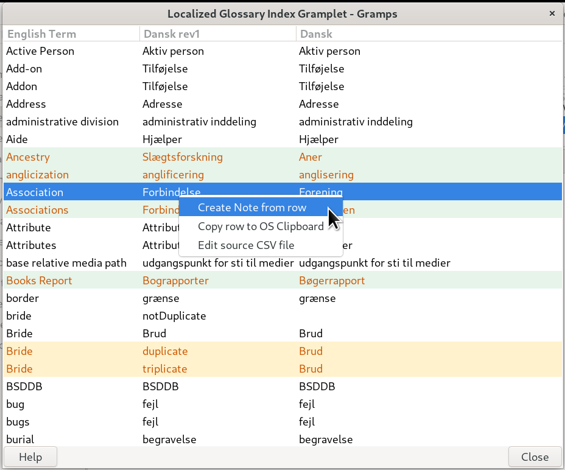
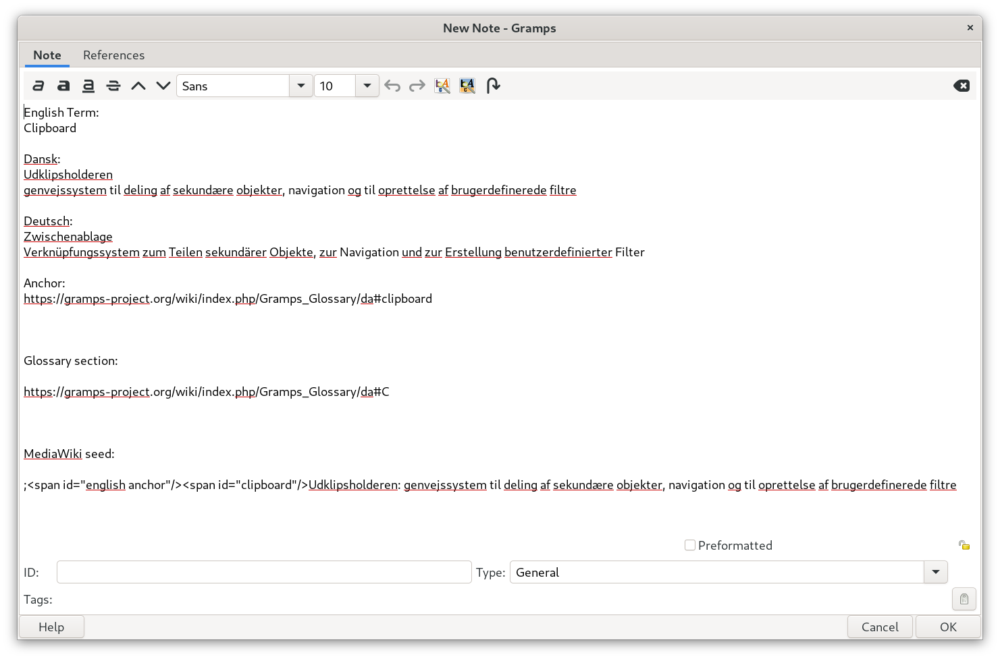
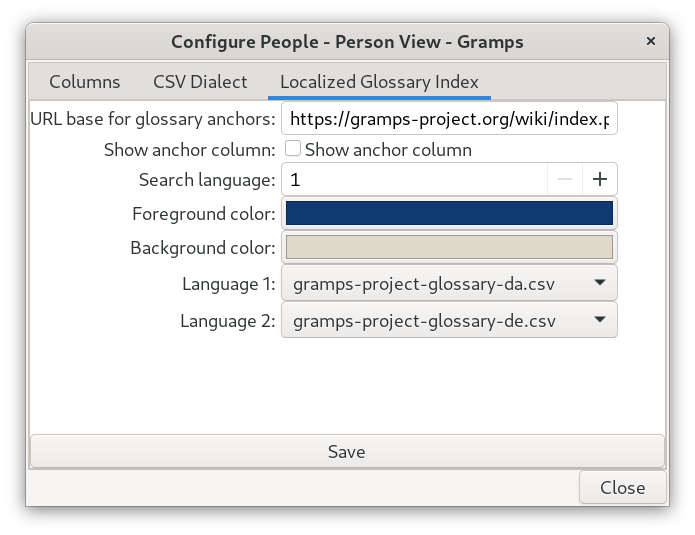

#  *LocalTerm* gramplet

a Localized index to [Gramps Glossary](https://gramps-project.org/wiki/index.php/Gramps_Glossary) terminology

 **This plugin is still in the Experimental stage.**  
*Not feature complete nor ready for general release. Your work done improving a data file is likely to be lost as the gramplet evolves.*

The LocalTerm gramplet (available for Dashboard, people-based and Notes view categories), will show you a table of glossary terminology (terms) for [Gramps for Desktops](https://gramps-project.org/wiki/index.php/Gramps_Glossary#gramps). 
It will show the term, as it appears in the Python source code's translatable strings, and up to two additional locale (language) translations.
The locale lookups are [provided in separate Weblate-generated CSV file](gramps-project-glossary/README.md). One for each language. (However, our CSVs have been modified with additional terms and corrections.) 

Double-clicking a row will open a browser page with the **Glossary in the *Gramps* wiki**  in the language of the 2nd column. If the term is unanchored, the local language will be scrolled to the top of page. (Which can be taken as a hint that the Glossary page has an opportunity for improvement.) If the anchor exists on the destination page, the browser will be scrolled to the row's term Dictionary for Gramps. 

Clicking one of the language columns and start typing will do a search in that column based upon your typing


## Context menu options

### `Create Note from row` information:
This context menu option copies the selected terms in each language and the Glossary URL for the term (from the 2nd column). Intended for pasting into Gramps Glossary localization page. 

``` text
English Term:
Clipboard

Dansk:
Udklipsholderen
genvejssystem til deling af sekundære objekter, navigation og til oprettelse af brugerdefinerede filtre

Deutsch:
Zwischenablage
Verknüpfungssystem zum Teilen sekundärer Objekte, zur Navigation und zur Erstellung benutzerdefinierter Filter

Anchor:
https://gramps-project.org/wiki/index.php/Gramps_Glossary/da#clipboard


Glossary section:
https://gramps-project.org/wiki/index.php/Gramps_Glossary/da#C


MediaWiki seed:
;<span id="english anchor"/><span id="clipboard"/>Udklipsholderen: genvejssystem til deling af sekundære objekter, navigation og til oprettelse af brugerdefinerede filtre
```



### `Copy row to OS Clipboard` information:

This context menu option copies the selected terms in each language and the Glossary URL for the term (from the 2nd column). Intended for pasting into the various Gramps support forums or eMails. 
``` text
Association	Forening	Verknüpfungen	https://gramps-project.org/wiki/index.php/Gramps_Glossary/da#association
```

### `Edit source CSV file` action:

The CSV files are originally downloaded with the customized download (using the `.csv` 

Opens whatever app your OS has associated with `.csv` type files. And load the CSV associated with populating the 2nd column. If you choose to edit this file, it is better to save it under a different file name. (These files are in the naming style and format of exports from Weblate's "Glossary" component.) Then use the Configure to choose the edit file for Language 1 and the original for Language 2. This will let you view the english term, your updated translation, and the original translation; all side-by-side for direct comparison. 

## Configure options:

Choose the View -> Configure menu items or click the Configure toolbar icon.



