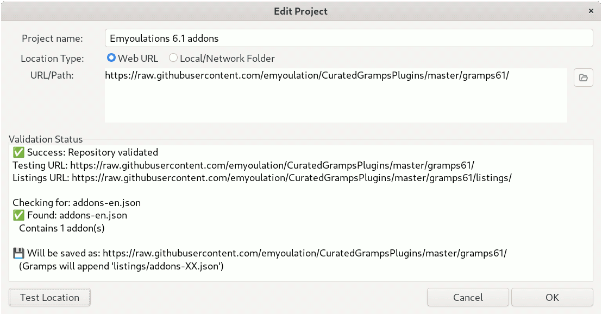
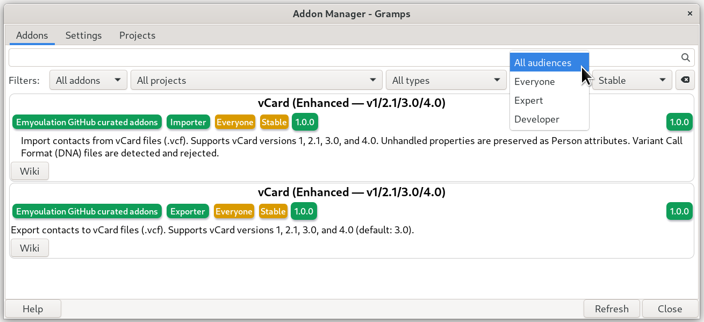
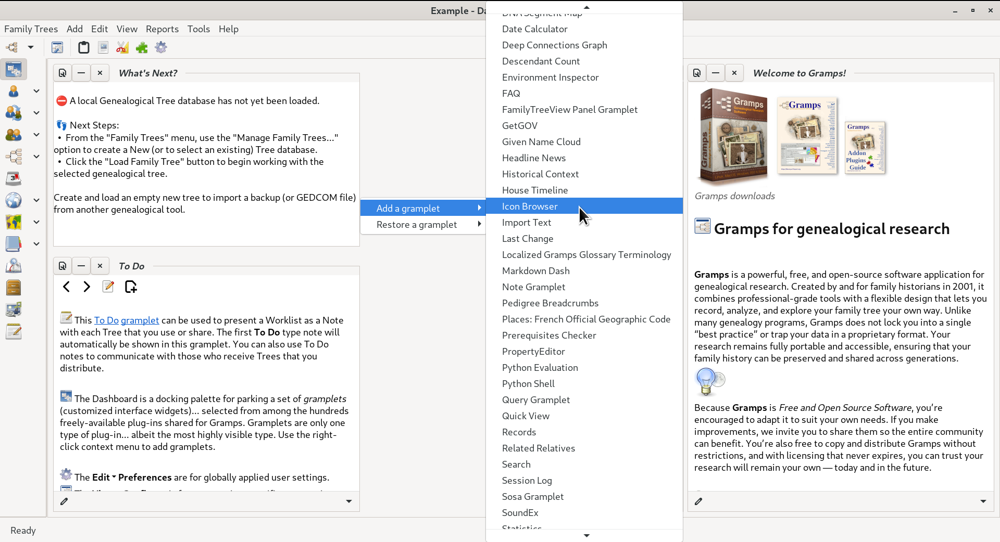

# Icon Browser (Gramps Dashboard gramplet) 
<!-- edit=True status=True browse=True -->
### Version 1.1.3 (Beta Evaluation)

### Target Environment: Gramps v6.1 Beta

## OVERVIEW
The Icon Browser is a specialized, interactive utility designed for the Gramps Dashboard. It serves as a real-time developer and power-user tool that inventories every icon asset available within the current GTK plus / GNOME icon-theme cascade. Following the [Freedesktop.org Icon Theme Specification](https://specifications.freedesktop.org/icon-theme/latest/), this plugin provides a dual-pane administrative interface to safely inspect active system assets, trace lookups, and streamline structural development.

It is a tool for GUI Developers and Theme Designers as part of a curated collection of Markdown-related tools, engineered to assist creators writing localized reports, interface extensions, or documentation layout schemas within the ecosystem.

## Installation via the Addon Manager 
To install this addon plug-in with Gramps version 6.1, you must [add a project](https://gramps-project.org/wiki/index.php/Gramps_6.0_Wiki_Manual_-_Navigation#Other_Projects) to the built-in [Addon Manager](https://gramps-project.org/wiki/index.php/Gramps_6.0_Wiki_Manual_-_Navigation#Using_the_Addon_Manager) to read from the third-party GitHub repository curated by Emyoulation.

1. Launch **Gramps**  
2. from the **Edit** menu, select the **Addon Manager...**
3. Select the **Projects** tab and review the list of third-party addon updates.
4. At the bottom of the project listings, select the **Add (+)** to "Insert a project"
5. Give the project a **Project name**, add the project **URL/Path**, and click **OK** to save the new project 
   `https://raw.githubusercontent.com/emyoulation/CuratedGrampsPlugins/master/gramps61/`
 
6. Select the checkbox for the new project and deselect the other projects
7. Select the **Addons** tab and clear the filters.

These addons tend to be *Experimental* **Status** and *Expert*/*Developer* **Audience**. In the **Addons** tab, Clear the default *Stable* **Status** and *Everyone* **Audience** filters that are intended to safeguard novice users.
 

8. Trigger a manual **Refresh** for updated listings. The Addon Manager will securely query the curated Emyoulation repository directory, parsing the listing of available extensions.
9. Select the **Icon Browser** Desktop gramplet from the listed inventory and click **Install**.

The Icon Browser is _**bundled**_ with a set of addons that share a "Markdown" parsing library.  This library supports both standard GitHub Flavored Markdown (GFM) with extensions for linking Gramps objects and icons. So selecting any one of these addons must install all in the bundle.

## Prerequisites
The tool utilizes standard GObject Introspection bindings for its core interface layer. Users must ensure their system environment possesses:
* Gtk 3.0
* Gdk 3.0
* GdkPixbuf 2.0
* Pango 1.0

## Usage 
Once installed in the Addon Manager, The gramplet will be available _**only**_ in the Dashboard's gramplet menu. Follow these deployment steps to dock the gramplet:

1. Select the **Dashboard** [view category](https://gramps-project.org/wiki/index.php?title=Gramps_Glossary#view).
2. Right-click an empty space within the dashboard canvas or click the configuration cog layout button.
3. Select **Add a gramplet** from the context-sensitive menu list.
4. Choose **Icon Browser** from the available options.
 

The Icon Browser benefits from having space to spread out.  Click the docking control icon (tooltip: _Drag to move; click to detach_) in the upper left of the gramplet window to 'undock' it.

 

## KEY FEATURES
* **Live Cascade Inventory**: Indexes active theme icons dynamically, categorizing assets under standard contexts such as Actions, Apps, Categories, Devices, Emblems, Emotes, FileSystems, International, MimeTypes, Places, Status, and Stock.
* **Intelligent Search & Filter**: Offers real-time name matching paired with a structural dropdown context selector to isolate specific layout assets.
* **Comprehensive Dimension Analysis**: Displays available pixel sizes (16px, 22px, 24px, 32px, 48px, 64px, 96px, 128px) and visually distinguishes native graphic sizes from scaled, non-native fallbacks.
* **One-Click Clipboard Injection**: Generates and copies ready-to-use syntax strings instantly, including scalable syntax, explicit dimension parameters, and complete GTK button initialization code snippets.
* **Path Inspector & Trace**: Deconstructs fallback logic by visually mapping lookups from the target string down to hard fallbacks like the generic image-missing graphic, detailing the absolute file path on disk or binary resource origins.
* **Performance Optimized**: Defers detail population and filesystem lookups to background idle loops to maintain snappy, stutter-free interface navigation during heavy scrolling.

## REPOSITORY INVENTORY EXAMPLES

**Incomplete. Work in progress**

When using the built-in clipboard copying functions, the plugin automatically inserts clean text layout lines into your clipboard ring. The formatting output structures are detailed below for your design reference:

Markdown Engine Scalable Syntax Pattern:

Markdown Engine Fixed Dimension Syntax Pattern:

Standard Python Gtk Initializer Construction Block:
```
icon_btn = Gtk.Button()
icon_img = Gtk.Image.new_from_icon_name("your-target-icon-name", Gtk.IconSize.SMALL_TOOLBAR)
icon_btn.set_image(icon_img)
icon_btn.set_relief(Gtk.ReliefStyle.NONE)
icon_btn.set_tooltip_text(_("your-target-icon-name"))
icon_btn.connect("clicked", self._on_icon_clicked)
footer.pack_start(icon_btn, False, False, 0)
```
## TECHNICAL LICENSE AND COPYRIGHT
Copyright (C) 2026 Brian McCullough (emyoulation@yahoo.com)

This program is free software; you can redistribute it and/or modify it under the terms of the GNU General Public License as published by the Free Software Foundation; either version 2 of the License, or (at your option) any later version.

This program is distributed in the hope that it will be useful, but WITHOUT ANY WARRANTY; without even the implied warranty of MERCHANTABILITY or FITNESS FOR A PARTICULAR PURPOSE. See the GNU General Public License for more details.

## EXTENSION CREDITS AND CITATIONS

### Software Code Authoring and Refinement
The implementation logic, user interface geometry, and asynchronous pipeline architecture found within IconBrowserGramplet.py were co-developed and refined utilizing collaborative AI engineering pipelines:

* LLM Architecture Framework: Claude (Anthropic PBC) and Gemini (Google LLC).
* Engineering Models: Generative model cascades spanning the mid-2026 release cycle.
* Core Integration Scope: GTK 3 cascade traversal mechanics, asynchronous layout rendering routines, clipboard memory routing, and structural path trace inspections.

### Technical Documentation and Layout Design
The administrative reference documentation, deployment instructions, and structural layout definitions contained within this README.md resource were authored and formatted exclusively by:

* Documentation Architecture: Gemini (Google LLC).
* Editorial Focus: Structural translation of plugin parameters into clean text schemas, validation of network tracking configurations for the curated Addon Manager repository path, and compliance with strict non-delimited browser display constraints.
