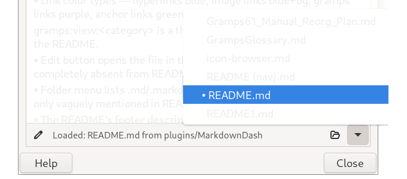

# Markdown Dash (v1.4.0)
<!-- undocked=false -->
[Markdown Based tools](../README.md)
  
   

`README.md` files have become common in Gramps Addon development repositories on GitHub. Unfortunately, most of the conversion of the markdown takes place on the server-side. Opening the files locally with a Browser does not support the markdown. So those development `README.md` files are accessible but crippled when opened locally.  

This where the **MarkdownDash** gramplet exists. It is flexible, local documentation reader for rendering and navigating Markdown (`.md`) documents natively within our genealogy workspace. Engineered for performance and clean desktop integration, it provides an interactive documentation environment using pure **GTK+ 3, Pango, and GdkPixbuf** —completely eliminating heavy dependencies like WebKit, embedded browsers, or third-party parsing packages.

---

## Key Features

- **Architectural Separation:** Designed as a high-performance thin shell (`MarkdownDash.py`) that delegates token parsing, inline table construction, custom styling tags, and icon lookups to a decoupled utility pipeline (`MarkdownUtils.py`).
- **Dynamic Session Cache:** Automatically tracks your reading history across application restarts, persisting your active document location via an internal filesystem cache layer (`.last_file.cache`).
- **Fully Integrated Actions Footer:** Equipped with an interactive bottom toolbar featuring:
    **✎ Edit File** — One-click launcher that pushes the open document safely into your desktop environment's default text/markdown editor.
    **File Status Bar** — Context-aware path display indicating document status and localization origin relative to your base plugin tree.
    **📂 Browse Folders** — Native GTK file chooser tailored with smart file-filters (`*.md`, `*.markdown`) that defaults to sorting available entries descending by modification time.
    **▾ File Selector** — A dynamic companion menu showing a live list of sibling Markdown files in the active directory for seamless context switches.


---

## Custom Directives

Markdown Dash checks the first two lines of any loaded document for file-level instructions and frontis-matter configuration blocks.

### 1. Document Title Override
If a document begins with a standard markdown Header 1 (`#`), the gramplet dynamically rewrites its workspace frame label to match the text.
```markdown
# Custom Dashboard Title
```

2. Layout Visibility Configuration

You can pass strict boolean toggles or layout commands to the text engine inside standard HTML comment wrappers (``) placed within the first two lines:

Available Parameters:

  * `controls=false`: Totally hides the actions footer toolbar for an immersive, read-only presentation.

  * `edit=false / status=false / browse=false / folder=false`: Hides specific individual buttons inside the actions toolbar while leaving the rest visible.

  * `undocked=true`: Automatically detaches the gramplet from its parent dashboard panel grid layout into its own standalone, floating GTK window container upon loading.

##  Rich Link Schemes & Interactive Actions

Links are fully semantic and stylized color-coded markers inside the text area. Clicking elements triggers distinct native operations based on their target prefixes:

1. Hyperlinks (Blue Text)

Standard external web URLs or explicit system protocols open directly in your operating system's default handler.

Example:
``` markdown
Read the [Visual Icon Inventory](icon-browser.md) for a list of available assets.
```
### Renders:
Read the [Visual Icon Inventory](icon-browser.md) for a list of available assets.

3. In-Document Anchor Scrolling (Green Text)

Links targeting internal anchor points automatically jump the GTK viewport scroll adjustments down to the exact header line matching the heading slug.

Example:
``` markdown
Jump directly down to the [Gramps Object Links Section](#gramps-object-links).
```
### Renders:
Jump directly down to the [Gramps Object Links Section](#gramps-object-links).

4.  Image Placeholders & Embedded Pixbufs (Blue Text + Light Background)

Images are automatically scaled to a max display width of 560px and embedded inside the text stream. If a local file path is broken, or a custom target URI is provided, the gramplet drops back to a stylized text-tag container block that opens the system's external image viewer upon left-clicking.

``` markdown

```
### Renders:


5. Gramps Object Connections (Purple Text)

Specialized relational URI patterns allow direct manipulation of your open genealogical databases:

  * **Switch Active Views**: `[Go to Places](gramps:view:geography)` <br />Valid targets: `people`, `families`, `events`, `places`, `sources`, `citations`, `repositories`, `media`, `notes`, `geography`, `charts`, `dashboard`

  * **Navigate to Record Profiles**: `[Select Person](gramps:nav:Person:I0001)` <br /> Switches to the appropriate object category tab page and updates the database's global active selection pointer.

    **Open Editor Modals**: `[Modify Source](gramps:edit:Source:S0024)` <br /> Instantly spawns the native Gramps core edit window dialog for that explicit element.

Both `gramps:edit` and `gramps:nav` accept standard Gramps ID tracking strings (`I0001`) or raw system handle values via the explicit syntax variation: `gramps:edit:Person:handle:XYZ123ABC`

## Native Layout Enhancements

###  Inline GTK Data Tables

Tables formatted with Markdown pipe dividers are reconstructed entirely into true native grid-aligned GTK widget alignments. Columns follow alignment specifications (`| :--- | :---: | ---: |`), adjust cell padding uniformly, and break code strings cleanly.

### High-Fidelity Gramps Icons

You can summon any standard internal Gramps database icon asset directly inline inside headers, bullet lists, or tables by passing the asset keyword and target dimensions (`16`, `22`, `24`, `32`, `48` px):

``` markdown
###  Automatic Path Localization
```

###  Automatic Path Localization

The file-loading infrastructure includes built-in fallback rules matching standard BCP47 language locale definitions. When opening `Document.md`, the engine safely checks for localized translation file overrides before reading the generic English source path:

1. `locale/[ll_CC]/Document.md` (e.g., `locale/en_US/Document.md`)
2. `locale/[ll]/Document.md` (e.g., `locale/en/Document.md`)
3. `./Document.md` (Base fallback source location)

    ./Document.md (Base fallback source location)
