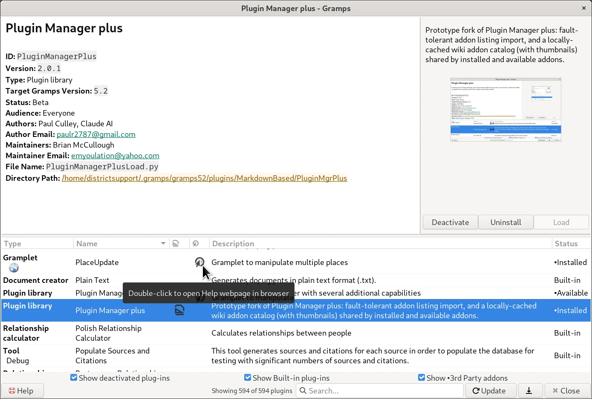
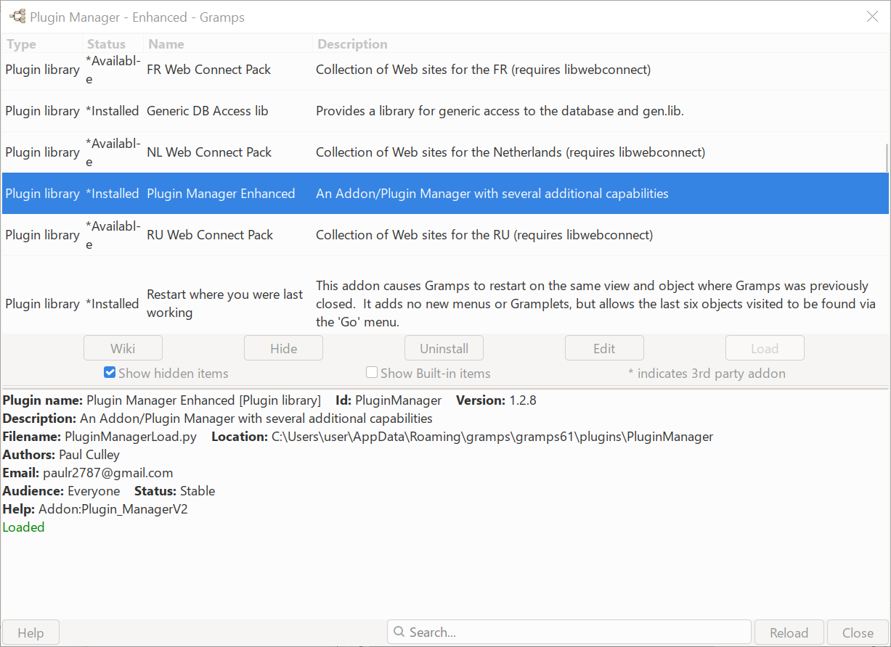
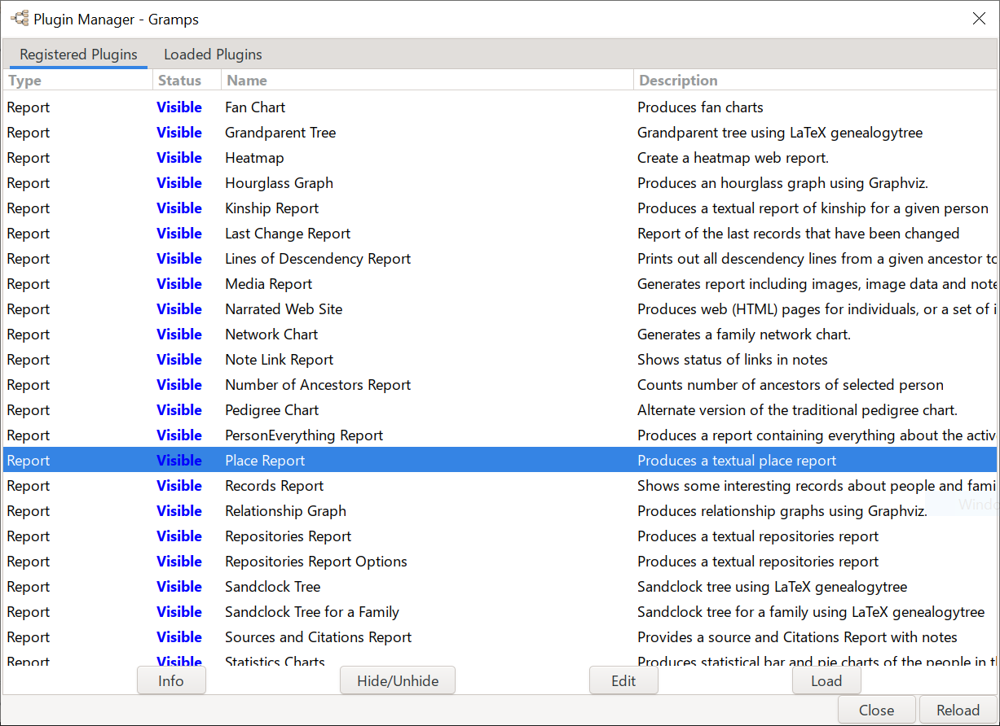

# Plugin Manager plus

  
<!--  -->

* In the  **Details** mode, the upper-left panel makes it easier to access where the Plugin lives (for tweaking purposes)
* In the  **Help** mode, the upper-left panel renders markdown of the locally-stored README.md file. 

**Plugin Manager** *plus*  is a drop-in replacement for the built-in **Help → Plugin Manager**. Instead of a bare list and a one-line description, every plug-in gets a details panel, a preview thumbnail, and quick one-click access to its README markdown file and help page — so you can tell what something does, who made it, and whether you want it, all without leaving the window. And you can search or filter the whole Gramps plugin registry right from this window — by name, description, or type — without digging through menus.

Tested with **Gramps 6.0** and **Gramps 5.2**.
---
## At a glance

- 🔍 **See before you install** — a thumbnail and description for almost every plug-in, installed or not
- 📖 **One click for the full story** — jump straight to a plug-in's README or online help
- 🗂️ **Everything sorted, everything resizable** — click any column header to sort; drag any divider or column to resize, and it's remembered next time

## Icon legend

A few icons show up throughout the window — here's what they mean:
| |Dashboard|People|Relationships|Families|Charts|Events|Places|Geography|Sources|Citation|Repositories|Media|Notes|
|:---:|:---:|:---:|:---:|:---:|:---:|:---:|:---:|:---:|:---:|:---:|:---:|:---:|:---:|
| |󠀠 |||| | ||| ||| ||

Some plug-ins only work in — or only apply to — specific parts of Gramps, and the list's **Type** column has a second line to show exactly that, so you're not left guessing:

- **Gramplets and Rules** show one or more of the icons above, restricting them to specific dashboards/object types (e.g. a Gramplet that only works on the People dashboard shows just the People icon).
- **Views** show up to two icons side by side: the generic category icon (as above), followed by that View's own icon for its particular mode within the category — e.g. Person Card shows  category icon, followed by its own view mode icon. A View in a category Gramps itself doesn't have a standard icon for shows its category name as text instead, which is a useful sign that the plug-in's own registration may need a closer look.
- **Tools and Reports** show their submenu name as text instead — e.g. "Utilities" or "Text Reports" — matching the menu you'd find them under in **Tools** or **Reports**.

Double-click a category icon or text on that second line — or double-click the same category's row in the **Type** column — to filter the whole list down to just that type; the active filter shows in bold dark red next to the Search box. Double-click that label, or the Type cell again, to clear it.

| Icon| Meaning |
|---|---|
|  | This plug-in has an online help page — double-click to open it in your browser. |
|  | This plug-in has its own README — double-click to read it. |
|  | Show this plug-in's full registration details. |
|  | Toggle between the details view and the README view. |


*(Icons appear twice above as a workaround for a rendering quirk in some Markdown viewers — one size renders in color, the other in black and white.)*

---

## Installing

Disable the **Plugin Manager** _enhanced_ (The Plug-in Registration system is confused if there are 2 alternative Addon options for the built-in **Help -> Plugin Manager** menu. It chooses unpredictably if there are options.)

Copy these files into the same folder as your other addons:

```
PluginManager2.py
PluginManager2.gpr.py
PluginManager2Load.py
README.md
media/
    Template_Addons5.2.txt
    screenshot.png
```

Then **restart Gramps**. That's it — Plugin Manager *plus* takes over **Help → Plugin Manager** automatically; there's no separate menu entry to find.

**Only one at a time:** if you also have the original **Plugin Manager** *enhanced* addon installed and enabled, disable one of them — whichever loads last is the one you'll get.

## Using it

The window has two parts:

**Top — details and preview.** Whatever plug-in is selected below shows its name, description, and a preview image up here. Click **Help** to flip between the full registration details (author, version, type, category/submenu, file locations, help link) and the plug-in's own README.

**Bottom — the plug-in list.** Every installed, built-in, and available plug-in, with:
- **Search**, to filter by name or description
- Checkboxes to show/hide deactivated plug-ins, built-ins, or third-party addons
- Sortable, resizable columns — click a header to sort by it, drag an edge to resize
- **Update**, to check your enabled addon repositories for anything new
- **Export Plugin List**, which writes every known detail — including each plug-in's raw registered category and, where applicable, its resolved category label and icon name(s) — to a file, handy if you're asking for help troubleshooting something

The window remembers how you've sized and arranged everything the next time you open it.

## Known issue

The upper-right preview thumbnail doesn't always find an image for every plug-in yet — this is still being worked on. When nothing more specific is available, you'll see a generic placeholder icon or this addon's own screenshot instead. Also, if the screenshot is of an uncommon format, a working thumbnailer must be installed for that format. 

## License

GPL-2.0-or-later, consistent with the rest of Gramps and its addons.

---

## For developers

*The rest of this README documents what's different under the hood, for anyone maintaining, auditing, or building on this addon.*

### Plugin Manager _plus_ 
A prototyping fork of **Plugin Manager** _enhanced_. It is a **prototype**: functional, but not yet brought into compliance with the Gramps project's [AGENTS.md](https://github.com/gramps-project/gramps/blob/master/AGENTS.md) coding conventions — that pass is deferred until the prototype's behavior is settled, per the project's understanding with its maintainer.


### Plugin Manager _enhanced_
A fork of the original built-in **Plugin Manager**. 


### Plugin Manager
The original built-in system for selectively enabling and disabling installed plug-in extensions for the Gramps for Desktops genealogy software. 

It also allowed uninstalling addons and re-registering updated modules without requiring a restart of the main application.


### What this fork adds on top of Plugin Manager plus

1. **Fault-tolerant addon-listing import** — a malformed or unrecognized line in the cached addon listing (`new_addons.txt`) no longer aborts the whole list or crashes a later lookup; it's skipped and logged instead. Each line is parsed as JSON first, then as a Python dict literal (the historical format) if that fails, and is required to contain the fields the dialog actually needs (`i`, `n`, `d`, `t`, `v`, `z`). A line that's blank, unparsable by either method, not an object/dict, or missing a required field is skipped with the reason logged — no `KeyError` later when the list is displayed.

2. **A local, all-columns wiki addon catalog** — Plugin Manager plus already bundled a local copy of the Gramps wiki's `Template:Addons5.2` table (the same table on the [Third-party Addons](https://gramps-project.org/wiki/index.php/Third-party_Addons) wiki page) to match plug-ins against extra metadata like a preview image and documentation link. This fork extends that:
   - If `media/Template_Addons5.2.txt` isn't already bundled, it's fetched once from `https://gramps-project.org/wiki/index.php?title=Template:Addons5.2&action=raw` and saved locally — no network access needed after that.
   - Every column of the table (`Plugin / Documentation`, `Type`, `Image`, `Description`, `Use`, `Rating`, `Contact`, `Download`) is preserved verbatim per row under a `raw_columns` key, alongside the cleaned-up fields (`help_url`, `display_name`, `image_file`, `description`, `use`, `rating`, `contact`, `download_stem`) the UI currently uses — nothing from the table is discarded even though not all of it is displayed yet.
   - The parsed catalog is cached as JSON at [`media/addons_wiki_catalog.json`](media/addons_wiki_catalog.json), next to the raw wikitext, and is only re-parsed when the source `.txt` file is newer than the cache. Other tools/scripts can read this JSON directly. A real sample generated from the bundled `Template_Addons5.2.txt` (104 addons, every column preserved) is included.
   - The matched entry's `Image` (via `https://gramps-project.org/wiki/Special:FilePath/<file>`) is meant to populate the upper-right preview thumbnail for both installed *and* available (not-yet-installed) plugins — previously this only worked for installed/built-in plugins, since available-only addons have no `PluginData` entry in the registry to hang the lookup off of.

3. **A single `media/` subfolder for every accessory/cache file** — nothing but `PluginManager2.py`, `PluginManager2.gpr.py`, `PluginManager2Load.py`, and `README.md` live in the addon's top level; everything else (cached listings, the wiki table, the parsed catalog, downloaded preview images, and this addon's own screenshot) lives under `media/`.

4. **A bundled screenshot as thumbnail fallback** — if `media/screenshot.png` or `media/screenshot.webp` exists, it's shown in the upper-right preview panel instead of the generic placeholder icon whenever no wiki-table or project-specific image is available. (Status: not yet confirmed to resolve every case — see Known Issue above.)

5. **Default selection on open, preserved through search** — Plugin Manager *plus*'s own row is selected and vertically centered in the plugin list as soon as the dialog opens, and re-centers as you type in the search box, as long as the selected row still matches.

6. **Category icons and labels read live from Gramps' own registries — never a hand-maintained copy** — so a third-party addon's own custom category (a Tool's own submenu, a Report's own section, or a View's own category) is picked up automatically, with no update to this addon needed when one is added:
   - **Tools and Reports** — their submenu/section label (shown as the List panel's Type-column second line, in the Details panel, and in the JSON export) is looked up directly from `gramps.gui.plug.tool.tool_categories` and `gramps.gen.plug.report._constants.standalone_categories` — the same live dicts Gramps' own **Tools**/**Reports** menus and the built-in Report/Tool selection dialogs read from — so an addon's custom submenu (e.g. a suite of tools all filed under their own category name) shows up correctly the moment that addon registers it, not just Gramps' own built-in submenus.
   - **Views** — the category icon shown is looked up the same way Gramps' own sidebar (`gramps.gui.navigator`) picks it: first its `CATEGORY_ICON` table of Gramps' built-in categories, then the View's own registered `stock_category_icon` if it has one, so an addon-defined category with no icon of its own (nothing in `CATEGORY_ICON`, and no `stock_category_icon` override) is reported as unrecognised via its text label instead of silently showing a misleading icon. Alongside it, the View's own `stock_icon` — its distinct icon for that particular mode within the category — is shown as a second icon when the plug-in registers one.
   - **The active category filter** — shown as a label beside the Search box when the list is narrowed to one type — now renders in bold dark red, and double-clicking that label clears the filter, in addition to the existing double-click-the-Type-cell-again gesture.

### Files

| File | Purpose |
|---|---|
| `PluginManager2.py` | Main dialog implementation (`PluginStatus` class). |
| `PluginManager2.gpr.py` | Gramps addon registration. |
| `PluginManager2Load.py` | `load_on_reg` hook; patches the built-in Plugin Manager. |
| `README.md` | This file. |
| `README_fallback.md` *(optional)* | Shown in README mode for a selected plugin that has no `README.md` of its own. |
| `media/screenshot.png` / `media/screenshot.webp` | This addon's own screenshot: shown in README mode, and as the upper-right thumbnail fallback for any plugin lacking a more specific image. Bundled here as a placeholder — see Known Issue above. |
| `media/Template_Addons5.2.txt` | Local copy of the wiki addon table (bundled; re-fetched automatically only if absent). |
| `media/addons_wiki_catalog.json` | Parsed wiki catalog (bundled sample; regenerated automatically if the `.txt` table changes). |
| `media/wiki_cache/` | Downloaded wiki preview-image cache (generated automatically, not bundled). |
| `media/new_addons.txt` | Cached addon listing from enabled repositories (generated by "Update"). |
| `plugin_debug_export.json` | Output of "Export Plugin List" (generated on demand; stays at the top level, not under `media/`). |

`media/Template_Addons5.2.txt` is optional at install time — if it's missing, Plugin Manager *plus* fetches it once from the Gramps wiki and saves a local copy on first use. If your Gramps installation has no network access, bundle the file yourself so the wiki catalog features work offline. Everything else under `media/` is generated automatically the first time it's needed.

**Conflict note:** Plugin Manager *enhanced* and Plugin Manager *plus* both patch the same Gramps attribute (`gramps.gui.viewmanager.PluginWindows.PluginStatus`). If both are installed and enabled, whichever one loads last wins — don't run both at once.

### AI-assistance disclosure

Portions of this addon were generated with AI coding assistance (Claude, various releases — see the `Generated-by:` / `Co-authored-by:` headers in each source file for specifics per change), per the Gramps project's [AI-generated code guidelines](https://www.gramps-project.org/wiki/index.php/Howto:_Contribute_to_Gramps#AI_generated_code).
