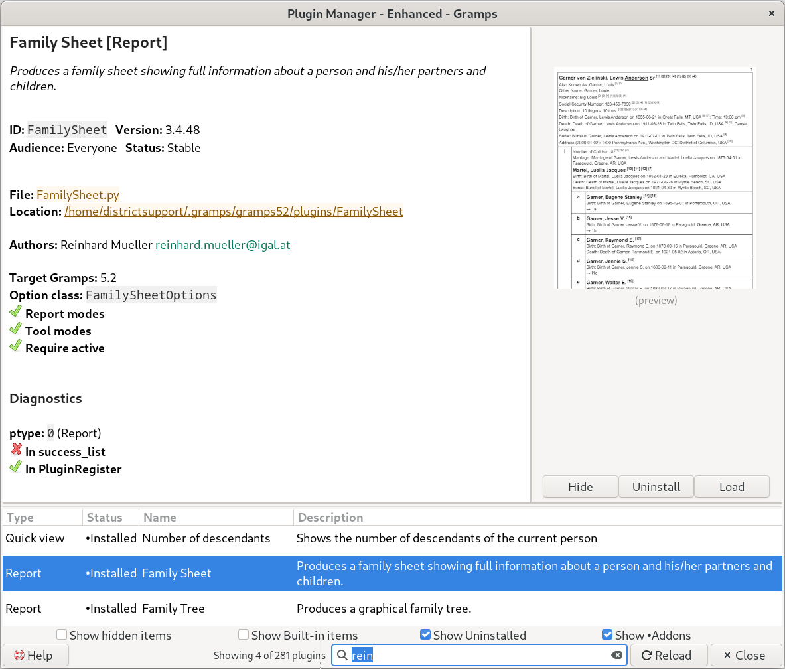

#  Plugin Manager *plus* 
This plugin provides an enhanced **Plugin Manager** interface for Gramps, focused on making plugin details and documentation easier to explore.
See the **[Plugin Manager *plus*](https://gramps-project.org/wiki/index.php/Addon:Plugin_Manager)** Gramps Wiki page for more detailed information.

## Notable behavior
- A bottom-bar toggle button switches between:
  - ** Details** *mode:* selected plugin metadata/details
  - ** Help** *README mode:* project README content plus a screenshot (if available)
- The toggle button label changes between  **Help** and  **Details** depending on current mode.

## Actions available
- Can ** Hide /  Unhide** plugins.
- Can ** Install /  Uninstall** plugins.
- Can ** Load** plugins (debug-related path visible in code).
- Can ** Reload** plugin registrations (debug mode).

## Main User Interface idea
- The window is split into two major sections:
  - **Top:** information panel
  - **Bottom:** plugin list
- The top panel itself is split into:
  - left side for rendered markdown details
  - right side for a thumbnail/preview area

## Plugin list features
- Shows plugin rows with columns like type, status, name, and description.
- Includes search/filtering:
  - all-words matching
  - exact-phrase matching with quotes
- Includes checkboxes to show/hide categories (hidden items, built-ins, uninstalled items, addons).

## Content rendering/details
- Uses a markdown utility layer when available.
- Supports clickable links (web, mailto, file paths, custom link styles).
- Displays icon-based status/boolean indicators in detail text.
- Shows diagnostics and failure information when plugin loading fails.

## Overall impression
A UI-focused plugin manager enhancement that emphasizes:
- richer detail presentation,
- quick switching between overview/help and item details,
- and practical management actions from one dialog.

# Plugin Manager v2

Adds:
* Show Addons checkbox
* extends search to Authors fields
* adds diagnostic readout

---

## Compatibility

Gramps 5.2 / Python 3.11+ / GTK 3. No WebKit, no `markdown` package.
SVG icons require `librsvg2` (standard on most Linux desktops).

## Credits

Developed with [Claude](https://claude.ai) (Anthropic) by Brian McCullough.
License: GPL v2 or later.
