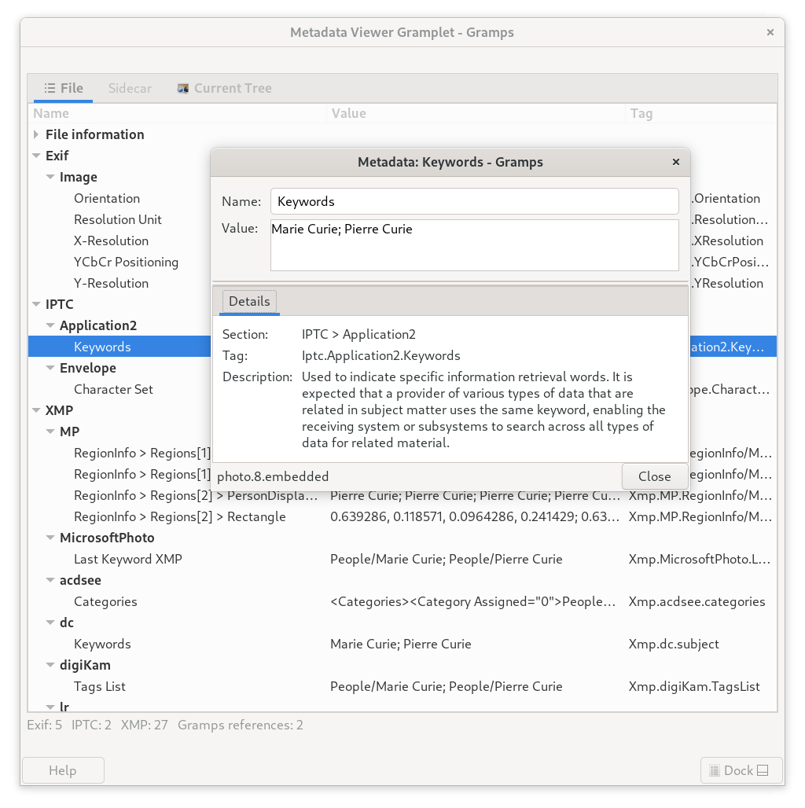
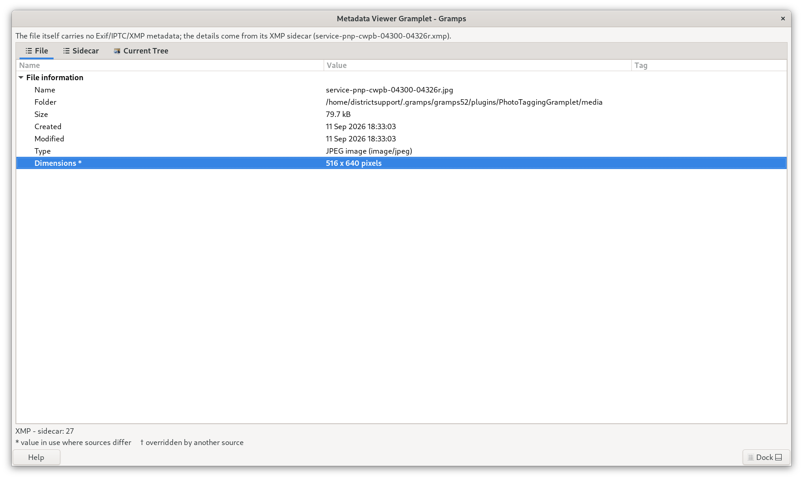
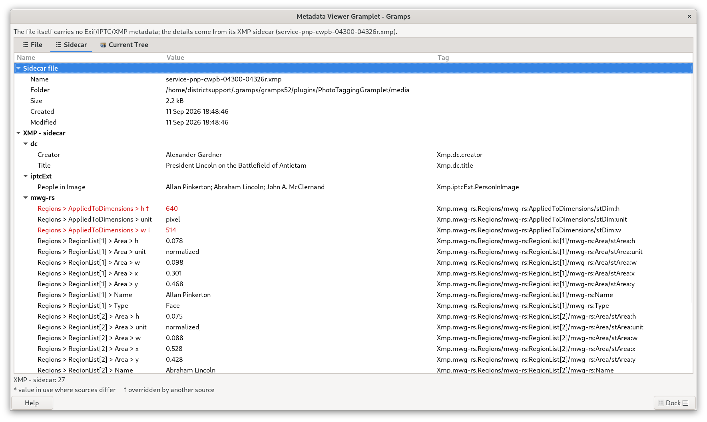
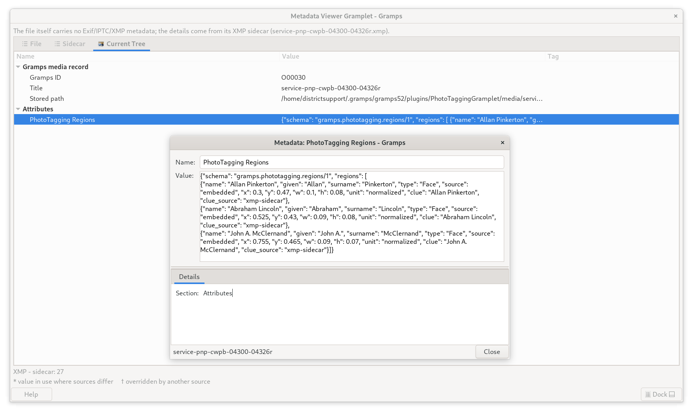

# Metadata Inspector
A [Gramps](https://gramps-project.org) gramplet that shows **everything known about a media file in one place**, kept apart by where it lives: what is embedded in the file itself, what is in its XMP sidecar, and what your family tree records about it.

* **Version:** 0.0.1 (Experimental)
* **Works with:** Gramps 5.2 and later (up to the 6.1 series)
* **Where it appears:** the **Media** views (sidebar / bottombar)
* **Read-only:** it never changes your media files, their sidecars or your family tree

*The File tab for a photograph that carries Exif, IPTC and XMP metadata, with the dialog opened by double-clicking the Keywords row.*

> Image files often carry far more information than you can see by looking at them, and the metadata can live in three different places that do not always agree. A scanned photograph, for example, may record the scan date in the file, the date of the original photograph in a sidecar, and a third version of that date in your tree. Metadata Inspector shows all three, and points out where they disagree.

---

## The three tabs
Select a Media object and the gramplet fills three tabs:

| Tab | What is in it |
|---|---|
| **File** | The file information (name, folder, size, created, modified, type, pixel dimensions), how the image was made (camera, exposure, lens, GPS), and everything embedded in the file: Exif, IPTC and XMP tags, PDF document information, audio/video tags |
| **Sidecar** | The XMP sidecar of the file: its own file information and its XMP tags |
| **Current Tree** | What your family tree holds about this media object: the media record, everything that references it (with the part of the image each reference selects), and its Attributes, Notes, Tags and Citations |

**Tab icons.** Following the convention of the tabs in Gramps, a tab shows its icon and a **bold title** only when it has something to show, and is plain when it does not.

* **File** and **Sidecar** have data whenever they have anything to list, so the File tab nearly always does: it always lists the information about the file.
* **Current Tree** always lists the ID and stored path of the media record, so it only counts as having data when something has been *recorded*: a reference, Attribute, Note, Tag or Citation, a date, or a Title other than the default file name.

An empty tab explains itself, for example *"No XMP sidecar found. Looked for: photo.xmp, photo.jpg.xmp"*.

### File tab

*File information: the creation time recorded by the file system sits just above the modification time. Dimensions is bold with an asterisk because another source disagrees with it (see [When sources disagree](#when-sources-disagree)).*

The File tab has up to seven sections, in this order:

| Section | What is in it |
|---|---|
| **File information** | Name, Folder, Size, **Created**, **Modified**, Type and (for images) **Dimensions** |
| **Technical & Capture** | How the image was made, decoded from the Exif data of the file: Make & Model, Exposure Settings, Lens Specifications, GPS, Altitude (see [below](#technical--capture-section)) |
| **Exif** | Camera and capture tags, dates (images) |
| **IPTC** | Captions, keywords, credits (images) |
| **XMP** | Titles, descriptions, rights, creator tool; regions written by other programs (images) |
| **PDF document** | Title, author, creation date, number of pages (PDF files) |
| **Audio/Video tags** | Stream information and tags such as title, artist, album (audio and video files) |

**Created** is the date the file was created. Python alone cannot read this on Linux, so Metadata Inspector asks the file system through GIO. If the file system does not record a creation time it says **Not available** rather than showing a wrong value.

### Sidecar tab

*The file information of the sidecar, then its XMP tags. The two red rows are marked with a dagger because the sidecar says its regions apply to a 514 pixel wide image while the file is 516 pixels wide.*

A sidecar is a small `.xmp` file kept next to the image. Metadata Inspector looks for it the same way the Photo Tagging gramplet does:

1. `photo.xmp` (the name of the image with `.xmp` in place of its extension)
2. `photo.jpg.xmp` (the form used by darktable and others)

(each also in capitals, `.XMP`, for case-sensitive file systems). The **first one found is used**; sidecars are never merged. Sidecars work for any kind of media file, not just images.

When the file itself has no Exif/IPTC/XMP metadata but the sidecar does, a line at the top says so, so you know where the details come from.

### Current Tree tab

*The media record and an Attribute (here, face regions stored by the Photo Tagging gramplet), with the dialog for the Attribute open.*

| Section | What is in it |
|---|---|
| **Gramps media record** | Gramps ID, Title, Date and the stored path |
| **Gramps references** | Every Person, Family, Event, Place, Source and Citation that uses this media object, grouped by type |
| **Attributes**, **Notes**, **Tags**, **Citations** | The secondary objects attached to the media object, as in the media editor |

**Regions.** A reference can select a part of the image (the "marquee" you draw in the Media Reference editor, typically around a face). It is shown as percentages of the image measured from the top-left corner, for example `15%, 27% – 25%, 43%`; double-click it to also see the approximate pixel rectangle. A reference with no region reads **Whole image (no region selected)**. These rectangles live in your database, not in the image file, so they appear here and not on the File tab.

---

## When sources disagree
The same fact can be recorded in the file, in the sidecar and in your tree. When they disagree, **the Current Tree is the arbiter**:

> Current Tree  **over**  Sidecar  **over**  File

(The one exception is the pixel size of the image: the file itself is the fact, so the file wins over a claim made by the sidecar.)

The disagreement is shown on the rows themselves, wherever they appear:

| Mark | Meaning |
|---|---|
| **Bold, with `*`** | the value in use, shown only where sources disagree |
| **Red, with `†`** | a value that another source overrides |
| plain | no competing value |

Hover over a marked row, or double-click it, to see why: the tooltip and the **Sources** line of the dialog say which source is in use and what the others say. A legend appears at the bottom whenever a mark is on screen.

**What is compared.** Any item that two sources both carry, for example a copyright notice in both the file and the sidecar. The Current Tree can contribute two things: its **Title** (a Title that is just the name of the file, the default Gramps fills in, says nothing and is ignored) and its **Date**. Differences of capitalization or spacing are not disagreements.

**Dates.** The Gramps media Date is the date of the **content**, that is the original photograph or document, which is what matters genealogically. It is therefore compared only with the embedded *content* dates: IPTC *Date Created*, `photoshop:DateCreated`, Exif *DateTimeOriginal* (in that order of preference). It is **never** compared with the dates of the *digital copy* (the Created and Modified times of the file, or Date/Time Digitized), which are shown for reference only.

Dates are compared with the date logic of Gramps (`Date.match`), so they behave the way you would expect in a tree:

* a year-only date agrees with any date in that year; "1897-03" does not agree with "1897-04-02"
* "about", "before", "after" and estimated dates, and date ranges, are compared using the ranges set in your Gramps preferences (by default an "about" date allows 50 years either way: tighten that setting if you want sharper checking)
* other calendars are converted (a Julian 1 January 1897 is 13 January 1897 in the Gregorian calendar)
* a text-only date ("the spring of the flood") cannot be compared and is left out

---

## Names used in the File and Sidecar tabs
Where the metadata standards give an item several names, Metadata Inspector uses the **first, generic name** as the row name; the raw tag is always in the *Tag* column and the tooltip. Where several tags could carry an item, the first one found in the order below is the one compared.

The three widely used standards are **Exif** (technical data written by cameras), **IPTC** (descriptive and administrative data) and **XMP** (an extensible framework that can carry both).

### Descriptive: what the image is about
| Name | Meaning | Tags (in order) |
|---|---|---|
| **Title** | Brief, formal name of the image | `Xmp.dc.title`, `Iptc.Application2.ObjectName` |
| **Headline** | Short summary of the story of the image | `Xmp.photoshop.Headline`, `Iptc.Application2.Headline` |
| **Description** | Detailed text about what is happening | `Exif.Image.ImageDescription`, `Xmp.dc.description`, `Iptc.Application2.Caption` |
| **Keywords** | Words used to group and find the image | `Iptc.Application2.Keywords`, `Xmp.dc.subject` |
| **Alt Text** | Accessibility text for screen readers | `Xmp.iptc.AltTextAccessibility` |
| **People in Image** | Names of the people shown | `Xmp.iptcExt.PersonInImage` |

### Dates and software
| Name | Meaning | Tags (in order) |
|---|---|---|
| **Date/Time Original** | The date of the **content**: when the original was created or photographed | `Iptc.Application2.DateCreated`, `Xmp.photoshop.DateCreated`, `Exif.Photo.DateTimeOriginal`, `Xmp.exif.DateTimeOriginal` |
| **Date/Time Digitized** | When the **digital copy** was made (for a scan, the scan date) | `Exif.Photo.DateTimeDigitized`, `Xmp.exif.DateTimeDigitized`, `Iptc.Application2.DigitizationDate`, `Xmp.xmp.CreateDate` |
| **Software** | Program that created or last processed the file | `Exif.Image.Software`, `Xmp.xmp.CreatorTool` |

> **Original vs. Digitized.** Digital cameras write the same time to both. For a **scanned** family photograph, *Digitized* is when it was scanned and *Original* is when the photograph was taken. The content-date tags lead the *Original* list because IPTC *Date Created* and `photoshop:DateCreated` are defined as the date of the content, whereas an Exif *DateTimeOriginal*, or `xmp:CreateDate`, is often just stamped by the scanner at scan time.

### Administrative and rights: who owns or can use the image
| Name | Meaning | Tags (in order) |
|---|---|---|
| **Creator** | Person who made the image (author, photographer) | `Exif.Image.Artist`, `Xmp.dc.creator`, `Iptc.Application2.Byline` |
| **Copyright Notice** | Formal claim of ownership | `Exif.Image.Copyright`, `Xmp.dc.rights`, `Iptc.Application2.Copyright` |
| **Rights Usage Terms** | How the image may be used | `Xmp.xmpRights.UsageTerms` |
| **Credit Line** | Who supplied the image | `Iptc.Application2.Credit`, `Xmp.photoshop.Credit` |
| **Digital Source Type** | Photograph, digital composite, AI-generated, … | `Xmp.iptcExt.DigitalSourceType` |

### Technical & Capture section
These File-tab rows are decoded and combined from the Exif section (the raw tags are still listed below, in the Exif section). They never come from a sidecar, and they take no part in the comparison.

| Name | Meaning | Tags |
|---|---|---|
| **Make & Model** | The camera or device (the make is not repeated if the model already contains it) | `Exif.Image.Make` + `Exif.Image.Model` |
| **Exposure Settings** | Aperture, shutter speed and ISO | `Exif.Photo.FNumber`, `…ExposureTime`, `…ISOSpeedRatings` |
| **Lens Specifications** | Lens and focal length | `Exif.Photo.LensModel`, `…FocalLength` |
| **GPS** | Where the image was captured, in your Gramps coordinate style | `Exif.GPSInfo.GPSLatitude` / `GPSLongitude` (with their N/S, E/W references) |
| **Altitude** | Meters above or below sea level | `Exif.GPSInfo.GPSAltitude` |

Everything else the file or sidecar contains is listed as it is, grouped by standard and namespace. XMP structures, such as the regions that photo programs write, appear as readable paths, for example *Regions > RegionList[2] > Name*.

---

## Using it
* **Select a Media object** in the Media view. The tabs fill in automatically and refresh when you change the selection or edit the object.
* **Groups start expanded.** Double-click a heading to collapse or expand it.
* **Double-click an item** to open a read-only dialog: the **Name**, the full **Value** (the list shortens long values to one line, the dialog shows up to 20,000 characters), and a **Details** pane with the **Section** of the item, the raw **Tag**, a **Description** of what the tag means and, for marked rows, the **Sources**. The name of the Media object is shown at the bottom left.
  * The dialog is listed in the **Windows** menu of Gramps, like any other editor.
  * Opening the same item again raises the dialog that is already open.
* **Right-click** for the context menu:
  * **Copy value** and **Copy tag name** (when you click on an item)
  * **Expand all Nodes** and **Collapse all Nodes** (for the current tab)
* **Hover** over an item to see its tag name, description and, where relevant, what overrides it.
* **Type** while a list has focus to search the *Value* column.
* The three columns (Name / Value / Tag) start at 40% / 40% / 20% of the width and can be resized by dragging; the 40/40/20 split is reapplied when the gramplet itself is resized.
* A line under the tabs counts the entries in each metadata section (Technical & Capture, Exif, IPTC, XMP, XMP - sidecar, PDF, Audio/Video tags and Gramps references).
* **The gramplet tab** in the Gramps sidebar/bottombar is highlighted when the media object has real metadata, embedded or in a sidecar, not merely because it has a file.
* Dates and times are shown in **your** Gramps date format, with partial dates (for example a year only) handled properly.

### If nothing (or not much) appears
| You see | Meaning |
|---|---|
| "Select a media object to view its metadata." | No Media object is active |
| "File not found: …" | The path stored in the Media object does not point to an existing file. The Current Tree tab still works. |
| "File is not readable: …" | Your account does not have permission to read it |
| "Install the GExiv2 library (gir1.2-gexiv2-*) to view image metadata and XMP sidecars." | GExiv2 is missing (see [Requirements](#requirements)) |
| "Install the 'pypdf' Python module to view PDF metadata." / "Install the 'mutagen' Python module to view audio tags." | The reader for that file type is not installed |
| "No readable Exif/IPTC/XMP metadata in this image." | The format is not supported, or the image carries none |
| "The file itself carries no Exif/IPTC/XMP metadata; the details come from its XMP sidecar (…)" | Not a problem: it says where the metadata on the Sidecar tab comes from |
| "No embedded metadata found in this file." | The file carries no metadata of the kinds this gramplet reads |
| "This PDF could not be read (damaged or encrypted?)." | The PDF is damaged or password-protected |
| Sidecar tab: "No XMP sidecar found. Looked for: …" | There is no sidecar with a name this gramplet looks for |
| Sidecar tab: "The XMP sidecar has no readable metadata." | A sidecar exists but could not be read |
| File tab: "The file is not available." | There is nothing on disk to read |
| Current Tree tab: "Nothing is recorded in the current tree for this media object." | The tree holds nothing for it |

---

## Requirements
Metadata Inspector works with whatever is installed. If something is missing the gramplet tells you what to install and still shows everything else.

| To read… | You need | Typical install (Debian / Ubuntu) |
|---|---|---|
| Images (Exif, IPTC, XMP), XMP sidecars and some video | **GExiv2** (any installed version) | `gir1.2-gexiv2-*` |
| PDF files | **pypdf** (or PyPDF2) | `python3-pypdf` |
| Audio and video tags | **mutagen** | `python3-mutagen` |

The pixel size of the image is read with the GTK image library, so it needs nothing extra. These Python modules must be installed for the same Python that runs Gramps. The Gramps "Edit Image Exif Metadata" addon uses the same GExiv2 library, so you may already have it.

---

## Installation
1. Copy the `MetadataInspector` folder into your Gramps user plugins folder, normally:
   * **Linux:** `~/.gramps/gramps52/plugins/` (use `gramps60`, `gramps61`, … for other Gramps versions)
   * **Windows:** `%AppData%\gramps\gramps52\plugins\`
2. Restart Gramps.
3. Open any **Media** view (for example *Media* in the navigator).
4. Right-click the sidebar or bottombar tab strip, choose **Add a gramplet**, and pick **Metadata Inspector**.

---

## Good to know
* **Read-only.** It displays; it does not edit. It also does not track provenance: the dates of the digital copy are shown for reference and are never compared with the date in your tree.
* **Privacy:** image metadata can include exact GPS locations and personal names. Metadata Inspector only *displays* it, but check what a file contains before you share it.
* **Large values** (for example camera maker notes) are shortened in the list; the dialog shows the full text.
* This is an early, **Experimental** release. Please report problems you find (including the file type and which libraries you have installed).

---

## Credits and license
* Metadata Inspector is a read-only fork of the **Edit Image Exif Metadata** gramplet by **Rob G. Healey**, with later work by **Paul Culley**. Its handling of XMP sidecars follows the method of the Photo Tagging gramplet.
* Maintainer: **Brian McCullough**.
* Licensed under the **GNU General Public License, version 2 or (at your option) any later version**, the same terms as Gramps.

---

## AI attribution
This addon and this README were produced with the help of an AI tool, disclosed here in line with the Gramps guidance on [AI generated code](https://www.gramps-project.org/wiki/index.php/Howto:_Contribute_to_Gramps#AI_generated_code).

| | |
|---|---|
| **Tool** | Claude Sonnet 5.5 (model string `claude-sonnet-5-5`) |
| **Provider** | Anthropic |
| **Interface** | claude.ai chat interface |
| **Date** | October 2026 |
| **Credit line used in the source files** | `2026  Claude AI (wish coding by Brian McCullough)` |

**What the AI did.** The addon code (`metadatainspector.py`, with the registration file `metadatainspector.gpr.py` adapted from the version written by the maintainer) and its unit tests were *substantially written* by Claude, starting from a review of the original Edit Image Exif Metadata gramplet. This README was also written by Claude. **Brian McCullough** directed the work step by step ("wish coding"), reviewed the results, and is the human maintainer responsible for the addon.

**Prompts used** (summarized, in order):

1. Review the attached Exif metadata gramplet and make a read-only fork that works as a general metadata viewer for the most common metadata types.
2. Cross-version `.gpr.py`; expand all Name groupings by default; add a context menu with "Expand all Nodes" / "Collapse all Nodes" using the same translatable strings as the Grouped People view of the People category.
3. Add a double-click action opening a read-only dialog (similar to an uploaded alpha Edit Attribute dialog example layout), using the preferred first-option field labels from a supplied metadata-label reference.
4. Set the columns to 40% / 40% / 20%; show the Media object name in the button row of the dialog; register the dialog in the Windows menu.
5. Read XMP sidecars, as the Photo Tagging gramplet does; show the face-region rectangles stored on media references in the database.
6. Keep embedded, sidecar and Gramps database metadata apart in tabs that follow the Gramps tab convention (icon and bold title only when there is data); mark disagreements on the rows instead of a compare pane; Gramps over sidecar over file; treat the Gramps date as the date of the content, not of the digital copy; compare approximate Gramps dates using the `Date.match()` function of Gramps.
7. Drop the Summary tab; put pixel dimensions and the created time of the file in the File tab; keep camera, exposure, lens and GPS in the File tab; use the list icon for File and Sidecar and "Current Tree" with the view-media icon of Gramps.
8. Rewrite this README for the current version.
9. Wrap the addon up for publication: bring the code to the AGENTS.md standard of Gramps, add unit tests, and bring this README up to date.
10. Rename the gramplet from Metadata Viewer to Metadata Inspector, to match the other gramplets that inspect Gramps data.

**Guidelines the AI worked under.** [Gramps AGENTS.md](https://github.com/gramps-project/gramps/blob/master/AGENTS.md) and the Gramps AI-contribution guidance linked above were supplied as the standards of the project. The code first went through a draft stage that prioritized working, readable code, and was then brought to the `AGENTS.md` standard that was current on the master branch of Gramps at that time: type hints, concise docstrings, import sections, class headers, `cb_` prefixes for callbacks, Black formatting, no inline lint suppression, and checks with mypy and pylint. Where the copy of `AGENTS.md` that was supplied at the start differed from the current one, the current one was followed.

**Testing.** The addon has a suite of unit tests in the `test` folder, written with the `unittest` framework of Python and run with `python3 -m unittest discover -p "*_test.py"` from the folder of the addon. The tests run without a display and without GExiv2: missing GTK parts are replaced by mocks, GExiv2 is faked (once behaving like older releases and once like current ones), and the date comparison, coordinate formatting and file creation time run against the real Gramps (`Date` class, preferences, `conv_lat_lon`) and GLib/GIO. The sample sidecar used by the tests contains invented names. The AI could not run the Gramps window or GExiv2 in its own environment, so the screenshots above were supplied by the maintainer from a running Gramps, and how the gramplet behaves across Gramps versions and systems has to be confirmed by the maintainer and testers. The code passes Black and mypy, and pylint rates it above 9 with the configuration of Gramps.

**Other sources.** The generic names follow a metadata-label reference produced by a Google AI-generated overview and supplied by the maintainer; this README paraphrases it in its own words. That reference cited the sources below, which Claude did not independently re-verify. Claude also consulted the source code of Gramps for its conventions (tab labels, managed windows, `Date.match`) and the Exiv2 tag table for the definition of `photoshop:DateCreated`.

* [IPTC Photo Metadata User Guide](https://www.iptc.org/std/photometadata/documentation/userguide/)
* [Exiv2 tag reference](https://exiv2.org/tags.html)
* [Exiv2 XMP photoshop tags](https://exiv2.org/tags-xmp-photoshop.html)
* [ExifTool Exif tag names](https://exiftool.org/TagNames/EXIF.html)
* [Casey Templeton: Image metadata](https://caseytempleton.com/blog/image-metadata/)
* [FotoWare: Essential guide to image metadata](https://www.fotoware.com/blog/essential-guide-to-image-metadata)
* [Photometadata.org field guide](http://www.photometadata.org/META-Resources-Field-Guide-to-Metadata)

Under the Gramps AI guidance, contributors are also expected to confirm that the terms of the AI tool do not restrict use of the code in a way that is inconsistent with the Gramps license. That check is the responsibility of the maintainer and is not asserted here.
