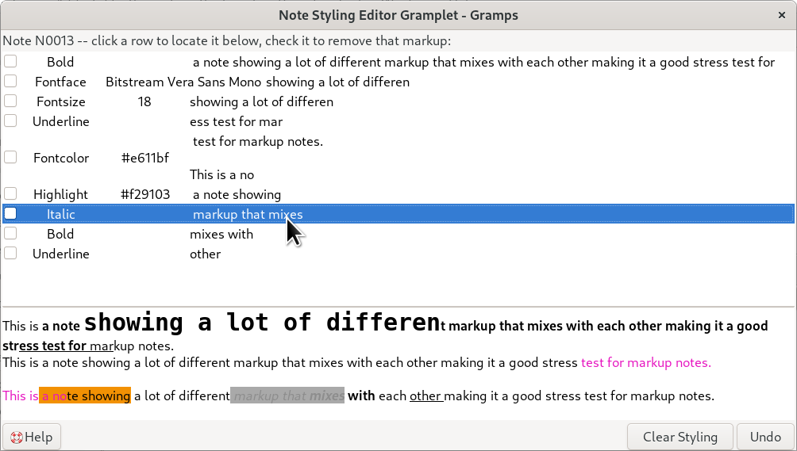

# Note Styling Editor - help
<!-- -->
An Experimental Gramps gramplet that shows the `StyledText` markup (bold, italic, font color, links, etc.) attached to a Note -- or to the first Note attached to the active record in any other note-holding category -- as a scrolling, checkable list, with buttons to strip selected markup or undo the last change.

This gramplet began as [Kari Kujansuu's SuperTool script `note-markup.py`](https://gramps.discourse.group/t/5396), originally written to be run inside the SuperTool gramplet against one note at a time. Claude AI re-packaged that same logic into a standalone gramplet that reacts automatically to active item in the views. (With some missteps along the way. Claude did not recognize that because the script was manually triggered and Gramplets react dynamically, the INIT of the script did not translate directly.) 
For Notes category views, it focuses on the directly selected Active Note. For the other categories focus is more indirect, it has to focus on the topmost Note that is secondary to the Active object.     

## Features
- Lists every styling applied to the active note, one row per style, in the order it appears in the text -- showing the style's name, its value (e.g. a font color), and the bit of text it applies to.
- Click a row -- its checkbox or its text -- to scroll the preview to that spot and briefly flash the affected text. This helps you focus on exactly what a style covers.
- Click anywhere in the preview to select whichever row's style is closest to that spot; the checklist and preview stay in sync in both directions.
- Double-click in the preview to open the note in Gramps' regular Note Editor, for changes beyond what this gramplet handles (new stylings, wording, spelling, etc.).
- **Clear Styling** -- check the rows you want stripped, then click to remove just that styling and save the change.
- **Undo** -- puts back the styling the note had when you first opened it here, in case you clear the wrong thing.
- A read-only preview showing how the note actually renders, so you can see the effect of your changes.
- A Help button, lower-left, that opens this help page (provided that the Markdown viewer addon is available, opens the Discourse thread if not.)

> **Heads up:** this gramplet and the Note Editor each work from their own copy of the note while they're open. If you open the Note Editor (by double-clicking the preview) and make changes there *and* in this gramplet before saving either one, whichever you save last will overwrite the other's changes -- there's no merging between them. Finish and save one before editing in the other.

## Where to find it
You can add this gramplet to the sidebar or bottom bar of the Notes, Citations, People, Families, Events, Places, Sources, Repositories, and Media views -- and dock, undock, or move it between them freely; it keeps following the view it was added to.

- In the Notes view, it always shows whichever note is currently selected.
- In any other view, since those records don't have styling of their own, it shows the first note attached to whichever record is currently selected. If that record has no notes at all, it says so -- e.g. "The F0004 Family has no Note to review."

## Requirements
- Gramps 5.2 or newer.
- Optional: the [Markdown Dash](https://gramps-project.org/wiki/index.php/Addon:Markdown_Dash) addon, so the Help button can open this page in its own window instead of your browser.

## Credits
- **Original concept and styling-editing logic:** Kari Kujansuu, from the SuperTool script `note-markup.py` discussed at [Styled Note Markup trimmer gramplet](https://gramps.discourse.group/t/5396).
- **Gramplet adaptation and maintenance:** Brian McCullough.
- **AI assistance:** Claude (Anthropic) -- see the developer notes below for the full disclosure.

## License

GNU General Public License v2 or later, consistent with Gramps itself.

---

## Developer notes

The rest of this page is for anyone maintaining or reviewing the addon's code rather than using the gramplet -- feel free to stop here.

### Files in this addon
| File | Purpose |
| --- | --- |
| `NoteStylingEditor.gpr.py` | Gramps addon registration. Also where the supported Gramps version range and the list of views it can be added to are set. |
| `NoteStylingEditor.py` | The gramplet itself. |
| `help_doc_button.py` | Shared Help-button widget (icon lookup, README-vs-browser routing); not specific to this addon. |
| `test/note_styling_editor_test.py` | Dev-only unit tests for the pure tag-filtering logic (`build_row_data`, `kept_tags_after_clear`); no GTK/Gramps dependency, run with `python3 -m unittest discover -p "*_test.py"` from this folder. |
| `README.md` | This file. |

### How it tracks the right record across views
Gramps tracks each view's "active object" independently, so the gramplet works out once, when it's created, which single view is actually hosting it -- by reading that from the page it was added to -- rather than checking every view at once. That stays correct even after it's undocked into its own floating window: undocking only reparents the widget, it doesn't change which page created it, so it keeps following the view it was originally added to no matter where the main window navigates afterward. See `resolve_primary_navtype()` in `NoteStylingEditor.py` for the implementation.

### AI-generated-code disclosure
- **Tool, provider, version:**
  - `NoteStylingEditor.py`, `NoteStylingEditor.gpr.py`, `note_styling_editor_test.py`, and this README: Claude (Anthropic), model "Claude Sonnet 5", web chat (claude.ai). Generated 2026-09-18.
  - `help_doc_button.py` (companion module, reused as-is by this addon): Claude (Anthropic), model "Claude Sonnet 4.6", web chat (claude.ai); see that module's own `HelpDocButton.md` for its disclosure.
- **Prompts used (summarized across the conversation):**
  Convert Kari Kujansuu's SuperTool `note-markup.py` script into a Gramps Note/Citation gramplet with a scrolling checklist and Clear Markup/Undo buttons; add a Help button following the `help_doc_button.py` sample; a follow-up pass to make internal naming consistent throughout (dropping a redundant "Gramplet" suffix from file and class names to match the addon's own title); write a README crediting the original script's author and disclosing AI assistance; several rounds of bug fixes and features (a resizable divider, selectable/highlighted rows, a settings `.ini` file, working across every note-holding category, a friendly no-notes message); reorganize this README to be end-user-oriented with the technical/policy material moved to this section.
- **Constraint documents worked under:**
  [Gramps AGENTS.md](https://github.com/gramps-project/gramps/blob/master/AGENTS.md) and the "AI generated code" wiki section linked above. This addon's Python files have been brought to full AGENTS.md style compliance (type hints, Sphinx docstrings, Black/Pylint, GPL license-header boilerplate, import-group headers) at the requester's ask; re-run Black/Pylint/mypy after any further change before treating the `.py` files as commit-ready.
- **Provenance:**
  `NoteStylingEditor.py`'s core logic (the tag-per-range checklist, and the Clear/Undo semantics of keeping unchecked tags or reverting to a snapshot) is adapted directly from Kari Kujansuu's `note-markup.py`. Its Help button is reused from `help_doc_button.py`, which carries its own separate AI disclosure.
- **Verification:**
  The pure, GTK-free logic (`build_row_data`, `kept_tags_after_clear`) has passing `unittest` coverage in `test/note_styling_editor_test.py`. The GTK/Gramps-specific parts of `NoteStylingEditor.py` (signal wiring, the view-detection in `resolve_primary_navtype()`, `DbTxn` commits, the highlight animation, etc.) have **not** been exercised against a real Gramps install -- test in a live Gramps environment before relying on this addon.
