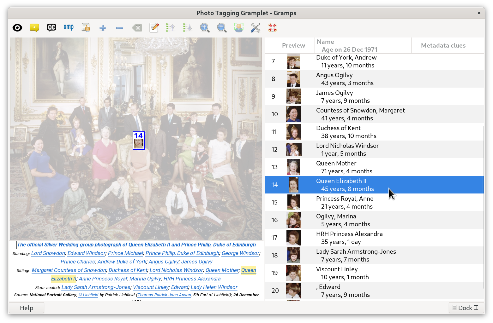

# Photo Tagging Gramplet
[ReadMe](README.md) ● [Change Log](CHANGELOG.md) ● [XMP data](XMP_Region_Name.md) ● [Icon List](media/icons/ICONLIST.md)

The **Photo Tagging** is a Media category addon [**gramplet**](https://www.gramps-project.org/wiki/index.php/Gramps_Glossary#gramplet) for [Gramps](https://gramps-project.org), the free genealogy software. It lets you draw marquees directly on a photo overlay to mark where each person appears, and link each marquee to that person's Gramps record — similar to how photo-tagging works in most modern photo apps.

Tagging your photos this way means Gramps can tell you, and later generate reports showing, which people appear together in which pictures — turning a folder of scanned family photos into a searchable part of your family tree.

## Features
- **Tag people in photos** by drawing a marquee (a rectangle) around them and linking it to a person in your tree, or by dragging a person directly onto the image or onto the list.
- **Quick Draw mode** (on by default) — draw one marquee after another with nothing popping up in between. Every marquee already on the photo stays visible with its row number, so you can see who's placed, and in what order, while you add more. See [Tagging a group photo quickly](#tagging-a-group-photo-quickly).
- **Placeholder names for people you haven't researched yet** — type a name straight into the Name column of any unlinked row (or drag one in from the Caption panel). It's saved with the photo, so nothing you type is lost while the research continues, and it pre-fills **Add a new person** and **Fuzzy Match Lookup** when you get to that row.
- **Turn those tags into a real photo caption**, not just an in-app label. A **Caption panel** below the photo shows a "Caption"-type Note, built from your tags and any Metadata clues, that you can rearrange into an actual caption. Every name in it is that person's own name *as of the photo's date*. And because it's a normal Gramps Note attached to the Media object, it's available to Gramps's own narrative reports and books. See [Using the Caption panel](#using-the-caption-panel).
- **Optional automatic face detection** — one click finds faces in the photo and draws marquees for you, ready to be assigned to people. (Requires the OpenCV and NumPy libraries; see [Requirements](#requirements).)
- **Optional Fuzzy Matching integration** — with the Fuzzy Matching gramplet installed, look up a row's name phonetically to check whether that person is already in your tree before creating a new one, and double-click a match to link it to the row.
- **Reorder tagged people** — drag and drop rows in the list, use the Move Up/Down toolbar buttons or right-click menu, press Alt+↑ / Alt+↓, or double-click a row's number and type the position you want. Your order is remembered the next time you open the photo.
- **The name shown for each person is the one they were actually using in that photo** — a birth name in a childhood photo, a married name in a later one — chosen from their Gramps Name records by the photo's own date, and rendered in that Name's own "Display As" format when one is set.
- **Age at time of photo** — shown right under the name, calculated from the photo's own date (falling back to today's date if the photo has none). An age that doesn't add up — the photo predates the person's birth, or postdates their death — is shown in red, a useful way to catch a wrong photo date or a wrongly tagged person.
- **Rotated photos display upright.** A photo whose orientation metadata calls for a 90°, 180°, or 270° rotation is shown corrected, marquees and thumbnails included. The original file is never modified.
- **Show/hide face marquees** and **cycle marquee labels** between row number, Gramps ID, or no label at all, via two toggle buttons on the toolbar.
- **Metadata clues column** — if a photo already has names recorded by another program, the gramplet surfaces them as a starting point, without creating anything in Gramps until you confirm them:
  - Named face regions written by a camera, phone, or photo organizer that uses Metadata Working Group (MWG) region tags — shown at their own position on the photo, unless a tagged marquee already covers that spot.
  - If there are none, a flat list of names from the file's `Xmp.dc.subject` tag (much more commonly supported, but with no per-person positions) — shown as whole-photo placeholders.
  - Both are read from the image file itself, or from a same-named `.xmp` sidecar file next to it (e.g. `photo.xmp` beside `photo.jpg`).
  - A toolbar toggle button shows or hides this column entirely.
- **Right-click context menu** for the currently selected marquee or row — see [Right-click menu reference](#right-click-menu-reference).
- **Selection is coupled across all three panels** — the tagged-people list, the marquees on the photo, and the Caption panel's linked names. Selecting a person in any one highlights them in all three, and makes them the active person elsewhere in Gramps; a double click on any one opens that person's editor.
- **Drag a person in** from the Clipboard or another Gramps view (such as the People list) straight onto the photo or onto the tagged-people list.
- Alternating rows in the list are lightly shaded for easier reading on longer lists.

## Requirements
- Gramps 5.2 or 6.x, with the [GExiv2 image-metadata library](https://wiki.gnome.org/Projects/gexiv2) available (normally bundled with a standard Gramps install). The gramplet will not load without it.
- **Automatic face detection is optional.** To enable it, install the [OpenCV](https://opencv.org/about/) and [NumPy](https://numpy.org/about/) Python libraries for the same Python that Gramps uses. Windows users in particular should note that these do not ship with Gramps by default. Without them, the **Detect faces** button is simply hidden; everything else works.
- **Fuzzy Matching lookups are optional.** They require the Fuzzy Matching gramplet addon. Without it, the Fuzzy Match Lookup actions do nothing.
- **Markdown Dash is optional.** If installed, the **Help** button opens this README inside Gramps.

## Installation
Install the Photo Tagging Gramplet from within Gramps using the built-in **Addon Manager** (*Edit → Addon Manager*, or search for "Photo Tagging" in *Help → Check for updated addons*). Restart Gramps after installing, and the gramplet will be ready to add to a view.

## Usage
1. Open the **Media** category view.
2. Right-click the sidebar or bottombar and choose **Add a Gramplet → Photo Tagging**.
3. Select a photo. The gramplet shows the image (with the Caption panel below it) on the left, and the list of tagged people on the right.

### The tagged-people list
| Column | What it shows |
|-----|----------------------------|
| *(row number)* | The row's position. Double-click it to open **Move Row** and type a new position. |
| Preview | A thumbnail cropped from the marquee. |
| **+** icon | Shown only on unlinked rows. Opens **Add a new person**, pre-filled from the row's placeholder name. |
| Name / Age on *date* | The linked person's name and age as of the photo's date. On an unlinked row, an editable placeholder name. |
| Search (magnifier) icon | Shown only on unlinked rows that have a Metadata clue. Click once to copy the clue to the clipboard as "Surname, Given"; double-click to open a **Fuzzy Match Lookup** for it. |
| Metadata clues | The name recorded in the photo's own metadata, if any. It stays visible after the row is linked, so you can always see what the file originally said. |

### Tagging a person
- Drag a marquee (a rectangle) around the person's face or figure on the image.
- With the marquee selected, either:
  - Click **Add a new person** (or the row's **+** icon) to create a new Person and link them — the new person is linked to the row automatically when you close their editor with OK, or
  - Click **Link** to link an existing Person from your tree, or
  - Drag a person from another Gramps view directly onto the marquee or its row.
- Click **Edit referenced Person** (or double-click the row, or right-click it and choose **See the person details**) to open the linked person's editor, **Clear Reference** to unlink the person from that marquee (keeping the marquee), or **Remove Selection** to delete the marquee entirely.

### Tagging a group photo quickly
This is the workflow Quick Draw mode is built for — a class photo, a family reunion, a newspaper clipping with a list of names underneath.

1. **Draw every marquee first.** With Quick Draw on (the default), drag one marquee after another. Nothing pops up between them, and the row numbers on the photo show the order you've drawn them in.
2. **Put the rows in caption order.** Drag rows, use Move Up/Down, or double-click a row number to move it straight to a position, so the numbering matches how the caption reads (left to right, front row first, and so on).
3. **Name each row.** Type a placeholder name into each row's Name cell. If the photo already has a Caption Note (for example, text OCR'd from beneath a newspaper photo), you can select a name in the Caption panel and drag it onto a row instead of retyping it. Placeholder names are saved with the photo.
4. **Research and link each row**, one at a time:
   - Right-click → **Fuzzy Match Lookup…** (or double-click the search icon, if the row has a Metadata clue) to check whether the person is already in your tree. Double-click a match to link it to the row.
   - If they aren't in the tree yet, click the row's **+** icon to create them, pre-filled from the placeholder name.
   - Or **Link** an existing person by hand.

Turn Quick Draw off when you'd rather get the right-click menu automatically after drawing each marquee.

### Using the Caption panel
The Caption panel sits below the photo preview and shows the photo's own "Caption"-type Note — the closest thing this gramplet has to a finished, human-readable caption, as opposed to the tags themselves (which only ever show up inside this window).

- **Creating a caption for a photo that doesn't have one yet**: the Show/Hide Caption toolbar button is dimmed when there's nothing to show. Double-click it (or right-click the list and choose **Transcribe list to a Note**) to generate a Caption Note from your current tags and Metadata clues.
- The generated text is a **starting draft**, not a finished caption: it opens in the Note editor, unsaved, for you to rearrange, trim, or rewrite before it's saved to the photo. Every name in it is already that person's own name as of the photo's date, so you're editing wording, not looking up names.
- Once saved, it appears in the Caption panel automatically — and, being a normal Gramps Note, it will also show up wherever Gramps's own reports and books include Media notes.
- **Reading it**: the Caption panel is read-only. Click a linked person's name to select them everywhere (their row, their marquee, and their highlighted name here); double-click their name to open their Person editor. Double-click any other linked object, or a plain web link, to open it the same way Ctrl+click would elsewhere in Gramps.
- **Using it as a name source**: select a name in the Caption panel and drag it onto an unlinked row to set that row's placeholder name.
- **Editing it**: double-click anywhere in the Caption panel that *isn't* a link to open the Note editor for the whole caption.
- **Showing/hiding it**: click the Show/Hide Caption toolbar button. The divider between the photo and the Caption panel can be dragged to whatever split you prefer — it's remembered as a proportion of the available height, so it stays put whether you resize the gramplet or undock it into its own window.
- **Changing its font**: right-click inside the Caption panel and choose **Caption Font...** to pick its own base font family and size, independent of your overall Gramps font.

### Toolbar reference

| Button Name | Action |
|-----|----------------------------|
| Quick Draw | On by default. Draw several marquees in a row with nothing popping up in between; all marquees stay visible with their row numbers while it's on. |
| Show/Hide face marquees | Temporarily hides all marquees so you can see the photo clearly. |
| Show ID | Cycles the label shown in each marquee: row number, Gramps ID, or none. |
| Show/Hide Caption | Shows or hides the Caption panel. Dimmed when the photo has no Caption Note yet — double-click it to generate one (see [Using the Caption panel](#using-the-caption-panel)). |
| Show/Hide Metadata clues | Shows or hides the Metadata clues column without discarding anything it found. |
| Link | Link the selected marquee to an existing person in your tree. |
| Add a new person | Create a new person and link them to the selected marquee. |
| Clear Reference | Unlink the person from the selected marquee, keeping the marquee. |
| Remove Selection | Delete the selected marquee entirely. |
| Edit referenced Person | Open the Person Editor for whoever is linked to the selected marquee. |
| Move Up / Move Down | Reorder the selected person in the list. |
| Zoom In / Zoom Out | Zoom the photo in/out. |
| Detect faces | Automatically find faces in the photo and draw marquees for them. Only shown when OpenCV is installed. |
| Settings | Open the gramplet's settings dialog (see below). |
| Help | Open this README (in Markdown Dash, if installed), otherwise the gramplet's online help page. |

### Right-click menu reference
Right-click a marquee on the photo, or a row in the list, for a context menu with the following, in order:

| Menu Item | Action |
|-----|----------------------------|
| See the person details | Opens the Person Editor for whoever is linked to the selected marquee — the same action as double-clicking the row. |
| Make the person active | Sets whoever is linked to the selected marquee as the active person elsewhere in Gramps. |
| Link | Link the selected marquee to an existing person in your tree. |
| Add a new person | Create a new person, pre-filled from the row's placeholder name, and link them to the selected marquee. |
| Clear Reference | Unlink the person from the selected marquee, keeping the marquee. |
| Fuzzy Match Lookup… | Opens the Fuzzy Matching addon's lookup window, seeded with the row's Name, to find a possible existing match. Double-click a match there to link it to this row. Requires the Fuzzy Matching addon. |
| Remove | Delete the selected marquee entirely. |
| Move Up / Move Down | Reorder the selected person in the list. |
| Transcribe list to a Note | Creates the photo's Caption-type Note (the one the Caption panel shows — see [Using the Caption panel](#using-the-caption-panel)), pre-filled with the photo's title/date/ID, the tagged people (each linked to their Gramps record, with the name they were using as of the photo's date), any Metadata clues, and the underlying tagging order, as a starting draft to rearrange into an actual caption. |
| Swap with *(name)* | One entry per other tagged person on the same photo. Swaps person assignments between the selected marquee and that person's marquee — both marquees stay exactly where they are; only who's linked to each one trades places. |

### Reordering people
Once more than one person is tagged, you can put them in whatever order makes sense to you (for example, left-to-right, or by age):

- Drag and drop a row in the list, or
- Select a row and click **Move Up** / **Move Down**, or use the right-click menu, or
- Select a row and press **Alt+Up** / **Alt+Down**, or
- Double-click the row's number and enter the row number to move it to.

The order is saved automatically when you move to a different photo or close Gramps, so it will still be there next time.

### Settings
Click the **Settings** toolbar button to adjust:

- **Options**
  - **Suppress warning when re-assigning Person reference** — skip the confirmation when you link a person who is already tagged elsewhere in the same photo.
  - **Display as** — a name format for this gramplet's Name column and generated captions only, overriding *Preferences → Data → Name format*. Leave it on the default to use your normal preference.
- **Face detection** — the minimum face width and height (in pixels) to detect, whether to detect faces inside marquees that already exist, and a sensitivity setting from 1 (least sensitive) to 20 (most sensitive).

## Getting help
Click the **Help** toolbar button, or visit the [Photo Tagging Gramplet page](https://www.gramps-project.org/wiki/index.php/Addon:Photo_Tagging_Gramplet) on the Gramps wiki. For details on the Metadata clues column specifically — what it reads, how it's stored, and troubleshooting — see [XMP data](XMP_Region_Name.md).

Discuss the Photo Tagging Gramplet on the Gramps support forum (powered by Discourse):
* [Gramps resists being a photo detective](https://gramps.discourse.group/t/gramps-resists-being-a-photo-detective/1889)
* [Photo tagging attributes not being written to the media file](https://gramps.discourse.group/t/photo-tagging-attributes-not-being-written-to-the-media-file/7727/6)
* [Cannot find Photo Tagging addon gramplet](https://gramps.discourse.group/t/cannot-find-photo-tagging-addon-gramplet/6853)
* [Could image marquee definition have higher resolution?](https://gramps.discourse.group/t/could-image-marquee-definition-have-higher-resolution/6795)
* [Problème de traduction du nom du gramplet PhotoTagging](https://gramps.discourse.group/t/probleme-de-traduction-du-nom-du-gramplet-phototagging/4906)
* [Photo tagging in Gramps & more](https://gramps.discourse.group/t/photo-tagging-in-gramps-more/3066)
* [Suggested update to PhotoTaggingGramplet to support XMP face regions](https://gramps.discourse.group/t/suggested-update-to-phototagginggramplet-to-support-xmp-face-regions/1209)
* [Utilize media metadata date and face tags in import and references](https://gramps.discourse.group/t/utilize-media-metadata-date-and-face-tags-in-import-and-references/1430)
* [New gramplet to show all images for a person](https://gramps.discourse.group/t/new-gramplet-to-show-all-images-for-a-person/1799)

## License
This addon is free software, licensed under the GNU General Public License,
version 2 or later, consistent with Gramps itself.
