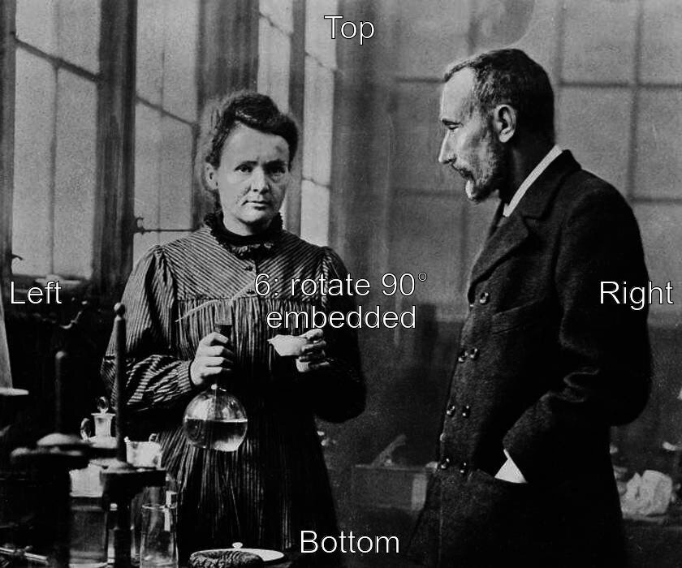
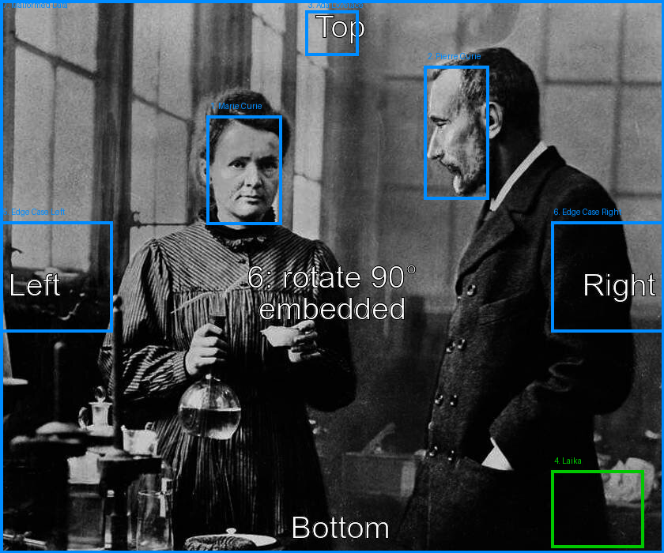

# Metadata Clues (formerly "XMP Region Name") — Photo Tagging Gramplet
[ReadMe](README.md) ● [Change Log](CHANGELOG.md) ● [XMP data](XMP_Region_Name.md) ● [Icon List](media/icons/ICONLIST.md)

This document describes the **Metadata clues** feature of the Photo Tagging gramplet (`PhotoTaggingGramplet.py`) in detail: what it is, the metadata standards it reads, exactly how it behaves (including edge cases visible in the source), its current limitations, and recommended sample images for demonstrating it.

A short history of the larger behavioral changes, each covered in full below:

- **1.1.1** — the column was renamed from **XMP Region Name** to **Metadata clues**, since it now surfaces two kinds of embedded metadata rather than one, and a silent-failure bug on some installs was found and fixed ([Section 10.4](#104-confirmed-root-cause-a-missing-gexiv2-python-override-fixed-in-111)).
- **1.2.0** — a per-region merge replaced the old one-time, whole-photo rule ([Section 4.1](#41-per-region-cascade-changed-in-120)); region data moved to a JSON attribute ([Section 4.2](#42-order-and-persistence-rewritten-in-120)); photos and regions are rotated for display to match the file's orientation metadata ([Section 8](#8-what-this-feature-does-not-do)).
- **After 1.2.0** — metadata is also read from a same-named `.xmp` sidecar file ([Section 4.3](#43-sidecar-xmp-files)); a row's Metadata clue now survives the row being linked to a Person ([Section 6.2](#62-turning-a-metadata-clue-into-a-real-gramps-link)).
- **1.2.2** — optional Fuzzy Matching lookups from a clue or placeholder name ([Section 6.1](#61-the-metadata-clues-column)).
- **1.2.3** (in progress) — hand-drawn placeholder regions are reloaded reliably even when they touch a neighboring marquee ([Section 4.4](#44-manual-placeholder-regions)).

It is based on a source-level review of `PhotoTaggingGramplet.py` as currently written; behavior of GTK/GdkPixbuf image loading and of `gramps.gui.widgets.SelectionWidget` (both outside this file) is described only where it can be inferred from calls made against them.

---

## 1. What it is
Many photo tools — Windows Live Photo Gallery/Photos, Adobe Lightroom and Photoshop, digiKam, Picasa, ACDSee, Mylio, FotoStation, and others — can detect faces in a JPEG and let a person label them, e.g. "Marie Curie". When they save that label, they don't just keep it in their own private database; many of them also **write it into the image's XMP metadata** — embedded in the file itself, or in a companion `.xmp` sidecar file next to it — in a standardized location, so that other, independent tools can read the same face boxes and names back out.

The Photo Tagging gramplet's **Metadata clues** feature is the *read* side of that interoperability: when a photo is opened in the gramplet, it looks for this metadata and, for any named region it finds, draws a selectable marquee on the photo and lists the recorded name in a dedicated **Metadata clues** column — *without* creating a Gramps `Person` or a `MediaRef` for it. It is a staging area: a hint, harvested from the file, that "someone already identified a face here, and called it *this*", left for a person to confirm by linking it to an actual Gramps `Person`. When a photo has no usable MWG region data at all, the gramplet falls back to a much simpler, flatter kind of metadata — `Xmp.dc.subject`, a plain list of names with no position information — rather than showing nothing; see [Section 4](#4-how-regions-are-loaded).

It complements, but is distinct from, the gramplet's normal region list, which is otherwise populated from Gramps's own data (via `MediaRef` back-references from people's media galleries) and from the gramplet's own saved placeholder regions — see [Section 4](#4-how-regions-are-loaded).

## 2. The underlying standard: MWG Regions
The metadata the gramplet reads is defined by the **Metadata Working Group (MWG) "Regions" schema** (namespace prefix `mwg-rs`), part of the MWG Guidelines for Handling Image Metadata. It's the same schema Lightroom, Photoshop, digiKam, Picasa, and several other tools use for both face tags and other named/typed regions, which is what makes it possible for the gramplet to read what another program wrote.

Each region in the list is stored as a small structured record giving:

| Field                              | Meaning                                                                 |
|-------------------------------------|--------------------------------------------------------------------------|
| `mwg-rs:Name`                      | Free-text label for the region (a person's name, in the face-tagging case) |
| `mwg-rs:Type`                      | The kind of region, e.g. `Face`, `Pet`, `BarCode`, `Focus`             |
| `mwg-rs:Area/stArea:x`             | Horizontal center of the region, normalized 0.0–1.0 across image width |
| `mwg-rs:Area/stArea:y`             | Vertical center of the region, normalized 0.0–1.0 across image height  |
| `mwg-rs:Area/stArea:w`             | Region width, normalized 0.0–1.0 of image width                        |
| `mwg-rs:Area/stArea:h`             | Region height, normalized 0.0–1.0 of image height                      |
| `mwg-rs:Area/stArea:unit`          | Normally `"normalized"`                                                |

Note that the area is stored as a **center point plus a size**, not as corner coordinates — this matters for the coordinate math in [Section 5](#5-coordinate-conversion). `mwg-rs:Type` is carried through into the gramplet's own persisted region data (see [Section 4.2](#42-order-and-persistence-rewritten-in-120)) — see [Section 5.2](#52-mwg-rstype-is-retained-but-not-filtered-on).

### 2.1. Exiv2 tag paths used by the gramplet
The gramplet reads these fields through **GExiv2** (the GObject-introspected binding for the Exiv2 library), using the following indexed tag-path pattern, where `%s` is the 1-based region index within the list:

```
Xmp.mwg-rs.Regions/mwg-rs:RegionList[%s]/mwg-rs:Name
Xmp.mwg-rs.Regions/mwg-rs:RegionList[%s]/mwg-rs:Type
Xmp.mwg-rs.Regions/mwg-rs:RegionList[%s]/mwg-rs:Area/stArea:x
Xmp.mwg-rs.Regions/mwg-rs:RegionList[%s]/mwg-rs:Area/stArea:y
Xmp.mwg-rs.Regions/mwg-rs:RegionList[%s]/mwg-rs:Area/stArea:w
Xmp.mwg-rs.Regions/mwg-rs:RegionList[%s]/mwg-rs:Area/stArea:h
Xmp.mwg-rs.Regions/mwg-rs:RegionList[%s]/mwg-rs:Area/stArea:unit
```

(See `get_xmp_regions()` in `PhotoTaggingGramplet.py`.)

### 2.2. Example embedded XMP (RDF/XML form)
For reference, this is what the gramplet's tag-path reads correspond to in the raw RDF/XML packet embedded in a JPEG's `APP1` segment (or in a sidecar file's body) — values abbreviated:

```xml
<mwg-rs:Regions>
  <mwg-rs:RegionList>
    <rdf:Seq>
      <rdf:li rdf:parseType="Resource">
        <mwg-rs:Name>Marie Curie</mwg-rs:Name>
        <mwg-rs:Type>Face</mwg-rs:Type>
        <mwg-rs:Area
            stArea:x="0.3079" stArea:y="0.6315"
            stArea:w="0.1986" stArea:h="0.1131"
            stArea:unit="normalized"/>
      </rdf:li>
      <rdf:li rdf:parseType="Resource">
        <mwg-rs:Name>Pierre Curie</mwg-rs:Name>
        <mwg-rs:Type>Face</mwg-rs:Type>
        <mwg-rs:Area
            stArea:x="0.2393" stArea:y="0.3125"
            stArea:w="0.2414" stArea:h="0.0964"
            stArea:unit="normalized"/>
      </rdf:li>
    </rdf:Seq>
  </mwg-rs:RegionList>
</mwg-rs:Regions>
```

A tool such as `exiftool -struct -j -G1 -RegionInfo photo.jpg` will print this in a friendlier flattened form and is the easiest way to inspect or hand-craft a test file.

## 3. Requirements
The whole Photo Tagging gramplet — not just this feature — has a **hard runtime dependency on GExiv2**. At import time, the module does:

```python
repository = gi.Repository.get_default()
v_array = repository.enumerate_versions("GExiv2")
if not v_array:
    raise ValueError("GExiv2 is not installed")
gi.require_version("GExiv2", v_array[-1])
from gi.repository import GExiv2
```

If the `GExiv2` GObject-introspection typelib is not installed, the gramplet raises `ValueError("GExiv2 is not installed")` while being imported, before any of its UI is built — i.e. it fails to load entirely, not just this one feature. On Debian/Ubuntu-family systems the required package is typically `gir1.2-gexiv2`; other distributions package it under similar names.

## 4. How regions are loaded
Every time the gramplet displays a different photo, `load_image()` first reads the photo's orientation (see [Section 8](#8-what-this-feature-does-not-do)), then builds `self.regions` from **up to four sources, in this order**:

1. **`retrieve_backrefs()`** — walks every `Person` in the database, looks at each person's media gallery for a `MediaRef` pointing at the current photo, and turns each one into a region backed by a real `person` and `mediaref`. This is the gramplet's normal, persistent, Gramps-native region data.
2. **`get_xmp_regions()`** — reads the MWG region list out of the image's XMP metadata (embedded, or from a sidecar — see [Section 4.3](#43-sidecar-xmp-files)) and turns each named entry into a region with `region.person = None` and `region.xmp_person` set to the name string read from the file. An entry overlapping an already-linked region from step 1 is skipped ([Section 4.1](#41-per-region-cascade-changed-in-120)).
3. **`get_manual_regions()`** — rebuilds every hand-drawn placeholder region saved in the photo's own `PhotoTagging Regions` attribute ([Section 4.4](#44-manual-placeholder-regions)).
4. **`get_xmp_keyword_regions()`** — only runs when steps 1–3 together produced *nothing at all* for this photo. Reads the flat list of names in `Xmp.dc.subject` (Dublin Core "Subject", commonly populated by keyword-tagging tools and usually labelled "Descriptive Tags" in general-purpose metadata viewers) and gives each name a region spanning the *entire image*, since this tag carries no position information at all. Each such region is flagged with `region.xmp_whole_image = True`, which the Metadata clues column shows as "*name* (whole photo, no region)" to make clear it isn't a real, positioned region.

```python
self.retrieve_backrefs()
self.get_xmp_regions(image_path)
self.get_manual_regions(media)
if not self.regions and not self.xmp_regions:
    self.get_xmp_keyword_regions(image_path)
self.regions = self.regions + self.xmp_regions
self.sort_regions_by_stored_order(media)
```

This fallback means the Metadata clues column only ever comes up completely empty when the file (and its sidecar, if any) genuinely has neither kind of metadata. A toolbar toggle button (using `media/icons/XMP_logo.svg`) shows or hides the whole column, for anyone who finds it more distracting than useful once their own tagging is done.

### 4.1. Per-region cascade (changed in 1.2.0)
Before 1.2.0, `get_xmp_regions()` only *added* its findings when `self.regions` (the Gramps-backed regions from step 1) was **still completely empty** — the moment even one region on a photo was linked to a Gramps person, embedded XMP regions stopped being read at all for that photo, including ones nobody had looked at yet. As of 1.2.0 this is a **per-region** check instead: an embedded region is only suppressed by a Gramps region that actually **overlaps it** (`intersects_any()`, a bounding-box test), not by the mere presence of *some* Gramps region anywhere else on the same photo.

In practice this means:

- On a **brand-new photo with no Gramps-linked people yet**, every named MWG region is shown, unassigned, with its name in the Metadata clues column.
- **Assigning one person doesn't hide the others.** A photo with three embedded face regions, one of which has been linked to a Gramps person, still offers the other two as Metadata clues on the next load, since neither overlaps the linked one's position.
- The remaining limitation is that matching is purely **positional** (bounding-box overlap), not identity-based — an embedded region whose marquee was nudged far enough by hand that it no longer overlaps its own prior position could, in principle, reappear as a separate, seemingly-duplicate clue. This hasn't been observed in practice but is worth knowing about.

This overlap check applies **only to metadata read from the file**. Manual placeholder regions are never suppressed this way — see [Section 4.4](#44-manual-placeholder-regions).

### 4.2. Order and persistence (rewritten in 1.2.0)
Regions are sorted by `sort_regions_by_stored_order()`/`get_stored_region_order()` using a `PhotoTagging Regions` custom `Attribute` on the `Media` object — a JSON document (schema `gramps.phototagging.regions/1`), not the plain `"row, Gramps ID"` text table 1.1.x used. Each entry uses the same field names as the MWG schema in [Section 2](#2-the-underlying-standard-mwg-regions) (`name`, `type`, `x`/`y`/`w`/`h`, `unit`), plus fields of the gramplet's own:

- `source` — `"gramps"` for a region confirmed and linked to a Person (authoritative), `"embedded"` for a still-unlinked region read from the file's metadata, or `"manual"` for a placeholder name typed into the Name column (or dragged onto a row) with no file metadata behind it.
- `gramps_ref` — the linked Person's Gramps ID, `"gramps"` entries only.
- `given` / `surname` — the placeholder name split into parts (see `split_placeholder_name()`), `"embedded"` and `"manual"` entries only. A `"gramps"` entry's name is always looked up live from the Person instead.

Display order is simply array position — the same way `mwg-rs:RegionList` is itself an ordered `rdf:Seq`. Still-unlinked placeholder rows keep their own stored position too, matched back by name.

An `"embedded"` entry is written even after a `"gramps"` region comes to cover the same spot, rather than being deleted — the way a lower-specificity CSS rule survives being overridden — so the clue is still there to offer again if that link is ever cleared.

For `"gramps"` and `"embedded"` entries this attribute is a *record*: the live data is re-derived from `MediaRef`s and the file on every load. A `"manual"` entry is different: it exists nowhere else, so it is read back as actual input ([Section 4.4](#44-manual-placeholder-regions)).

**Migration from 1.1.x:** a photo tagged under a pre-1.2.0 gramplet has its order recovered once from the old `PhotoTagging Order` attribute the first time it's opened under 1.2.0+; the next time this photo's region data is persisted, the new attribute is written and the old one is deleted.

### 4.3. Sidecar `.xmp` files
Some workflows keep metadata in a companion file instead of writing it into the image — notably archival collections that distribute the original image bytes untouched, with added metadata (region tags among them) kept beside it. The gramplet now reads those sidecars too, via `sidecar_xmp_path()`:

- **Naming:** the sidecar must have the **same base name with an `.xmp` extension in place of the image's own**, in the same folder — `photo.jpg` → `photo.xmp`. This is the convention Lightroom, digiKam and exiftool use by default. The alternative `photo.jpg.xmp` convention (used by darktable, among others) is **not** picked up.
- **Precedence:** the image's own embedded metadata always wins. The sidecar is consulted only when the image has no usable data of that kind:
  - MWG regions (`get_xmp_regions()`) — the sidecar is used only if the image has no `mwg-rs:Name` for region 1 and the sidecar does. The two are never merged.
  - `Xmp.dc.subject` (`get_xmp_keyword_regions()`) — the sidecar is used only if the image's own list is missing or empty.
  - Orientation (`read_rotation_degrees()`) — the sidecar is used only if the image has neither `Exif.Image.Orientation` nor `Xmp.tiff.Orientation`.
- Both files are opened through the same override-independent helper, `open_gexiv2_metadata()` ([Section 10.4](#104-confirmed-root-cause-a-missing-gexiv2-python-override-fixed-in-111)), since GExiv2/exiv2 read a standalone `.xmp` file through the same API as an image.

### 4.4. Manual placeholder regions
A marquee drawn by hand and given a typed name, but never linked to a Person, has no other source to be rediscovered from: it isn't a `MediaRef`, and it isn't in the file's metadata. `get_manual_regions()` rebuilds each `"manual"` entry from the `PhotoTagging Regions` attribute on every load, setting `region.manual_name` to the saved name and `region.xmp_person` to `""` (it is not a metadata clue).

**There is deliberately no overlap check here (fixed in 1.2.3).** An earlier version skipped any manual entry whose rectangle intersected an already-found region, borrowing the logic `get_xmp_regions()` needs. But in a tightly packed group photo — a school class, a family portrait — adjacent marquees touch or share an edge by construction, so the next placeholder in a row was silently dropped on every reload and had to be redrawn. A manual entry's presence in the attribute already means someone deliberately drew and named it, so it is always restored.

Because manual regions are added before the keyword fallback runs, a photo with any saved placeholder never also shows whole-photo `Xmp.dc.subject` clues.

## 5. Coordinate conversion
MWG stores each region's area as a **center point (`x`, `y`) plus a size (`w`, `h`)**, all normalized to the 0.0–1.0 range, whereas the gramplet's `Region`/`SelectionWidget` model works with **rectangle corners** in real image pixels. `get_xmp_regions()` performs this conversion for every region it reads:

1. Multiply `x`, `y`, `w`, `h` by 100 (working in percent instead of fractions).
2. Compute the box's edges from the center and size: `left = x - w/2`, `top = y - h/2`, `right = x + w/2`, `bottom = y + h/2`.
3. Clamp all four edges to the `[0, 100]` range, so a region whose stored center/size would place it partly outside the image is cropped to the image bounds instead of drawn off-canvas.
4. Rotate the rectangle to match the displayed (upright) image, if the file's orientation calls for it (`rotate_proportional_rect()` — see [Section 8](#8-what-this-feature-does-not-do)).
5. Convert the resulting percentage rectangle to real pixel coordinates for the displayed image via `self.selection_widget.proportional_to_real_rect(rect)`.

### 5.1. Malformed-value fallback
If `x`, `y`, `w`, or `h` cannot be parsed as a float — a `ValueError` (e.g. a writer used an unexpected format) or a `TypeError` (the tag is missing entirely, so the read returns `None`) — the gramplet does **not** skip the region or crash. Instead it falls back to:

```python
x = y = 50
w = h = 100
```

i.e. a region covering the **entire image**, still carrying whatever name was read. A malformed-but-named region is never silently lost — it shows up (impossible to miss, since it covers the whole photo) rather than disappearing, at the cost of an unhelpful bounding box that the person will need to resize or discard manually.

### 5.2. `mwg-rs:Type` is retained, but not filtered on
Through 1.1.x the gramplet read `mwg-rs:Type` (typically `Face`, but the schema also allows `Pet`, `BarCode`, `Focus`, `Area`, and vendor-specific values) and then discarded it. As of 1.2.0 it's kept, as `region.xmp_type` (defaulting to `"Face"` when absent), and carried through into the persisted `PhotoTagging Regions` JSON ([Section 4.2](#42-order-and-persistence-rewritten-in-120)) as that entry's `type` field. It is still **not used to filter** which regions are surfaced — any named region of any type is shown with its name, whether or not it represents a human face.

## 6. What the person sees and does
### 6.1. The Metadata clues column
The region list (a `Gtk.TreeView`) has six columns, two of them narrow, header-less icon columns:

| # | Column header       | Content                                                          |
|---|----------------------|------------------------------------------------------------------|
| 1 | *(unlabeled)*        | 1-based row number. Double-click opens a **Move Row** dialog. |
| 2 | Preview              | Thumbnail cropped from the region's rectangle (from the rotated display image when the photo is rotated) |
| 3 | *(icon)*             | **Add a new person** icon — unlinked rows only |
| 4 | Name / (indented) Age on \<date\> | Two-line Pango markup cell for a linked row; an editable placeholder name for an unlinked row |
| 5 | *(icon)*             | Search icon — unlinked rows that have a metadata clue only; hidden along with column 6 |
| 6 | **Metadata clues**   | `region.xmp_person` — the name read from metadata, from whichever source in [Section 4](#4-how-regions-are-loaded) produced it |

The **Metadata clues** column shows a row's clue whenever it has one — **including after that row has been linked to a Person**. Linking no longer clears `region.xmp_person` (it did through 1.2.0), so the column keeps showing what the metadata actually said, and the clue still appears in "Transcribe list to a Note" output. Rows sourced from `get_xmp_keyword_regions()` additionally get "*(whole photo, no region)*" appended for display only (`metadata_clue_text_for()`); the bare name (`metadata_clue_name()`) is what gets copied or searched.

The column itself is **read-only display**; no code path writes to it. Editing happens in the **Name column** to its left: for any unlinked row, that cell is an editable text field, pre-filled from a prior manual edit or, failing that, the metadata clue (`effective_placeholder_name()`). Confirming an edit records a `"manual"`-sourced name (see [Section 4.2](#42-order-and-persistence-rewritten-in-120)). Plain text dragged onto an unlinked row — for example a name selected in the Caption panel — sets the same placeholder name; dropping text on a linked row does nothing.

The two icon columns:

- The **Add a new person** icon (column 3) opens a new Person editor pre-filled from the row's current placeholder name (split into given/surname by `split_placeholder_name()`, which accepts both "Surname, Given" and "Given Surname"). The new Person is linked to the row when the editor is closed with OK.
- The **search** icon (column 5) acts on the *metadata clue*, not on the Name column's possibly hand-edited value:
  - A **single click** copies the clue to the clipboard, formatted "Surname, Given" — ready to paste into another tool's own name field (Data Entry's quick-entry field, a Relationship Filter, etc.). There is no picker yet, since the clipboard is the only implemented destination.
  - A **double click** opens the Fuzzy Matching addon's **Fuzzy Match Lookup** window, seeded with the clue (1.2.2). Double-clicking a match there links that Person to the row that opened the lookup. Does nothing if the Fuzzy Matching addon isn't installed and enabled.

The right-click menu's **Fuzzy Match Lookup…** item does the same lookup for any selected row, but seeded from the **Name column** value instead — so it also works for rows with no metadata clue at all.

A toolbar toggle button hides the Metadata clues column and its search icon without affecting what data is loaded.

### 6.2. Turning a metadata clue into a real Gramps link
A person confirms each identification; nothing is linked automatically:

1. Select the unassigned marquee or row (its clue is visible in the Metadata clues column, and pre-fills the editable Name column — see [Section 6.1](#61-the-metadata-clues-column)).
2. Then either:
   - **Fuzzy Match Lookup** (search icon double-click, or right-click menu) to find a possible existing Person phonetically, and double-click the match; or
   - **Link** to pick an existing `Person` with the standard selector; or
   - **Add a new person** (toolbar, menu, or the row's icon) to create one pre-filled from the placeholder name; or
   - drag a Person onto the row or marquee.
3. `set_person()` runs: a real `MediaRef` is created for that person and rectangle, and `region.person` is set. `region.xmp_person` is deliberately **left as is**, so the row keeps its Metadata clue.

From that point on, the region behaves like any other Gramps-backed region. Any *other* still-unassigned clue regions on the same photo remain offered on the next load — see [Section 4.1](#41-per-region-cascade-changed-in-120).

### 6.3. Interaction with the "show ID" overlay
The toolbar's face-marquee ID overlay (`draw_ids_overlay`) cycles through three modes:

- **Row ID** (default): draws each region's 1-based list number on the photo, including unassigned metadata-clue and placeholder regions.
- **Gramps ID**: draws `person.get_gramps_id()` over each region — a region with `region.person is None` gets **no label**. Unassigned regions show only their marquee outline in this mode.
- **Hidden**: no overlay at all.

While **Quick Draw** mode is on, every marquee is forced visible with the Row ID overlay, regardless of these settings; the previous settings come back when Quick Draw is turned off.

## 7. Data model summary (`Region` object)
The gramplet attaches these attributes to each `gramps.gui.widgets.Region` instance it manages:

| Attribute        | Set by                                     | Meaning                                                     |
|-------------------|---------------------------------------------|---------------------------------------------------------------|
| `region.person`   | `retrieve_backrefs()`, `set_person()`; cleared by `clear_ref()` | The linked Gramps `Person`, or `None` if unassigned |
| `region.mediaref` | `retrieve_backrefs()`, `set_person()`; cleared by `clear_ref()` | The `MediaRef` backing the link, or `None` |
| `region.xmp_person` | `get_xmp_regions()`, `get_xmp_keyword_regions()`; `""` for manual regions | The name read from metadata, or `""`. **Not** cleared by linking. |
| `region.xmp_type` | `get_xmp_regions()`, `get_manual_regions()` | The region's `mwg-rs:Type` (e.g. `Face`), defaulting to `"Face"` — see [Section 5.2](#52-mwg-rstype-is-retained-but-not-filtered-on) |
| `region.xmp_whole_image` | `get_xmp_keyword_regions()` | `True` for a position-less `Xmp.dc.subject` clue |
| `region.manual_name` | A confirmed Name-column edit or text drop; `get_manual_regions()` | A person-typed placeholder that overrides `xmp_person` for display and editing; absent until set |

Because a `Region` reused from the generic `SelectionWidget` API doesn't otherwise carry any of the `xmp_*` or `manual_name` attributes, they are read via `getattr(region, ..., default)` throughout rather than assumed present.

## 8. What this feature does *not* do
To avoid surprises, it's worth being explicit about the boundaries of the current implementation:

- **It never writes back to the file or its sidecar.** There is no code path anywhere in `PhotoTaggingGramplet.py` that modifies `Xmp.mwg-rs.*` tags. Assigning a Gramps person to a region creates a `MediaRef` in the Gramps database; the original metadata is left untouched, permanently. A companion tool to flatten the gramplet's tagging back into XMP is a future objective (see the [Change Log](CHANGELOG.md)).
- **Merging is per-region, but positional, not by identity.** As covered in [Section 4.1](#41-per-region-cascade-changed-in-120), a Gramps-linked region only suppresses a metadata region that overlaps it, but the match is a bounding-box test, not a stable identifier.
- **It does not filter by region `Type`.** Non-face MWG regions (pets, barcodes, focus points, etc.) with a `Name` value are surfaced the same as faces (see [Section 5.2](#52-mwg-rstype-is-retained-but-not-filtered-on)).
- **It does not merge an image's own regions with its sidecar's.** One or the other is used, never both ([Section 4.3](#43-sidecar-xmp-files)).
- **Orientation is compensated for display only, rounded to the nearest 90° (added in 1.2.0).** `read_rotation_degrees()` reads `Exif.Image.Orientation` (or `Xmp.tiff.Orientation`, or either from a sidecar) and, for a rotation of 90/180/270, displays a pre-rotated copy of the photo and rotates every region rectangle to match (`rotate_proportional_rect()`/`unrotate_proportional_rect()`), in both directions — reading an existing MWG/`MediaRef`/placeholder region for display, and converting a newly drawn or resized one back to the file's native, unrotated coordinate space before it's persisted. Two things this does *not* cover: the mirrored orientation codes (2/4/5/7) are treated as their non-mirrored rotation equivalent, since an actual camera essentially never produces those; and other Gramps displays of the same photo are not affected. Thumbnails in this gramplet's list are cropped from the same rotated image the preview shows (`safe_get_thumbnail()`), since `SelectionWidget`'s own thumbnail generation crops from the file's native, unrotated bytes.
- **No automatic name matching.** A clue is never matched to an existing Gramps `Person` on its own. Matching is always person-initiated: the optional Fuzzy Match Lookup ([Section 6.1](#61-the-metadata-clues-column)) offers phonetic candidates, and **Add a new person** pre-fills a new Person from the clue, but someone has to choose.

## 9. Demo / sample file
To see the feature in action you need a JPEG that already carries named MWG regions in its XMP — a plain photo with no such metadata will simply show nothing in the Metadata clues column.

### 9.1. Recommended sample
**[`skatsubo/exif-orientation-vs-face-regions`](https://github.com/skatsubo/exif-orientation-vs-face-regions)** is a small, purpose-built GitHub repository of JPEGs specifically created to test face-region handling. Its `images/photo.6.embedded.jpg` is a good match for demoing this feature:

- It carries **two named, embedded (not sidecar-only) MWG face regions**, confirmed via `exiftool -struct -j -G1 -RegionInfo`:
  - `Marie Curie` — area center `(0.3079, 0.6315)`, size `(0.1986 × 0.1131)`, normalized
  - `Pierre Curie` — area center `(0.2393, 0.3125)`, size `(0.2414 × 0.0964)`, normalized
- Both names appear in the **Metadata clues** column, as two unassigned marquees on the photo, the first time it's loaded for a Media object that has no Gramps-linked people yet — a direct, reproducible demonstration of the feature end to end (see [Section 6.2](#62-turning-a-metadata-clue-into-a-real-gramps-link) for the follow-up "assign to a Person" step).
- The two names correspond to real historical figures, which makes the demo self-explanatory without needing invented test data.
- The underlying photo of Marie and Pierre Curie was contributed to the `immich-app/test-assets` project specifically as a face-region test image, and the repository author built the orientation-variant test set from it.

Add the file to a Gramps Media object in the usual way (Media view → Add → select the downloaded `photo.6.embedded.jpg`) and open the Photo Tagging gramplet on it.

### 9.2. Licensing note
The `exif-orientation-vs-face-regions` repository does not carry an explicit license file as of this writing. Treat the image as suitable for **local development/testing purposes** (verifying and demonstrating this feature) rather than for redistribution inside the Gramps codebase or an addon package; confirm licensing directly with the repository/upstream `immich-app/test-assets` project before bundling it anywhere.

If a license-clear, redistributable fixture is needed (e.g. to ship inside the addon's own test suite), the cleanest option is to generate one locally with `exiftool`, using any image the project already has rights to:

```bash
exiftool -config "" \
  -XMP-mwg-rs:RegionAppliedToDimensionsW=<image width in px> \
  -XMP-mwg-rs:RegionAppliedToDimensionsH=<image height in px> \
  -XMP-mwg-rs:RegionAppliedToDimensionsUnit=pixel \
  -XMP-mwg-rs:RegionName="Test Person" \
  -XMP-mwg-rs:RegionType=Face \
  -XMP-mwg-rs:RegionAreaX=0.5 \
  -XMP-mwg-rs:RegionAreaY=0.5 \
  -XMP-mwg-rs:RegionAreaW=0.3 \
  -XMP-mwg-rs:RegionAreaH=0.3 \
  -XMP-mwg-rs:RegionAreaUnit=normalized \
  your-photo.jpg
```

(Exact flat-tag names for `exiftool` vary by version; `exiftool -struct -j -G1 -RegionInfo` on a file already produced by Picasa/Lightroom/digiKam is the most reliable way to confirm the exact tag set your installed `exiftool` expects to write.)

### 9.3. A second file to exercise orientation and sidecars
Since `photo.6.embedded.jpg` carries EXIF orientation `6` (rotate 90° CW), it doubles as a regression check for the rotation handling added in 1.2.0 (see [Section 8](#8-what-this-feature-does-not-do)): load it and confirm the photo displays upright and the two face marquees land on the actual faces, rather than being offset or rotated relative to them. This has not yet been re-verified against the file since that change landed.

The same repository's `images/photo.6.embedded_sidecar.jpg` carries the same region data in a sidecar `.xmp` file rather than embedded. Since the gramplet now reads sidecars ([Section 4.3](#43-sidecar-xmp-files)), this file is a test that sidecar regions **are** picked up — provided the sidecar is named `photo.6.embedded_sidecar.xmp`. If the repository names it `photo.6.embedded_sidecar.jpg.xmp` instead, the gramplet will not find it; rename (or copy) it to the `.xmp`-replaces-extension form to test.

### 9.4. A single file covering the full spectrum of behaviors
`photo.6.embedded.jpg` (Section 9.1) is a good *first* demo, but it only exercises the plain, well-formed, two-face case. To exercise every code path described in this document in one file, this project includes **`spectrum_demo.jpg`**, built by taking that same base photo, rotating it to upright orientation, and replacing its `Xmp.mwg-rs.Regions` metadata with seven hand-crafted regions:



| # | Embedded name     | Type   | What it exercises                                                                 |
|---|--------------------|--------|--------------------------------------------------------------------------------------|
| 1 | Marie Curie        | Face   | Normal, well-formed region (re-derived for the now-upright image)                   |
| 2 | Pierre Curie       | Face   | Normal, well-formed region (re-derived for the now-upright image)                   |
| 3 | Ada Lovelace       | Face   | A third named region, to exercise a **multi-person** region list                    |
| 4 | Laika              | Pet    | Non-`Face` `mwg-rs:Type`, to confirm it's shown anyway (Section 5.2)                 |
| 5 | Edge Case Left     | Face   | Center near the left edge; box extends past `x=0` and must clamp there (Section 5)  |
| 6 | Edge Case Right    | Face   | Center near the right edge; box extends past `x=100%` and must clamp there          |
| 7 | Malformed Data     | Face   | `stArea:x` is the literal text `garbage`; `float()` raises `ValueError`, triggering the full-image fallback rect (Section 5.1) |

Because the base photo's original EXIF orientation (`6`, rotate 90° CW) would otherwise entangle the orientation handling with everything else, `spectrum_demo.jpg` is first re-rotated to upright (`Orientation: Horizontal (normal)`) and Marie/Pierre Curie's region coordinates are algebraically re-derived for the rotated frame, so this file isolates the seven scenarios above without also being an orientation test case. (`photo.6.embedded.jpg` itself remains the file to use for orientation specifically — see [Section 9.3](#93-a-second-file-to-exercise-orientation-and-sidecars).)

This was verified two ways before being finalized:

- **Metadata verification** — `exiftool -struct -j -G1 -RegionInfo spectrum_demo.jpg` confirms all seven regions round-trip exactly as written, including the non-numeric `garbage` value (most tools, including `exiftool` itself, refuse to *write* a non-numeric value through their normal typed tag interface — this file's malformed value was injected by editing the raw XMP/RDF packet directly, since that's also how a real, buggy or hand-edited third-party writer could produce one "in the wild").
- **Logic simulation** — `get_xmp_regions()`'s conversion/clamp/fallback logic was re-implemented line-for-line in a standalone script (GExiv2 itself is a GTK/GObject-introspection library and wasn't available in the environment used to build this file) and run against the file's actual metadata. The resulting seven rectangles were then drawn onto the image for a visual sanity check:

| # | Name            | Type | Resulting rect, in % of image (L, T, R, B) | Fallback triggered? |
|---|------------------|------|-----------------------------------------------|------------------------|
| 1 | Marie Curie      | Face | (31.2, 20.9, 42.5, 40.7)                       | No                     |
| 2 | Pierre Curie     | Face | (63.9, 11.9, 73.6, 36.0)                       | No                     |
| 3 | Ada Lovelace     | Face | (46.0, 2.0, 54.0, 10.0)                        | No                     |
| 4 | Laika            | Pet  | (83.0, 85.0, 97.0, 99.0)                       | No                     |
| 5 | Edge Case Left   | Face | (**0**.0, 40.0, 17.0, 60.0)                    | No (clamped at left)   |
| 6 | Edge Case Right  | Face | (83.0, 40.0, **100**.0, 60.0)                  | No (clamped at right)  |
| 7 | Malformed Data   | Face | (0.0, 0.0, 100.0, 100.0)                       | **Yes**                |

`spectrum_demo_preview.png` (included alongside `spectrum_demo.jpg`) renders these seven boxes over the photo for a quick visual check — Marie's and Pierre's boxes should land tightly on their faces, Ada's sits near the top edge, Laika's sits near the bottom-right corner, "Edge Case Left"/"Right" are visibly cut off flush with the image's left/right border, and "Malformed Data" covers the entire photo.



**Reproducing or modifying it:** [build_spectrum_demo.sh](media/build_spectrum_demo.sh) (included alongside the image) is the exact, runnable recipe used to build `spectrum_demo.jpg` from the original `photo.6.embedded.jpg` — download the base photo, rotate it upright with ImageMagick, and splice a hand-written `mwg-rs:Regions` RDF block into its XMP packet with `exiftool`. Re-run it to regenerate the file identically, or edit the embedded RDF block in the script to add further scenarios (e.g. a region with `mwg-rs:Type` of `BarCode` or `Focus`, or one with `w`/`h` values of zero).

**Licensing note:** as this is a derivative of `photo.6.embedded.jpg`, the same caution in [Section 9.2](#92-licensing-note) applies.

## 10. Troubleshooting
### 10.1. Quick reference
| Symptom                                                        | Likely cause                                                                                   |
|-------------------------------------------------------------------|---------------------------------------------------------------------------------------------------|
| Gramplet fails to load at all / "GExiv2 is not installed"       | The `GExiv2` GObject-introspection typelib isn't installed (see [Section 3](#3-requirements))   |
| A clue you know is in the file doesn't appear on a photo that already has some people tagged | A linked marquee overlaps that clue's position, which suppresses it by design — see [Section 4.1](#41-per-region-cascade-changed-in-120) |
| Metadata clues column blank even on a fresh photo with no Gramps people linked | The metadata may be in a sidecar named `photo.jpg.xmp` rather than `photo.xmp` — only the latter is read (see [Section 4.3](#43-sidecar-xmp-files)); or see [Section 10.4](#104-confirmed-root-cause-a-missing-gexiv2-python-override-fixed-in-111) if it's blank even for files proven to carry good embedded data |
| Sidecar regions ignored even though the sidecar is correctly named | The image's own embedded XMP has at least one MWG region, which takes precedence; the two are never merged ([Section 4.3](#43-sidecar-xmp-files)) |
| Column blank on **every** file tried, including known-good ones, sometimes with a `CRITICAL **: XMP Toolkit error 201` / `Failed to decode XMP metadata` message in the terminal or `gramps.log` | Fixed in 1.1.1 — see [Section 10.4](#104-confirmed-root-cause-a-missing-gexiv2-python-override-fixed-in-111); if it recurs on a 1.1.1-or-later install, [Section 10.3](#103-earlier-hypothesis-gexiv2-built-against-exiv2-028-superseded--see-104)'s diagnostic process is still the right starting point |
| Whole-photo "(whole photo, no region)" clues don't appear | The photo already has a linked person, an MWG region, or a saved placeholder — the `Xmp.dc.subject` fallback only runs when there's nothing else ([Section 4](#4-how-regions-are-loaded)) |
| Marquee covers the entire photo instead of a face               | Malformed or missing `x`/`y`/`w`/`h` values triggered the full-image fallback (see [Section 5.1](#51-malformed-value-fallback)) |
| Marquee is offset from the actual face                          | Possible orientation mismatch, e.g. a mirrored orientation code — see [Section 8](#8-what-this-feature-does-not-do) |
| A non-face region's name shows up unexpectedly                  | `mwg-rs:Type` isn't filtered — see [Section 5.2](#52-mwg-rstype-is-retained-but-not-filtered-on)     |
| A hand-drawn placeholder disappears when the photo is reopened  | Fixed in 1.2.3 — placeholders touching a neighboring marquee were dropped on reload ([Section 4.4](#44-manual-placeholder-regions)) |

### 10.2. Diagnostic tools
Two small development tools were written because the failure mode covered in [Section 10.4](#104-confirmed-root-cause-a-missing-gexiv2-python-override-fixed-in-111) turned out to be invisible from inside Gramps itself. **Neither is included in the addon package**; they're described here because the approach remains useful for diagnosing a similar report:

- **`xmp_region_diagnostic.py`** reproduces `get_xmp_regions()` outside Gramps entirely, printing every step (import, `GExiv2.Metadata()` construction, a full XMP tag dump, and the indexed-path reads) so a silent failure can be isolated without touching Gramps at all. Run it with the *exact* Python interpreter Gramps itself uses — for a Flatpak install, that means running it *inside* the sandbox, e.g.:
  ```bash
  flatpak run --command=python3 org.gramps_project.Gramps \
      /path/to/xmp_region_diagnostic.py /path/to/photo.jpg
  ```
  A native/distro-packaged Gramps can just run it with the system `python3`.
- **`get_xmp_regions_patch.py`** was a drop-in replacement for the method of the same name that only added logging around the then-current, override-dependent code. **Superseded by the actual fix in 1.1.1** (see [Section 10.4](#104-confirmed-root-cause-a-missing-gexiv2-python-override-fixed-in-111)).

### 10.3. Earlier hypothesis: gexiv2 built against exiv2 0.28 (superseded — see 10.4)
> **This section documents the investigation as it stood at the time.** It correctly ruled out the file, the coordinate logic, and the one-time-merge rule (since replaced — see [Section 4.1](#41-per-region-cascade-changed-in-120)), but its conclusion — a `libgexiv2` build incompatible with exiv2 0.28's ABI — turned out to be circumstantial rather than the actual mechanism. [Section 10.4](#104-confirmed-root-cause-a-missing-gexiv2-python-override-fixed-in-111) below found and fixed the real cause on the same reporter's system. Kept here for the diagnostic process itself, which remains a reasonable model for narrowing down a similarly silent failure elsewhere.

This was found and confirmed via an extended diagnostic session and is recorded here in full because it produces exactly the symptom this document is about — an empty column (then called "XMP Region Name") — with **no indication anywhere in Gramps that anything is wrong**, for files that are provably valid and provably readable elsewhere.

**Symptom.** On a Flathub install of Gramps (confirmed on Gramps 5.2.1, `org.gramps_project.Gramps`, `stable` channel), the column stayed empty for every MWG-region file tried — including files independently verified (via `xmllint` and via direct testing with an unrelated exiv2 binding) to be valid, well-formed, and perfectly readable. Larger/more complex files additionally logged:
```
** CRITICAL **: XMP Toolkit error 201: Error in XMLValidator
** WARNING **: Failed to decode XMP metadata.
```
while minimal, single-region test files produced no message at all — just silence, both in the gramplet and in the terminal.

**Diagnosis path** (each step ruling something out):

1. **The file's own coordinate math and edge cases** — clamping, malformed-value fallback, multi-region lists — were verified correct by re-implementing `get_xmp_regions()` standalone and running it against known-good metadata (see [Section 9.4](#94-a-single-file-covering-the-full-spectrum-of-behaviors)). Not the cause.
2. **The one-time-merge rule** then in effect was ruled out by checking the Media object's References tab showed zero linked people.
3. **Malformed XML** was ruled out with `xmllint --noout` on the raw extracted XMP packet of every file involved (all valid, exit code 0), including the file that produced the `CRITICAL`/`XMLValidator` message above — proving that message wasn't describing an actual XML syntax error, despite its wording.
4. **A fully broken/unreadable XMP environment** was ruled out because *some* XMP consistently read correctly throughout — `Xmp.dc.subject` and keyword-list tags came through cleanly, every time, via a different gramplet (Edit Image Exif Metadata) reading the very same files that showed nothing for `mwg-rs:Regions`.
5. **exiv2 itself** (the C++ library both gexiv2 and the `exiv2` CLI are built on) was ruled out last: the failing Flatpak turned out to bundle **exiv2 0.28.2** internally (`/app/lib/libexiv2.so.0.28.2` — found via `flatpak run --command=sh org.gramps_project.Gramps -c "find /app -iname 'libexiv2*'"`), a different major version from the `exiv2` CLI on the host system (0.27.6) that earlier testing had been comparing against. Reading the same minimal test files directly through **exiv2 0.28.8** (a close later patch release, tested via the independent, non-gexiv2 `pyexiv2` Python binding) succeeded perfectly — every region, every field, even a deliberately malformed value — proving exiv2 0.28.x's own XMP parser handles this schema correctly.

**Conclusion at the time.** With the file, the coordinate logic, the one-time-merge rule, and exiv2 itself all cleared, the fault was narrowed to *some* incompatibility specific to the `libgexiv2` build bundled in that Flatpak (reported as version 2.14.2 — the same version number as a working Ubuntu-packaged `libgexiv2`, but necessarily a *different compiled artifact*, since exiv2 0.28 changed its SONAME as part of a deliberately ABI-breaking rewrite). This was a reasonable narrowing at the time, but — per Section 10.4 — the actual mechanism turned out to be simpler and one step higher up, in how the gramplet's own Python code called into `gexiv2`, not in `libgexiv2`/`libexiv2` themselves.

### 10.4. Confirmed root cause: a missing GExiv2 Python override (fixed in 1.1.1)
Continued debugging on the *same reporter's own system* (still Flathub Gramps 5.2.8) found the real, directly-observed mechanism, via two live tracebacks the previous investigation never surfaced because the failures it depended on had, up to that point, always been swallowed silently.

**What `GExiv2.Metadata(path)` actually is.** The convenient one-argument constructor used throughout the original `get_xmp_regions()` (`metadata = GExiv2.Metadata(image_path)`) is not part of the native, GObject-Introspection-generated `GExiv2.Metadata` class at all. It's added by an optional Python *override* module (`gi/overrides/GExiv2.py`, shipped by some `gexiv2` packages) that wraps the real constructor and calls the always-present `open_path()` method. The same override also adds the convenience `.get(key)` method used throughout the same function. **On this reporter's Flatpak, that override module is missing.** Calling `GExiv2.Metadata(path)` therefore falls straight through to the plain, autogenerated `GObject.__init__()` (which takes no arguments) and raises:
```
TypeError: GObject.__init__() takes exactly 0 arguments (1 given)
```
and, once that was fixed by calling `GExiv2.Metadata()` then `.open_path(path)` directly, the very next line's `metadata.get(...)` call raised a second, equally fundamental error:
```
AttributeError: 'Metadata' object has no attribute 'get'
```
— confirming the override genuinely isn't present at all, not just its constructor shortcut.

**Why Section 10.3's investigation never saw this.** Both of these are ordinary Python exceptions raised on the very first lines of `get_xmp_regions()`, and the original code wrapped that whole block in a bare `except:` with no logging of any kind:
```python
try:
    metadata = GExiv2.Metadata(image_path)
except:
    return
```
A bare `except` catches *everything*, indiscriminately — a genuine `libgexiv2`/exiv2 incompatibility (Section 10.3's hypothesis) and a simple `TypeError` from a missing convenience wrapper (the real cause) are completely indistinguishable from outside the function once caught this way. Only adding real logging and reading the resulting traceback could tell them apart.

**The fix, shipped in 1.1.1** (and since factored into one shared helper): every metadata read — image or sidecar — now goes through `open_gexiv2_metadata()`, which uses the override-independent two-step form, and a small helper, `get_xmp_tag_string(metadata, key)`, reimplements exactly what the override's `.get()` used to do (`get_tag_string(key)` if `has_tag(key)`, else `None`) using only native methods that exist regardless of whether the override is installed:
```python
metadata = GExiv2.Metadata()
metadata.open_path(path)
...
name = get_xmp_tag_string(metadata, region_name % i)
```
The bare `except:` was also replaced with a two-tier `except GLib.GError` / `except Exception` split: a `GLib.GError` is exiv2's own well-defined "this isn't a format I can read metadata from" signal (e.g. an SVG file mistakenly added as Media) and is logged quietly at `DEBUG`, since it's routine and not a bug; anything else is logged at `ERROR` via `LOG.exception()`, so a failure like this one is visible in Gramps's own log the next time it happens, on any system.

**Practical implication.** This does not necessarily mean every occurrence of an empty Metadata clues column has this same cause — Section 10.3's diagnostic process (ruling out the file, the merge rule, and exiv2 itself in turn) remains the right way to approach a fresh report of this symptom, and a genuine `libgexiv2`/exiv2 ABI incompatibility hasn't been *ruled out* as a real, separate phenomenon that could affect a different install. But on at least this one real system, a missing Python override — not an ABI mismatch — was the actual, complete explanation, and the override-independent rewrite fixes that class of failure on any system, whether or not the override happens to be present.

## 11. Related source locations
For future maintenance, the relevant code in `PhotoTaggingGramplet.py` is concentrated around:

- `load_image()` — the load order and merge decision across all four sources, and reading rotation and pre-rotating the display copy
- `retrieve_backrefs()` — the Gramps-native region source
- `get_xmp_regions()` — the MWG XMP reader and coordinate conversion
- `get_manual_regions()` — reloads saved `"manual"` placeholder regions (no overlap check, 1.2.3)
- `get_xmp_keyword_regions()` / `read_xmp_subject_tag()` — the `Xmp.dc.subject` whole-image fallback
- `open_gexiv2_metadata()` / `get_xmp_tag_string()` — override-independent metadata access (see [Section 10.4](#104-confirmed-root-cause-a-missing-gexiv2-python-override-fixed-in-111))
- `sidecar_xmp_path()` — sidecar lookup (see [Section 4.3](#43-sidecar-xmp-files))
- `set_person()` / `clear_ref()` — linking and unlinking (note: `xmp_person` is kept on link)
- `intersects_any()` — the bounding-box overlap test behind the per-region cascade
- `parse_region_data()` / `serialize_region_data()` / `get_stored_region_order()` / `sort_regions_by_stored_order()` — the `PhotoTagging Regions` JSON schema's read/write side
- `split_placeholder_name()` / `effective_placeholder_name()` / `metadata_clue_name()` / `metadata_clue_text_for()` — placeholder-name parsing, the manual/embedded precedence rule, and clue text
- `cb_name_cell_edited()` / `text_drag_received()` — setting a placeholder name by typing or by text drop
- `open_piping_options_dialog()` — clipboard copy from the search icon
- `_get_fuzzy_match_lookup()` / `_handle_pipe_icon_double_click()` / `cb_fuzzy_lookup_clicked()` / `_apply_fuzzy_match()` — the optional Fuzzy Matching integration
- `read_rotation_degrees()` / `rotate_proportional_rect()` / `unrotate_proportional_rect()` / `rotated_pixbuf_and_temp_path()` — rotation support (see [Section 8](#8-what-this-feature-does-not-do))
- `NoteTextBuilder` / `transcribe_list_to_note_clicked()` — "Transcribe list to a Note", which includes the Metadata clues text
- Column setup (`column_add_icon`, `column_pipe_icon`, `self.column_metadata_clues`) in the gramplet's UI-building method, and `row_mouse_click()` for the icon and row-number click handling

## 12. Accompanying files
Files shipped with the addon that this document refers to:

| File | Purpose |
|------|---------|
| `media/spectrum_demo.jpg` | Seven-region demo/test file covering the full behavioral spectrum ([Section 9.4](#94-a-single-file-covering-the-full-spectrum-of-behaviors)) |
| `media/spectrum_demo_preview.png` | Rendered preview of `spectrum_demo.jpg`'s seven regions — **not** itself a valid test fixture; has no embedded XMP |
| `media/build_spectrum_demo.sh` | Reproducible build script for `spectrum_demo.jpg` |
| `media/icons/XMP_logo.svg` | Icon for the Show/Hide Metadata clues toolbar button |

The development-only files from the 1.1.1 investigation (`xmp_region_diagnostic.py`, `get_xmp_regions_patch.py`, `test_minimal_single_region.jpg`, `test_combined_dc_and_mwg.jpg`, and a since-superseded `gexiv2_bug_report.md`) are not part of the addon package.

---

*This document was drafted with AI assistance (an Anthropic Claude model, via the claude.ai chat interface and Claude Cowork) from a review of the `PhotoTaggingGramplet.py` source, public web research into the MWG Regions XMP schema, and two extended interactive debugging sessions — one that produced the since-superseded hypothesis in Section 10.3, and a later one that found and fixed the actual cause in Section 10.4. It was revised for 1.2.0, and again for 1.2.2/1.2.3 (sidecar support, manual placeholder regions, clues surviving linking, the icon columns and Fuzzy Matching integration), each time from a review of that version's source rather than fresh independent testing. Per the Gramps project's AI-generated-content guidance, this should be disclosed in the commit message if/when this file is contributed, e.g. with a `Generated-by:` tag naming the tool/provider/version and a summary of the prompts used, and it should be reviewed by a human contributor for accuracy before being merged.*
