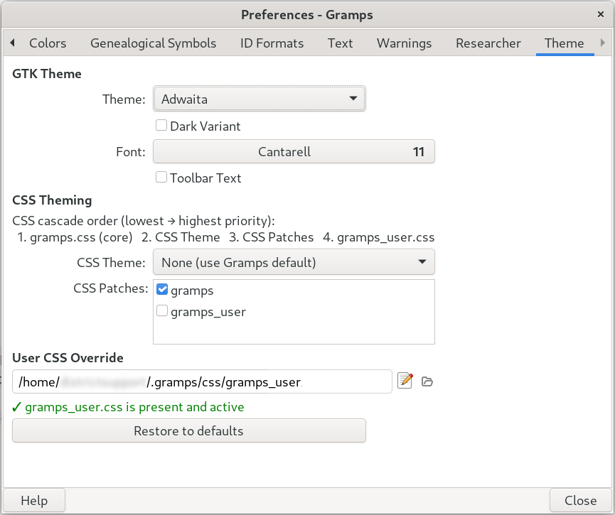

# Themes — Gramps Addon [README.md](README.md) ** ⚠ * EXPERIMENTAL * ⚠ **


**Version:** 1.0.0 alpha test 
**Target:** Gramps 5.2 or newer 
**Category:** General (Help -> Preferences -> Theme tab)  
**Status:** Stable  
**Original author:** Paul Culley <paulr2787@gmail.com>  
**Maintainer:** Brian McCullough <emyoulation@yahoo.com> 
**Rewrite and bug-fixes:** Claude Sonnet 4.6 (Anthropic), May 2026, under direction of Brian McCullough <emyoulation@yahoo.com>.
## Overview

The **Themes** addon adds a **Theme** tab to the Gramps Preferences dialog (`Edit → Preferences`). It gives you control over three overlapping but independent theming systems:



| System | What it changes | How it works |
|---------|---------------|-------------|
| **GTK Theme** | Every pixel of every GTK widget | Replaces the whole GTK widget style engine |
| **Dark Variant** | Background/foreground color inversion | Boolean flag inside the current GTK theme |
| **Font** | Application-wide text font and size | GTK font setting |
| CSS Theme | NYI : Gramps-specific widget colors and layout | NYI : Single `.css` file layered *on top of* `gramps.css` |
| [**CSS Patches**](#) | Small targeted tweaks | One or more `.css` files layered on top of the CSS Theme |
| **`gramps_user.css`** | Your personal overrides | Highest-priority CSS; always wins |
| [**GTK Inpector**](#gtk-inspector) | Identifying CSS styles for GTK applications | Discover which CSS layer and element wins |

The GTK controls and the CSS controls are completely independent — you can use one, both, or neither.

---

## GTK Theme vs. CSS Theme — key differences

This is the most important concept to understand before using the addon.

### GTK Theme

A GTK theme is a complete replacement for the way GTK draws *every* widget on screen — buttons, scrollbars, checkboxes, menus, title bars, the works. It is loaded by the GTK library itself at startup, before Gramps draws anything.
Examples: **Adwaita** (the default), **Adwaita-dark**, **HighContrast**, **Breeze**, **Arc**, **Numix**.

Choosing a GTK theme affects *all* GTK applications, not just Gramps. On Linux this is typically the job of your desktop-environment settings; on Windows and macOS there is no system-level GTK-theme mechanism, so this addon is the only practical way to switch.

**Priority:** GTK themes sit below everything else in the CSS cascade. The entire `gramps.css`, any CSS Theme, any patch, and `gramps_user.css` all load *after* and *on top of* the GTK theme.

### CSS Theme

**Not Yet Implemented** : Future development placeholder.  Have not yet determined what file/folder structure offer best migration path to eventual sharing of Gramps Theming overlays.

A CSS Theme is a single `.css` file that you (or a theme author) place in:

```
~/.local/share/gramps/css/themes/   (Linux / macOS)
%APPDATA%\gramps\css\themes\        (Windows)
```

It targets Gramps-specific CSS classes and widget names — things like `.lozenge`, `.tag-editor`, `#PersonView`, and so on — rather than generic GTK widget types. It is loaded *on top of* both the GTK theme and Gramps's own built-in `gramps.css`, so it can refine colors, spacing, and fonts for particular Gramps views without touching anything else on your system.

**Use a CSS Theme when** you want to restyle Gramps views without affecting other GTK apps, or when you are distributing a Gramps color scheme to other users.

### Cascade order (lowest → highest priority)

```
1. GTK Theme             ← replaces all GTK widget drawing
       ↓
2. gramps.css            ← Gramps built-in styles (loaded by ViewManager)
       ↓
3. CSS Theme             ← your selected theme file (optional)
       ↓
4. CSS Patches           ← small targeted tweaks (zero or more, sorted order)
       ↓
5. gramps_user.css       ← your personal override (PRIORITY_USER = 800)
```

A rule in a higher layer always beats a rule in a lower layer.
`gramps_user.css` is loaded at GTK's `PRIORITY_USER` (800), which is higher than `PRIORITY_APPLICATION` (600) used by all the others, so it genuinely always wins.

---

## Installation

### From the Gramps Addon Manager (recommended)

1. Open Gramps → `Edit → Addon Manager → Projects tab`.
2. Add  
3. Search for **Themes** and click Install.
3. Restart Gramps. The **Theme** tab appears in `Edit → Preferences`.

### Manual installation

Copy the three files into a `Themes` subdirectory inside your Gramps user plugins directory:

| Platform | Plugins directory |
|---|---|
| Linux | `~/.local/share/gramps/plugins/Themes/` |
| macOS | `~/Library/Application Support/gramps/plugins/Themes/` |
| Windows | `%APPDATA%\gramps\plugins\Themes\` |

The three files are:

```
themes_gpr.py   ← plugin registration
themes_load.py  ← startup loader (load_on_reg entry point)
themes.py       ← Preferences panel
```

Restart Gramps after copying.

---

## The Theme tab

Open `Edit → Preferences` and click the **Theme** tab on the left.

### GTK Theme section

**Theme combo** lists every GTK 3.x theme found on your system (built-in, user-installed, and system-installed). Select one to switch immediately. The change is live — no restart needed.

If the environment variable `GTK_THEME` is set, the combo and the dark-variant checkbox are disabled because the theme is hardcoded outside Gramps's control.

**Dark Variant** checkbox enables the dark variant of the current GTK theme (equivalent to setting `GTK_THEME=Adwaita:dark` but without locking the theme name). Not all themes have a dark variant; if nothing changes, the theme does not support it.

**Font** opens a font chooser filtered to normal-weight upright faces (no bold, no italic). The change is live.

**Toolbar Text** shows text labels beneath toolbar icons. Off by default.

**Fixed Scrollbar** (Windows only) restores the traditional up/down arrow buttons on scrollbars and disables overlay scrollbars. Requires a restart to take full effect.

### CSS Theming section

**CSS Theme** combo lists every `.css` file found in:

```
~/.local/share/gramps/css/themes/
```

Selecting one loads it immediately into the running Gramps session on top of `gramps.css`. Select **None** to return to the plain Gramps default.

**CSS Patches** shows a scrollable checklist of every `.css` file found in:

```
~/.local/share/gramps/css/patches/
```

Tick any combination. Patches are applied in alphabetical order, so you can control layering by prefixing filenames with numbers (`01-fix-lozenge.css`, `02-wider-columns.css`, …). Changes are live.

### User CSS Override section

Shows the full path to `gramps_user.css`. Two icon buttons sit to the right of the path:

| Icon | Action |
|---|---|
| ✏ (text-editor) | Opens `gramps_user.css` in your default text editor. Creates the file with a template comment if it does not yet exist. |
| 📂 (document-open) | Opens the `css/` folder in your file manager. |

A green tick (✓) appears below the path when the file exists and is active. The status updates immediately after the file is created — no need to close and reopen Preferences.

**Restore to defaults** resets the GTK theme, dark variant, font, CSS theme, and all patches to their original values and clears every related key from `gramps.ini`.

---

## Setting up CSS Themes and Patches

### Directory layout

Create the following directories inside your Gramps user data folder (it is created automatically when you click **Open Folder** or **Edit** for the first time):

```
~/.local/share/gramps/css/          ← USER_CSS root
    gramps_user.css                 ← personal override (any rules)
    themes/
        my-dark-theme.css           ← selectable in CSS Theme combo
        another-theme.css
    patches/
        01-wider-sidebars.css       ← selectable in CSS Patches list
        02-tag-colours.css
```

### Writing a CSS Theme

A CSS Theme file is plain GTK 3 CSS targeting Gramps widget names and classes.
Start by reading [`gramps.css`](https://github.com/gramps-project/gramps/blob/master/data/gramps.css) from the Gramps source as a reference.
A minimal example:

```css
/* my-dark-theme.css – a Gramps CSS Theme */

/* Sidebar background */
.sidebar {
    background-color: #1e1e2e;
    color: #cdd6f4;
}

/* Active view header */
.view headerbar {
    background-color: #313244;
}

/* Tag lozenges */
.lozenge {
    border-radius: 4px;
    padding: 1px 6px;
}
```

Save it as `~/.local/share/gramps/css/themes/my-dark-theme.css` and it appears in the CSS Theme combo the next time you open Preferences.

### Writing a CSS Patch

A patch is identical in format to a CSS Theme but is intended to be small and targeted — a single focused fix rather than a whole-look redesign. Because patches stack on top of the selected CSS Theme (and on top of each other), they are ideal for:

* Fixing one color you dislike in someone else's theme.
* Adjusting font sizes in a specific view.
* Overriding a spacing value that is wrong on your screen resolution.
* Experimenting with CSS variations

```css
/* 02-tag-colours.css – patch: make birthday tags yellow */
.tag-birthday .lozenge {
    background-color: #f9e2af;
    color: #1e1e2e;
}
```

Patches are applied in alphabetical filename order. Workaround: Prefix with numbers to control the order (`01-`, `02-`, …).

### Using `gramps_user.css`

`gramps_user.css` is your personal scratch-pad. It is loaded at `PRIORITY_USER` (800), above every other stylesheet, so any rule you write here beats everything else unconditionally. Use it for quick experiments before promoting your work into a proper theme or patch file.

The file is created with a template comment header the first time you click the edit (✏) icon in Preferences. Edit it with any text editor; changes take effect on the next Gramps restart.

---

## Preferences file (`gramps.ini`)

The addon stores its settings in `gramps.ini` under the `[preferences]` and `[interface]` sections:

| Key | Type | Meaning |
|---|---|---|
| `preferences.themes-version` | string | Version sentinel — see below |
| `preferences.theme` | string | GTK theme name, or `""` for OS default |
| `preferences.theme-dark-variant` | string | `"True"` if dark enabled, `""` if not |
| `preferences.font` | string | GTK font name, or `""` for OS default |
| `preferences.css-theme` | string | Selected CSS theme name (no `.css`), or `""` |
| `preferences.css-patches` | string | Comma-separated enabled patch names |
| `interface.toolbar-text` | bool | Show text under toolbar icons |
| `interface.fixed-scrollbar` | string | Windows fixed scrollbar (`"True"` / `""`) |

### Version sentinel and predictable upgrades

`preferences.themes-version` stores a compatibility string (currently `"1.0"`).
On every Gramps startup, `themes_load.py` compares the stored value against the addon's built-in `PREFS_VERSION` constant. If they differ — including when the key is entirely absent (first run ever) — **all addon-owned keys are reset to their defaults** before the new version string is written.

This means:

* **First install:** keys are created fresh with no stale values.
* **Upgrade from an older Themes release:** old keys are purged before the new defaults are applied. You will need to re-select your theme and patches, but you will not encounter corrupt or misinterpreted saved values from the previous release.
* **Downgrade:** same — the sentinel mismatch triggers a clean slate.

### What happens when the addon is uninstalled?

The addon is designed to leave `gramps.ini` as clean as possible:

* The GTK **theme name** key is only written when the user selects something *different* from GTK's own default. If you never touched the combo, or you clicked **Restore to defaults** before uninstalling, the key is `""` and Gramps core ignores it.
* The **dark-variant** key stores `"True"` when dark mode is on, or `""` (empty string) when it is off. An empty string is falsy in Python, so the `if value:` guard in the startup code never fires for the off case.
  Critically, `"False"` is *never* written — a non-empty string `"False"` is truthy and would incorrectly force the dark flag off on every startup even after the addon is removed.
* **CSS keys** have no meaning to Gramps core and are simply ignored when the addon is absent.

If you uninstall the addon and Gramps opens with an unexpected GTK theme or dark mode, open `gramps.ini` in a text editor, find the `[preferences]` section, and delete any `theme`, `theme-dark-variant`, or `font` line that carries a non-empty value.

---

## Troubleshooting

### The CSS Theme combo is empty

No `.css` files exist in `~/.local/share/gramps/css/themes/`. Click the
📂 icon next to `gramps_user.css` to open the CSS folder in your file manager, create the `themes/` subdirectory, and add your `.css` files.

### `gramps_user.css` always showed "not yet created" even though it existed

This was a bug in versions prior to 1.0.0. The status label was a local variable evaluated once when the Preferences panel was built, so it could never update after you clicked Edit. Version 1.0.0 fixes this: the label is stored as `self._user_css_status` and refreshed immediately by `cb_open_user_css()` after the file is created.

### Gramps opened with Adwaita-dark after removing the old addon

This was caused by the old 0.x code saving the string `"False"` (a non-empty truthy value in Python) for the dark-variant-off state. On the next load, `if value:` evaluated to `True` and `value == "True"` was `False`, so `set_property('gtk-application-prefer-dark-theme', False)` was called — forcing the dark flag *off* every startup. Combined with a persisted `preferences.theme = Adwaita-dark` from a previous explicit selection, this created the illusion that Adwaita-dark was being forced on.

Version 1.0.0 never writes `"False"` for the dark key (it writes `""` for the off state), so this cannot recur. To clean up a `gramps.ini` that was written by the old addon, delete or blank the `theme` and `theme-dark-variant` lines in the `[preferences]` section.

### Theme combo shows no themes on Windows

Third-party GTK themes on Windows must be installed under `%APPDATA%\gtk-3.0\themes\<ThemeName>\gtk-3.0\gtk.css` or the GTK system data directories. The addon scans those locations automatically. The built-in themes (`Adwaita`, `HighContrast`, `gtk-win32`) are always listed.

### The font chooser shows every font on my system

The chooser is intentionally filtered to normal-weight, upright faces only (no bold, italic, condensed, etc.). If you still see many faces, your system font metadata may be inconsistent; this is outside the addon's control.

### Changes to `gramps_user.css` do not appear immediately

GTK does not support unloading a CSS provider once it has been attached. 
The cascade is additive: each `add_provider_for_screen()` call stacks a new provider on top. A full Gramps restart always gives a clean slate. Alternatively, making any change in the Theme panel (e.g. toggling a patch checkbox) triggers `_reload_css_cascade()`, which pushes the current `gramps_user.css` on top of the stack again, picking up any edits you have saved to disk.

---

## For developers — extending the CSS cascade

The cascade is managed by `_load_css_provider()` in both `themes_load.py` (startup) and `themes.py` (live Preferences changes). The signature is:

```python
def _load_css_provider(path: str, screen, priority: int) -> bool:
    """Return True on success, False on failure (file missing or bad CSS)."""
```

To add an extra layer — for example a site-wide organization stylesheet that sits between the CSS patches and `gramps_user.css` — call it with `PRIORITY_APPLICATION` (600). Because `gramps_user.css` uses `PRIORITY_USER` (800), personal overrides still win:

```python
from themes_load import _load_css_provider
from gi.repository.Gdk import Screen
from gi.repository import Gtk

_load_css_provider(
    "/etc/gramps/site.css",
    Screen.get_default(),
    Gtk.STYLE_PROVIDER_PRIORITY_APPLICATION,   # 600
)
```

---

## License

This addon is free software: you can redistribute it and/or modify it under
the terms of the GNU General Public License as published by the Free Software
Foundation; either version 2 of the License, or (at your option) any later
version.

---

## AI disclosure

Portions of this addon were substantially rewritten by **Claude Sonnet 4.6** (Anthropic, model string `claude-sonnet-4-6`), May 2026, under the direction of Brian McCullough. The rewrite followed the constraints documented at:

* <https://www.gramps-project.org/wiki/index.php/Howto:_Contribute_to_Gramps#AI_generated_code>
* <https://github.com/gramps-project/gramps/blob/master/AGENTS.md>

Prompts used: rewrite Gramps Themes addon for Gramps 5.2 following ThemesRewrite.odt design document; add preferences versioning with purge-on-mismatch; fix status-label refresh bug; fix dark-variant string/bool pollution of gramps.ini; replace text buttons with icon buttons to reduce translation workload; write extensive README.

The terms and conditions of the Claude API do not place restrictions on the use of generated code that are inconsistent with GPL-2.0-or-later.

## GTK Inspector
The [GTK Inspector](https://developer.gnome.org/documentation/tools/inspector.html) is the built-in interactive debugging support in GTK. It is a debugging tool integrated into GTK applications (GTK3 and GTK4) that lets developers inspect widget hierarchies, modify properties, view CSS nodes, and test theme changes interactively. It is disabled by default for production use but can be enabled per-session or globally. 

## Enabling Inspector
Run apps with the `GTK_DEBUG=interactive` environment variable to auto-launch the inspector window (works across platforms). Alternatively, enable the keybinding via `gsettings set org.gtk.Settings.Debug enable-inspector-keybinding true` where `gsettings` is available. 

## Invoking on Linux
Launch GTK apps from terminal: `GTK_DEBUG=interactive your-app`. Or press **Ctrl+Shift+I** (or **Ctrl+Shift+D**) in the running app after enabling keybinding. Install dev packages like `gtk3-devel` or `libgtk-3-dev` if needed. 

## Invoking on Windows
Use MSYS2 to install GTK (e.g., `pacman -S mingw-w64-ucrt-x86_64-gtk4`), set `GTK_DEBUG=interactive` before launching the app, then press **Ctrl+Shift+D** (avoid conflicts with app shortcuts like in Darktable). Keybinding may need manual setup. 

## Invoking on macOS
Set `GTK_DEBUG=interactive` and run the GTK app from Terminal.app. Use **Ctrl+Shift+I** or **Ctrl+Shift+D** once enabled (similar to Linux, assuming GTK built via Homebrew or jhbuild). macOS-specific Terminal inspector is unrelated. 


