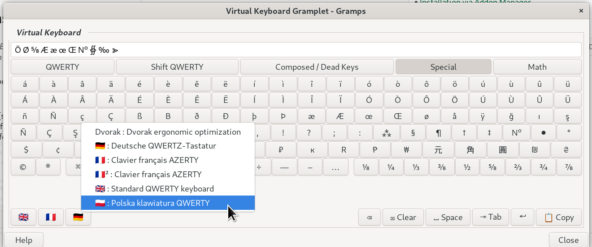

 A simple clipboarding gramplet with shortcuts to those hard-to-remember dead key combinations.
Available for **docking in all views *except* :**  Relationships,  Charts, and  Geography

##  Change log
### 1.3.0
- Right-click any flag button to view to switch language choosing buttons.
- CSV Layout Support: Automatically discovers and loads custom keyboard layouts from CSV files 
- Double-Click Symbol Insertion: Double-click any flag button to insert its symbol (flag emoji or text) 
- Settable Insert point, in addition to original appending
- add Polish and Dvorak sample CSVs

### 1.2.0
- external CSV for addon Keyboard mapping and layout sets definitions
- Load addon keyboard layout definitions from external CSV files in a layouts/ directory​
- Allow CSV-defined layouts to supersede or extend built-in layout sets per language​
- Support referencing built-in row definitions from CSV via symbolic layout ids​
- Add configuration schema metadata and persistence for selected layout set and options​
- Auto-select default layout set from Gramps UI language, with English fallback​

### 1.1.2
- Suppress unintended Gramps tooltips over virtual keyboard controls
- Refactor keyboard layout definitions in preparation for external layout files
- Add Composed / Dead Keys layout for diacritics and extended characters
- Improve internal validation and error handling for layout definitions

### 1.1.0
- Add multi-language keyboard sets (FR, DE added to GB) 
- flag-based layout sets switching as "radio buttons"
- add Tab character key
- Introduce AltGr and Shift-AltGr layouts for supported layouts
- Improve layout switching UI using toggle buttons
- Expand Special character coverage for international text entry
- Internal reorganization of keyboard layout definitions
- GUI marked for Weblate Translation

### 1.0.0
- Virtual on-screen keyboard Gramplet for Gramps
- Standard QWERTY keyboard layout
- Basic editing controls (Backspace, Tab, Space, Newline, Clear)
- OS Clipboard copy support
- Dockable Gramplet with floating window support
- Compatible Categories: Dashboard and all except: Charts and Geography

### Not Yet Implemented
- Mixed input : hardware Keyboard and virtual keyboard
- Toggle (using Shift/CapsLock) between Upper and Lower keymaps 

