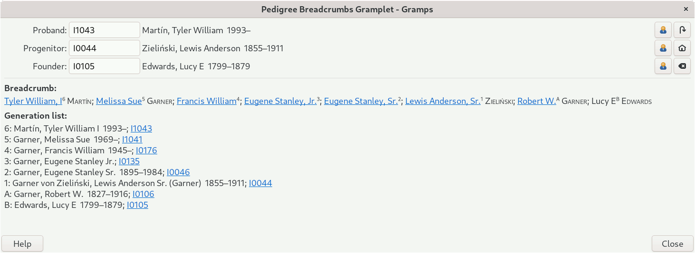
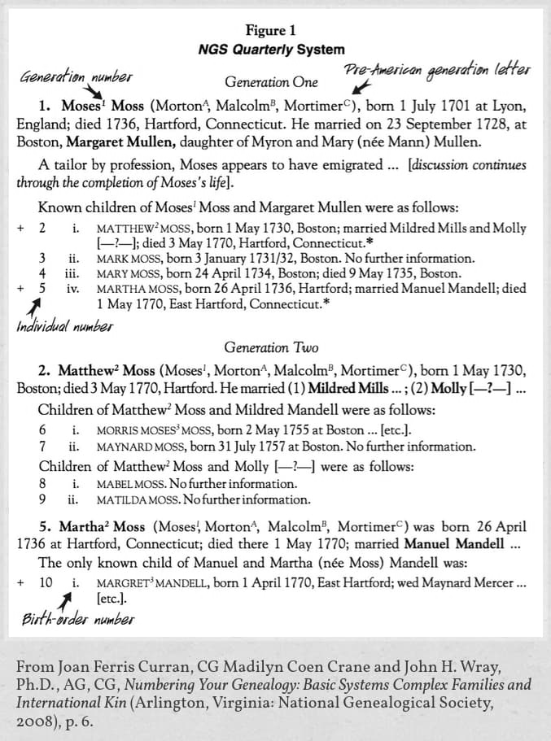

# Pedigree Breadcrumbs 
**Version 0.1.0** — Development Release  
**For Gramps 5.2.x** desktop genealogy software  
[**BreadcrumbFormatterAPI.md**](BreadcrumbFormatterAPI.md) | [**README.md**](README.md)



Pedigree Breadcrumbs is a Gramplet for Gramps 5.2 that shows a concise, generation‑numbered “breadcrumb path” between a Proband, a Progenitor, and an optional Founder.  The core display is built from a companion module, `BreadcrumbFormatter.py`, which receives an ordered list of people (with generation labels) and returns both plain‑text and styled versions of the breadcrumb line and a per‑generation list; end‑users normally do not need to interact with this module directly.  For technical API details of the formatter module, see the separate [`BreadcrumbFormatterAPI.md`](BreadcrumbFormatterAPI.md) file. 


---

## What this gramplet shows

The gramplet focuses on the direct ancestor–descendant path among up to three key people: 

- **[Proband](https://gramps-project.org/wiki/index.php/Genealogy_Glossary#proband)** – the descending relative you are studying (auto‑follows the Active Person unless locked).   
- **[Progenitor](https://gramps-project.org/wiki/index.php/Genealogy_Glossary#progenitor)** – an “anchor” ancestor, typically an immigrant or head of a main lineage (defaults to the Home Person).   
- **Founder** – an optional older “old‑country” ancestor above the Progenitor, labeled with letters (A, B, C, …). 

From these, the gramplet computes the direct pedigree path and displays it in two synchronized formats: a one‑line breadcrumb and a multi‑line generation list. 

---

## Installation

1. Copy the following files into your Gramps user plug‑ins directory (e.g. `~/.gramps/gramps52/plugins` on Linux):   
   - `PedigreeBreadcrumbs.py`  
   - `BreadcrumbFormatter.py` (companion formatting module; your local copy may be named `BreadcrumbFormatter-3.py` while developing)  
   - `PedigreeBreadcrumbs.gpr.py` (the plugin registration file, named similarly to `PedigreeBreadcrumbs.gpr-2.py` in this distribution)  

2. Restart Gramps so it detects the new plugin. 

3. In Gramps, enable the gramplet if needed via:  
   `Help → Plugin Manager` → *Pedigree Breadcrumbs* → ensure it is enabled. 

4. Add the gramplet to a sidebar or bottombar:  
   - Open a view (e.g. People view).  
   - Right‑click the sidebar/bottombar gramplet area and choose “Add a gramplet”.  
   - Select “Pedigree Breadcrumbs”. 

---

## Basic usage

### Selecting the three people

The top part of the gramplet shows three person‑selector rows, one each for Proband, Progenitor, and Founder. 

Each row contains: 

- A label (Proband, Progenitor, or Founder).  
- An editable Gramps ID field.  
- A read‑only “Surname, Given YYYY–YYYY” label that acts as a drag‑and‑drop target.  
- A person‑selector button.  
- A reset/clear button.  

You can choose people in three ways: 

- **Type a Gramps ID** into the ID entry and press Enter.  
- **Drag and drop a person** from another Gramps view onto the name label.  
- **Click the selector button** to open the standard person selector dialog.  

Additional behavior: 

- The **Progenitor** row’s reset button returns to the Home Person.  
- The **Proband** row’s reset button returns to the Active Person and re‑enables auto‑follow.  
- The **Founder** row’s reset button clears the Founder slot.  

If the Progenitor and Proband end up being the same person, or the Progenitor is not a direct ancestor of the Proband, the gramplet shows an informational message instead of a breadcrumb. 

---

## Breadcrumb display

The **Breadcrumb** section shows a single line like: 

```text
Given⁶ SURNAME; Given⁵; … Given¹ SURNAME

